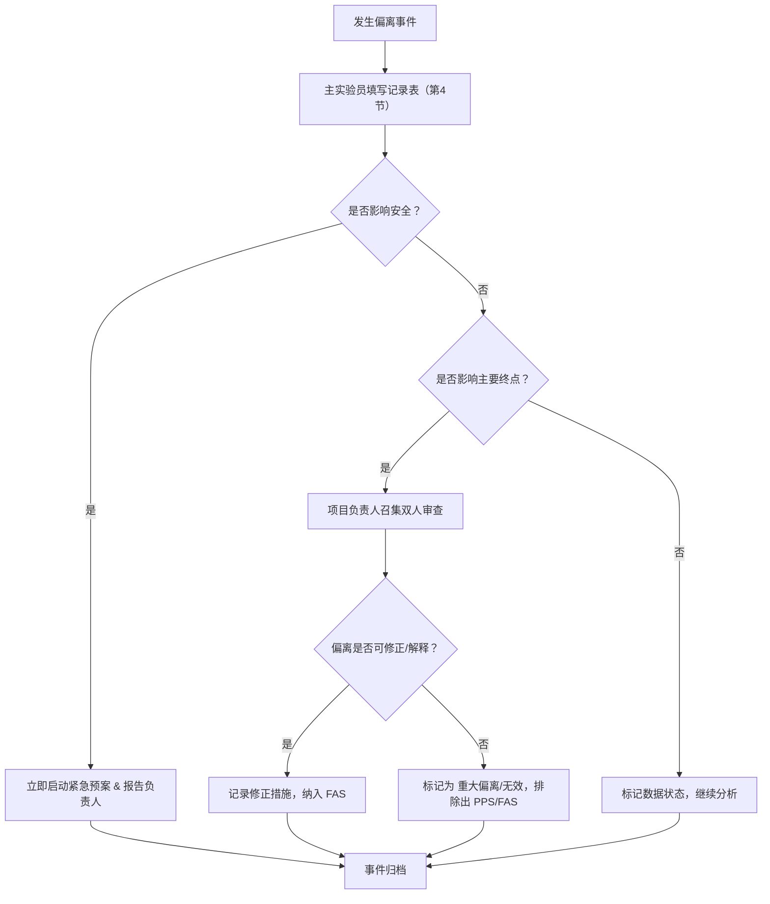

# G-01-06 研究协议偏离与执行事件记录模板

> **关联项目**：SRP × IJHCI — 场景原生呼吸引导研究
> **版本**：v1.1-candidate
> **状态**：`READY_FOR_TRAINING`
> **依据权威**：`protocol_authority_v1.1.json`、`13_IJHCI独立审稿攻击与升级裁定_v1.1.md`
> **关联文件**：`90_既有执行材料/2026-08-05_SRP_IJHCI_第五步伦理与预试材料包_v1.0/17_协议偏离与版本变更表.md`（用于协议版本变更申请）

---

## 1. 文件目的与适用范围

本模板用于记录**单次研究会话**在执行过程中发生的任何偏离预设协议的事件。

### 1.1 记录目标

- 捕捉所有影响数据质量、参与者安全或研究完整性的异常事件；
- 为 **Gate 1（执行质量非劣）** 的 `COMPLIANT` / `NONCOMPLIANT` / `TECH_UNOBSERVABLE` 标记提供溯源证据；
- 为产能模型（U8）中的“故障/重做”成本提供原始数据；
- 确保研究透明性，满足 IJHCI 复现性要求。

### 1.2 适用范围

- Level C 技术预试；
- 阶段一正式实验（平行组比较）；
- 阶段三正式实验（策略前瞻性队列）。

**注意**：涉及研究方案（如样本量、随机化清单、纳入标准）的永久性变更，请填写 `90_既有执行材料/2026-08-05_SRP_IJHCI_第五步伦理与预试材料包_v1.0/17_协议偏离与版本变更表.md` 并提交伦理修订。本模板仅面向**执行层级的会话事件**。

---

## 2. 标准单次研究流程基准（v1.1 权威）

> **工位总占用时间**：**55 ~ 70 分钟**（含知情同意、设备准备、标准化训练与清理）。
> **核心体验净时长**：**13 分 20 秒（800 秒）**，由 4 个**结构相同**的天气—呼吸复合模块组成（风暴/炙烤/暴雪/褪色配对各不相同，详见 `G-01-01 单次参与材料` 第 2 节）。

| 顺序 | 阶段 | 内容描述 | 目标时长 | 硬性约束 / 备注 |
| :---: | :--- | :--- | :--- | :--- |
| 0 | **知情同意与安全筛查** | 说明研究流程，确认知情同意书签署；执行保密安全筛查。 | 5 ~ 8 分钟 | 未签署或未通过筛查不得进入后续阶段；P-ELG 类事件主要发生于此环节。 |
| 1 | **设备准备与训练** | 佩戴 PLUX respiBAN 呼吸胸带与 Polar H10 心电；标准化呼吸指导与设备自检。 | 10 ~ 15 分钟 | 必须确认双设备遥测 20Hz 自包含信号稳定。 |
| 2 | **PANAS 前测** | 填写中文版 20 项 PANAS（正负性情绪量表）。 | 2 ~ 3 分钟 | 必须由参与者独立完成。 |
| 3 | **核心体验（4模块）** | 连续完成 4 个模块。每个模块结构：`演示(25s)` → `闭环(150s)` → `锁定转场(25s)`。 | **严格 800 秒** | 每个模块的技术允许区间：Demo [24-30]s，闭环 [140-160]s，锁定 [20-30]s。**两条件（场景原生/抽象提示）冻结时长必须完全一致**。 |
| 4 | **PANAS 后测** | 填写中文版 20 项 PANAS。 | 2 ~ 3 分钟 | 紧接核心体验结束。 |
| 5 | **体验后问卷包** | SCCI（操纵检查）、四层理解题（8题）、心智努力（单题）、次要体验指标（注意连续性/喜欢度/舒适度等）。 | ≤ 5 分钟 | **总问卷预算上限为 5 分钟**；90 分位数超过 300 秒须触发修订。 |
| 6 | **目的与条件猜测** | 开放回答研究目的及提示条件差异。 | 2 ~ 3 分钟 | 访谈子样本的定性访谈在同一占用窗口内完成。 |
| 7 | **结束、补偿与清理** | 说明结束，发放补偿，回答疑问；设备清理与数据打包校验。 | 5 ~ 8 分钟 | 数据完整性哈希校验通过后方可释放工位。 |

---

## 3. 偏离事件分类与代码

所有偏离事件须在发生时或会话结束后 **2 小时内** 按以下分类记录。

### 3.1 参与者相关事件（P）

| 代码 | 类别 | 触发条件 | 处理方式 |
| :--- | :--- | :--- | :--- |
| **P-ACT** | 参与者主动退出 | 参与者因个人原因（不适、时间冲突等）主动请求中止，或未完成全部 4 模块后拒绝继续问卷。 | 尊重决定；记录中止时点；补偿按比例结算。 |
| **P-NOS** | 参与者爽约 | 预约后未到场，且未在约定时间前 30 分钟取消。 | 首次重排；两次以上取消参与资格；记录在演练漏斗中。 |
| **P-SAF** | 安全/健康事件 | 出现过度通气、严重头晕、胸带过敏或急性焦虑发作（依据安全筛查与中止规则）。 | **立即终止体验**；提供紧急医疗路径；必须报告项目负责人。 |
| **P-ELG** | 纳入标准偏离 | 事后发现参与者不符合纳入标准（如年龄、健康状况、跨阶段重复参与）。 | 标记数据状态；若跨阶段重复，则排除后续阶段数据并重新审计。 |

### 3.2 技术/设备事件（T）

> **引用裁定的工程证据门**：正式运行环境必须证明 Unity 独立于 TD/Spout，且支持断连、延迟与重连故障注入。

| 代码 | 类别 | 触发条件 | 处理方式 |
| :--- | :--- | :--- | :--- |
| **T-UNI** | Unity 运行时崩溃 | 核心体验期间应用无响应或闪退。 | 重启或重排会话；记录崩溃日志与版本哈希。 |
| **T-BRE** | 呼吸设备失效/断流 | PLUX respiBAN 信号丢失、覆盖率低于 80% 或 400Hz 数据中断超过 5 秒。 | 尝试重连；失败则标记对应模块为 `TECH_UNOBSERVABLE`（见第 5 节）。 |
| **T-ECG** | 心电设备失效/断流 | Polar H10 蓝牙断开，或 R-R 间期数据丢失。 | 心电仅作离线解释，不进入正式在线策略；记录缺失段。 |
| **T-CLK** | 时钟/同步偏离 | 单调时钟漂移超过 **50ms**，或端到端反馈延迟 P95 超过 **200ms**。 | 若偏离不可恢复，相关模块的 PF 标记为 `TECH_UNOBSERVABLE`。 |
| **T-SPO** | 禁止组件访问 | Unity 构建错误调用 TD/Spout 端口，或访问了旧 `calm_index` 权威。 | 记录日志；触发软件紧急回退；若污染正式状态则废弃该会话。 |
| **T-INS** | 依赖/权限异常 | 干净机器构建失败、许可过期或环境变量错误。 | 冻结配置；未解决前不得启动正式阶段。 |

### 3.3 流程与数据事件（F）

| 代码 | 类别 | 触发条件 | 处理方式 |
| :--- | :--- | :--- | :--- |
| **F-TIM** | 模块时长违规 | 任何模块的 Demo/闭环/转场实际时长超出技术允许区间（见第 2 节）。 | 标记该模块的周期机会为 `NONCOMPLIANT`（见第 5 节）。 |
| **F-SEQ** | 随机化/盲态破坏 | 实验员误披露条件分配，或随机化清单保管/揭示流程违反规则。 | 记录偏差；评估是否揭盲；若影响分配隐藏则排除该参与者。 |
| **F-MIS** | 问卷数据缺失 | 参与者跳题（SCCI/理解题）、或 PANAS 后测未提交。 | 区分 `SKIPPED` / `TIMEOUT` / `TECH_UNPRESENTED`；按预注册缺失规则处理。 |

---

## 4. 偏离记录表（执行日志）

每次事件必须独立填写下表，并由主实验员签名，项目负责人审核。

| **字段** | **填写说明** |
| :--- | :--- |
| **事件编号** | 格式：`[阶段]-[代码]-[序号]`，例：`S1-T-UNI-001`（阶段一 Unity 崩溃第 1 例） |
| **发生日期与时间** | 精确到分钟。 |
| **参与者研究 ID** | 不可逆哈希 ID，**严禁**记录原始联系方式。 |
| **会话阶段** | 知情同意与筛查 / 设备准备 / PANAS 前测 / 模块 X / PANAS 后测 / 问卷 / 猜测 / 结束与清理。 |
| **偏离代码** | 引用第 3 节分类（如 P-ACT、T-BRE、F-TIM）。 |
| **具体描述** | 客观描述现象与上下文（包括屏幕截图/日志路径，限内部审计）。 |
| **影响评估** | - 是否影响参与者安全？（是/否） - 是否影响 Gate 1/2/3 主要终点？（是/否） - 涉及的机会周期数量。 |
| **机会标记** | 针对 Gate 1：该事件导致的机会应标记为 `COMPLIANT` / `NONCOMPLIANT` / `TECH_UNOBSERVABLE`（见第 5 节定义）。 |
| **数据状态判定** | 参与者级最终状态（见第 6 节）。 |
| **纠正与预防措施** | 当场措施（如重启、重连）及后续改进计划（如更新 SOP）。 |
| **记录人/主实验员** | 签名与日期。 |
| **项目负责人审核** | 签名、日期及是否批准该数据纳入完整分析集。 |

---

## 5. 机会分母状态定义（Gate 1 关键）

根据审稿裁定 R3，**技术不可观测机会不得从分母消失**。每个呼吸周期机会必须标记为以下三类之一：

| 状态 | 定义 | 示例 |
| :--- | :--- | :--- |
| `COMPLIANT` | 可观测，且完整满足冻结的结构与时序要求。 | 信号清晰，目标与实际阶段匹配，时长在公差内。 |
| `NONCOMPLIANT` | 可观测，但不满足结构或时序（如早吸、晚吸、时长超标）。 | 参与者实际呼吸与提示目标错位。 |
| `TECH_UNOBSERVABLE` | 由预注册技术原因造成不可观测（非参与者过错）。 | 设备断流、屏幕延迟 > 200ms、Unity 崩溃导致该段无记录。 |

> 技术不可观测机会不得计入 `PF` 分子，但应保留在机会分母中，并通过**参与者级缺失处理**（有界多重插补）纳入 Gate 1 主要分析。

---

## 6. 参与者级数据状态定义

在会话结束后，综合所有偏离事件，为整个参与者数据赋予最终状态：

| 状态 | 代码 | 含义 | 分析集归属 |
| :--- | :--- | :--- | :--- |
| **完整** | `Complete` | 所有 4 模块完成，无 `TECH_UNOBSERVABLE`，且偏离不影响主要终点。 | 完整分析集 + 完整四模块集。 |
| **技术不完全** | `Tech-Incomplete` | 存在 `TECH_UNOBSERVABLE` 机会，但至少 4 模块均有部分可观测数据。 | 仅完整分析集（缺失插补处理）。 |
| **参与者中止** | `Aborted` | 参与者主动退出或安全事件触发中止，未完成全部模块。 | 仅完整分析集（若前测及部分数据可用）或排除。 |
| **协议重大偏离** | `Major-Deviation` | 分配错误、条件污染、随机化破坏。 | 排除出主要分析，仅作描述性报告。 |
| **无效** | `Invalid` | 数据损坏、设备全程无记录、或发现跨阶段重复参与。 | 完全排除。 |

---

## 7. 偏离审核与数据处置流程

---

## 8. 版本记录

| 版本 | 日期 | 修改内容 | 负责人 |
| :--- | :--- | :--- | :--- |
| v1.1-candidate | 2026-08-11 | 对齐 v1.1 权威：机会分母三态、参与者级数据状态、偏离分类代码 | G-01 治理组 |
| v1.1-candidate | 2026-08-21 | 修正第 2 节模块表述为"结构相同、配对各不相同"；修复 Mermaid 代码围栏；移除与本文档无关的粘贴说明段；关联文件指向 G-01-01 流程权威 | Codex（G-01 治理组） |
