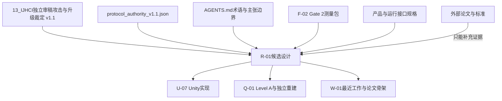
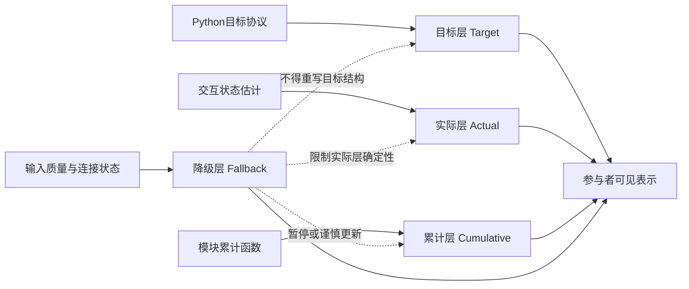
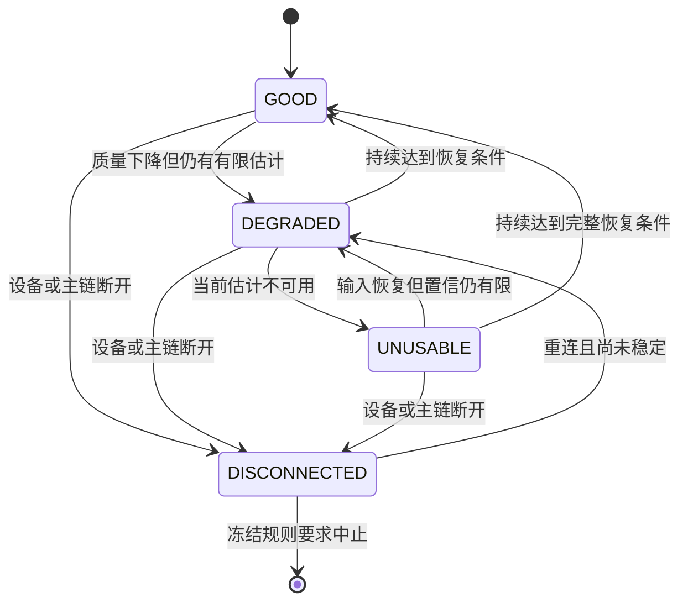

# R-01_四层候选语法与完整表示方案_v0.9-candidate.md

> **任务编号：** R-01
> **项目裁定：** `REJECT_AND_RESUBMIT_DESIGN`
> **制品版本：** `v0.9-candidate`
> **最终状态：** `PLANNED_NOT_OBSERVED`
> **证据状态：** `CANDIDATE_NOT_LEVEL_AB_VALIDATED`
> **处理定义：** `scene_native` 与 `abstract_pacer` 是两种**完整提示表示方案**，不是单一视觉机制操纵
> **主张边界：** 本制品只提出候选四层设计语法、映射规则、对照公平性规范、配置契约和参与者说明；不声称Unity已经实现，不声称Level A/B/C已经完成，不声称Gate 2已经关闭
> **术语约束：** 全文将实时输入解释为“交互状态估计”，不作个人能力判断或健康判断

## 导入与证据处理记录

- 外部输入：`C:\Users\fujunye\Downloads\deep-research-report (3).md`
- 输入SHA-256：`66C786349F8AB06CB24DAF438C817BFF16339EF9462778F6C0C97439E8AC0D31`
- 导入处理：移除42处不可复核的GPT内部会话引用；项目依据改为下表中的仓库链接；公开依据保留DOI或官方链接。
- 完成边界：本文件是R-01候选设计制品，不代表Unity实现、双人审查、Level结果、真实渲染测量或Gate结果已发生。

| 项目权威 | 用途 |
|---|---|
| [AGENTS项目规则](../../../../../AGENTS.md) | 术语、主张与项目工作流边界 |
| [IJHCI升级裁定v1.1](../../00_总控/13_IJHCI独立审稿攻击与升级裁定_v1.1.md) | 处理定义、贡献层级与失败降称 |
| [机器协议权威v1.1](../../00_总控/protocol_authority_v1.1.json) | 时长、条件、状态与执行防火墙 |
| [项目全生命周期总览](../../00_总控/00_项目全生命周期总览.md) | 四模块目标呼吸结构 |
| [F-02构念与测量包](../../03_步骤02_构念比较条件与测量/01_F-02_Gate2构念与测量深度研究包_v0.9-candidate.md) | 四层理解、SCCI、心智努力与Gate 2接口 |
| [参与者产品总规格](../00_参与者产品总规格.md) | 无操作流程与参与者界面边界 |
| [四场景实现总规范](../01_四场景实现总规范.md) | 四模块唯一核心机制 |
| [抽象双环对照规格](../06_抽象双环对照规格.md) | 抽象条件目标、实际与累计表示 |
| [信号质量与降级设计](../../21_真实设备与在线运行系统/04_信号质量与降级设计.md) | 质量状态与降级语义 |
| [目标运行接口v2](../../21_真实设备与在线运行系统/06_目标运行接口_v2.md) | Python、Unity、TD职责和20 Hz接口 |

## 执行摘要与协议权威

本制品把R-01操作化为一套可审查、可配置、可被Unity消费的候选表示契约。其核心不是“让天气画面更自然”，而是在两种完整提示表示方案中，以功能上可比较的方式表达四类信息：当前应跟随的**目标层**、由输入形成的**实际层**、跨时间汇总的**累计层**，以及说明信息可靠程度与系统行为变化的**降级层**。项目协议已经明确，阶段一只能识别完整提示表示方案的组间差异，不能识别天气、呼吸结构、场景融合位置、圆环几何或任一视觉变量的独立作用。

Gate 2必须继续采用联合门：SCCI只检查场景融合操纵是否成立；四层理解和心智努力构成功能底线；SCCI提高但理解、心智努力或客观阶段错误恶化时，Gate 2必须失败。四层理解题不能包含天气、融合、圆环或控件偏好措辞，总问卷目标时长不得超过五分钟。

Python Session Core是目标阶段、交互状态估计、质量状态、累计状态、顺序和时间的唯一权威；Unity只负责参与者可见渲染；TouchDesigner只读且不得成为正式运行依赖。正式遥测为20 Hz自包含帧，缺失不得填零或切换Mock。 两条件使用相同场景、音频、累计函数和事件真值；`scene_native`通过场景机制表达目标与实际，`abstract_pacer`通过外环和内环表达目标与实际，同时保留匹配的场景背景与累计变化。

本制品采用以下证据标签：

| 标签 | 含义 | 可承担的作用 |
|---|---|---|
| **直接证据** | 项目协议、官方标准或来源直接规定相应职责、字段或方法 | 可作为设计约束或方法依据 |
| **间接证据** | 相邻HCI、信息可视化、视觉注意或视听实验研究支持设计风险与测量思路 | 只能支持合理性，不能证明本方案有效 |
| **项目推导** | 由项目边界和来源综合形成的候选操作化 | 必须经过Level A/B、真实Unity测量或独立重建后冻结 |

协议优先级如下。外部论文和标准仅用于补充构造依据，不得覆盖项目权威。



AGENTS.md要求全部项目文档使用“交互状态估计”，禁止把消费级输入写成严肃个人判断，并要求每种天气仅保留一个核心视觉机制、提示由环境自然表达。  项目当前只有设计和任务可启动证据，尚无完整系统、设计框架或研究结果成立的证据。

## 四层候选语法与严格操作定义

四层不是四个可任意混合的动画变量，而是四种因果角色、四个时间尺度和四种信息承诺。任何映射只要改变了这些角色，即使画面看似相似，也不再是合法的四层实现。



### 四层严格定义

| 层 | 严格操作定义 | 必须回答的问题 | 不得被解释为 | 证据类型 |
|---|---|---|---|---|
| **目标层 `TargetCue`** | Python目标协议在当前单调时刻规定的呼吸阶段、阶段进度及下一合法转换；独立于参与者当前表现 | “此刻系统希望我跟随什么？”“下一步何时转换？” | 当前实际表现、累计成绩、输入质量、奖励程度 | 直接证据＋项目推导 |
| **实际层 `ActualFeedback`** | 由真实输入形成的当前呼吸阶段、进度及置信度的交互状态估计；质量不足时允许衰减或停止表达 | “系统当前估计我处于什么阶段？”“与目标大致是什么关系？” | 对个人能力的评价、目标命令、长期累计水平 | 直接证据＋项目推导 |
| **累计层 `RecoveryState`** | 从模块开始至当前时刻，按照冻结累计函数整合的过程级状态；时间尺度显著慢于单个呼吸阶段 | “截至目前，整个模块累积到了什么区间？” | 当前一瞬、下一阶段预测、单次呼吸正确与否 | 直接证据＋项目推导 |
| **降级层 `FallbackState`** | 对输入可靠程度、连接状态及由此触发的显示行为变化作显式说明；属于系统认识边界信息 | “哪些信息暂时受限？”“系统此刻仍会继续表达什么？” | 参与者做错、模块失败、目标已改变、伪造成功 | 直接证据＋项目推导 |

四层的统一句法为：

```text
Target = 应当跟随的协议状态
Actual = 当前可观测的交互状态估计
Cumulative = 从模块开始至今的慢变量摘要
Fallback = 当前可见信息的可靠性与显示策略
```

### 数据、更新和时间尺度契约

| 层 | 权威数据源 | 数据刷新 | 候选视觉响应 | 主要时间尺度 | 视觉职责 | 合法降级语义 | 禁止耦合项 |
|---|---|---:|---:|---|---|---|---|
| 目标 | `target_phase`、`target_progress`、目标转换事件 | 20 Hz遥测或可靠控制事件 | 每帧插值；不得自行改变阶段 | 单阶段约0.5–10秒；模块结构200秒候选 | 提供稳定、可预测、可跟随的节奏骨架 | 输入受限时继续开环；断连时安全开环或中止 | 不得由`actual_phase`、`recovery_value`、SCCI、喜欢度或质量分数改变 |
| 实际 | `actual_phase`、`actual_progress`、`actual_confidence` | 20 Hz | 候选100–250毫秒平滑；待端到端测量 | 50毫秒采样至单次呼吸周期 | 表示当前交互状态估计及置信程度 | `DEGRADED`衰减；`UNUSABLE/DISCONNECTED`停止 | 不得推进目标；不得直接改变累计奖励；不得填零或Mock |
| 累计 | `recovery_value`、`recovery_locked` | 20 Hz传输；语义更新可降频 | 候选2–5秒低通或事件更新 | 10–200秒 | 表示过程趋势，避免被单次波动支配 | 按唯一冻结规则谨慎更新或暂停；不可用时暂停 | 不得编码当前相位；不得作为实际层替代；不得因画面美观继续增长 |
| 降级 | `signal_quality`、`fallback_state`、`fallback_reason`、设备状态 | 20 Hz及连接事件 | 候选250毫秒内出现；恢复需防抖 | 即时状态＋持续区间 | 明示哪些信息受限，并维持目标可跟随性 | `GOOD/DEGRADED/UNUSABLE/DISCONNECTED`逐级处理 | 不得表达参与者失败；不得伪造实际层；不得改写固定目标结构 |

20 Hz、字段权威和四种质量状态来自运行协议；100–250毫秒视觉平滑、2–5秒累计低通和250毫秒降级显现是**工程候选、待实测冻结**。项目接口要求外部测得的端到端延迟P95候选不高于200毫秒，但该目标尚无真实证据。

### 跨层独立性规则

| 规则 | 可执行判定 |
|---|---|
| **来源独立** | 四层分别只能绑定目标协议、交互状态估计、累计函数和质量状态，不允许实际层读取目标值后伪装“吻合” |
| **时间尺度独立** | 累计层不得随每个吸呼阶段来回摆动；目标和实际层不得用全局恢复程度改变阶段边界 |
| **视觉可分** | 任意两层至少在“空间位置、形态、运动方式、时间尺度、纹理”五项中有两项可区分 |
| **非颜色唯一** | 颜色不得是识别层级、阶段或降级的唯一线索；W3C明确要求颜色不能作为唯一信息通道。 |
| **降级非评价** | 降级只说明输入与系统可见性的变化，不使用“失败、差、做错”等指向参与者的语义 |
| **目标稳定** | `DEGRADED`和`UNUSABLE`状态下目标继续开环；只有`DISCONNECTED`可按冻结安全规则在继续开环与中止之间选择 |
| **累计守恒** | 不可用时累计暂停，不以零输入、Mock或动画惯性制造进步 |
| **条件公平** | 两条件的事件真值相同，但可见编码可以不同；公平性不等同于逐像素相同 |

非文本图形中承担理解任务的视觉部分应与相邻区域保持可辨识差异；WCAG 2.2为有意义图形给出3:1的非文本对比参考，但本桌面体验是否采用同一阈值，仍需结合场景与显示器实测，不能直接宣称合规。

## 跨模块统一语法与两种完整表示方案

四模块必须共享同一四层语义、同一输入字段和同一失败行为，但不要求共享同一图形。每个模块只允许一个核心场景机制；四层通过该机制的不同空间尺度或时间尺度表达，而不是堆叠为仪表盘。该原则来自项目AGENTS.md和四场景总规范。

### 跨模块统一句法

| 句法角色 | `scene_native`统一规则 | `abstract_pacer`统一规则 |
|---|---|---|
| 目标 | 远场、前导或预测性场景变化表达；节奏由目标协议唯一驱动 | 外环表达目标；扩张=吸气，静止=停留，收缩=呼气，双吸=两次扩张 |
| 实际 | 近场、局部或响应性场景变化表达；随交互状态估计变化 | 内环表达实际；使用同一阶段几何，但受实际进度和置信度驱动 |
| 累计 | 使用共享的慢变量场景变化；两条件时点和幅度函数一致 | 保留同一场景累计变化，不得由环额外增加奖励 |
| 降级 | 实际通道衰减、停用或出现非评价性不确定纹理；目标继续 | 内环淡出或停用，外环继续；累计按同一规则暂停或谨慎更新 |
| 条件身份 | 场景本身承担目标与实际的表达职责 | 场景闲置动画不得泄露呼吸周期；目标与实际由双环承担 |
| 奖励 | 不得因场景原生表达额外获得更强恢复、音效、镜头或转场 | 不得因抽象环清晰而获得额外文字、阶段标签或更高对比补偿 |

### 四模块候选映射矩阵

下表的模块机制均为**项目推导、工程候选、待Level A与真实实现验证**。它们不等于已经冻结的美术设计。

| 模块 | 呼吸结构要求 | 唯一核心机制 | 目标层候选映射 | 实际层候选映射 | 累计层候选映射 | 降级层候选映射 | 禁止做法 |
|---|---|---|---|---|---|---|---|
| **风暴** | `3-3-3-3`四阶段箱式结构：吸气、停留、呼气、停留 | `storm_field`：风压—雨幕场 | 远场云隙或雨带按目标阶段开合；停留期保持稳定边界 | 近场草叶、衣摆或雨丝方向随交互状态估计推进 | 地平线能见度、积水扰动或整体风暴强度缓慢变化 | 近场响应降低透明度并加入稀疏断续纹理；远场目标继续 | 不让累计晴朗程度控制目标速度；不让雨量同时独占目标和实际 |
| **炙烤** | 长呼气结构，来源于任务包 | `thermal_flow`：热流—阴影边界 | 热流边界或阴影呼吸按目标阶段收放，突出长呼气持续段 | 近场尘粒、布料或热浪局部位移随实际阶段变化 | 阴影覆盖、地表冷却纹理或远景稳定度缓慢累计 | 局部热流响应减弱、断续；目标热流仍按固定结构运行 | 不把亮度变暗直接等同成功；不得仅靠红/黄颜色编码阶段 |
| **暴雪** | 等时结构，来源于任务包 | `snow_drift`：雪流—风道场 | 远场雪流通道以等时吸、停、呼段推进 | 近场雪带、围巾或雪粒轨迹响应实际阶段 | 路径可见度、积雪稳定度或远景轮廓缓慢改变 | 近场响应淡出并出现稀疏中断轨迹；目标风道继续 | 不让雪花密度同时代表目标、实际和累计；不以白度单独编码 |
| **褪色** | 双吸结构，来源于任务包 | `chromatic_return`：纹理—色素回流波 | 目标波产生两次可分辨的吸气推进，停留和呼气有不同边界行为 | 局部物体纹理、轮廓厚度和色素回流随实际双吸推进 | 全局纹理完整度、饱和度与轮廓连续性缓慢恢复 | 实际回流波透明度下降并叠加点状不确定纹理；目标轮廓继续 | 不用闪烁区分双吸；颜色必须辅以轮廓或纹理，不把褪色解释为个人失败 |

四模块目标结构以项目全生命周期总览和场景规格为准：风暴采用`3-3-3-3`四阶段箱式结构，炙烤采用`4-6`延长呼气，暴雪采用`5-5`等时慢呼吸，褪色采用舒适吸气、较短补吸和缓慢完整呼气的双吸结构。前三项秒数进入目标manifest；褪色各阶段精确秒数仍由后续目标协议配置在Level材料生成前冻结，R-01不自行补造数值。

褪色模块不得使用快速明暗闪烁制造双吸边界。WCAG 2.2要求内容不得在一秒内闪烁超过三次，除非低于通用闪烁阈值；本项目采取更保守的候选策略：任何承担语义的闪烁均不作为首选，真实构建仍需视频和显示器检查。

### 两种完整提示表示方案比较矩阵

近期HCI工作表明，抽象动态形状、环境变化和混合现实自然元素均可被用于呼吸或可穿戴输入反馈，但这些工作不能证明任一表示天然更易理解，也不能证明本项目的四层语法有效。Chittaro等比较了真实反馈和安慰性反馈的完整体验；Respireal以呼吸驱动植物生长和虚实自然环境；Heartscape使用动态抽象形状表达实时心率相关信息。这些相邻工作支持“表示方案应作为整体体验审计”，而不是将一种视觉属性当作唯一因果机制。

| 比较维度 | `scene_native` | `abstract_pacer` | 因此不能作出的归因 |
|---|---|---|---|
| 目标表示位置 | 嵌入场景远场或前导机制 | 屏幕中的外环 | 不能归因为“仅位置” |
| 实际表示位置 | 场景近场或响应机制 | 内环 | 不能归因为“仅中心/外围” |
| 几何词汇 | 云隙、热流、雪流、纹理回流等模块化词汇 | 环形扩张、静止和收缩 | 不能归因为“仅圆形几何” |
| 语义关联 | 与模块环境语义一致 | 中性、无天气语义 | 不能归因为“仅天气融合” |
| 空间占用 | 可分散覆盖场景不同区域 | 较集中、边界可精确记录 | 不能归因为“仅遮挡” |
| 运动分布 | 多对象、局部与全局运动可能并存 | 两个主要运动对象 | 不能归因为“仅运动复杂度” |
| 目标—实际分离 | 通过空间深度、对象角色和时间响应区分 | 外环与内环区分 | 不能归因为“仅层级分离方式” |
| 累计表示 | 共享场景慢变量 | 同一共享场景慢变量 | 累计必须匹配，不能成为处理差异 |
| 降级表示 | 场景实际通道衰减或停用 | 内环衰减或停用 | 表现形式不同，但信息语义必须相同 |
| 可发现性风险 | 可能因融入环境而不易发现 | 可能因控件化而更显眼 | 必须用理解、阶段错误和显著度共同审计 |
| 构念风险 | SCCI可能天然偏向场景原生 | SCCI可能把“独立控件”当负面 | SCCI只能作操纵检查 |
| 研究处理 | 完整提示表示方案A | 完整提示表示方案B | 不能声称只改变一个视觉机制 |

### 条件间必须匹配的项目

| 必须匹配项 | 冻结要求 | 验证制品 |
|---|---|---|
| 目标阶段和阶段边界 | 同一`target_phase`、`target_progress`和转换时间 | manifest、目标事件日志、重放哈希 |
| 实际输入和置信度 | Level材料中使用同一事件fixture；正式阶段按各自真实输入但同一算法 | fixture哈希、算法版本、遥测 |
| 累计函数 | 输入、锁定时点、更新规则和视觉幅度函数一致 | 配置差异报告 |
| 降级原因和状态转换 | 同一状态机、原因码和暂停规则 | 故障注入日志 |
| 模块时长 | 同一冻结的demo、closed-loop和lock-transition时长 | manifest |
| 场景背景 | 同一场景资产、镜头、分辨率和非提示动画 | 构建哈希、截图差异 |
| 音频 | 同一音频文件、音量、时点和动态范围 | 音频哈希和时间线 |
| 奖励时点 | 场景恢复、音效和转场不得额外偏向任一条件 | 事件日志 |
| 题目与说明 | 同一条件中性文字、题序和答案键 | 材料版本哈希 |
| 显示环境 | 同一显示器、观看距离、亮度设置、帧率目标 | 工位检查表 |
| 交互负担 | 体验中均无手部操作、无问卷、无条件特有文字 | 全程录像 |
| 事件真值 | 八道理解题所依赖字段在两条件完全一致 | 真值fixture和第二人复核 |

核心体验每模块推荐25秒示范、150秒闭环和25秒锁定转场；技术预试只可在24–30秒、140–160秒和20–30秒范围内统一调整，正式阶段条件间必须完全匹配。

### 必须记录而不要求相同的处理差异

| 差异类别 | 最低记录字段 |
|---|---|
| 表示词汇 | 条件、模块、层、机制ID、资产ID、参数版本 |
| 空间位置 | 层级ROI、质心坐标、视觉角、占屏比例 |
| 运动 | TI、光流补充量、速度分位数、动态对象数量 |
| 亮度 | 全屏及层级ROI平均相对亮度、P5/P95 |
| 复杂度 | SI、边缘密度、可见对象/粒子数量 |
| 遮挡 | 提示掩膜与保护ROI交叠率 |
| 显著度 | 显著图得分、提示ROI与背景比、事件跃迁 |
| 延迟 | Python时间、Unity接收时间、应用时间、呈现测量 |
| 置信表达 | 透明度、纹理、停用阈值和恢复防抖 |
| 非提示动画 | 动画对象、速度、周期性和是否可能泄露目标阶段 |
| 可访问性 | 非颜色冗余、对比、闪烁、低运动版本一致性 |
| 实现偏离 | 构建哈希、配置哈希、运行时自动修正和错误码 |

## 六类视觉混杂的计算定义与公平审计

六类指标的作用不是证明两个条件“完全等价”，而是识别完整表示方案比较中的严重视觉失衡，并约束结果解释。ITU-T P.910把空间信息和时间信息作为刺激选择与报告的重要参数，并提供基于Sobel和相邻帧差分的标准化思路。 视觉显著模型可预测自由观看中的注视分布，但其结果依赖训练图像与任务，不能替代真人审查。

### 统一测量前提

所有指标均在以下条件下计算：

```text
分辨率：正式目标分辨率，未指定前候选1920×1080
帧率：记录实际帧时间；分析前重采样至60 fps候选
色彩：sRGB解码到线性RGB，再计算相对亮度
主窗口：2秒滑动窗口，步长0.5秒
事件窗口：[-1,0)秒基线、[0,2)秒出现、[2,5)秒稳定
空间范围：全屏 + Target ROI + Actual ROI + Cumulative ROI + protected ROI
条件对齐：按同一module、segment、target_phase、actual_phase、
          signal_quality和事件时刻配对
```

分辨率与60 fps属于**工程候选**；正式值必须由U-07返回。不能用不同帧率、不同显示器或不同录屏压缩设置比较两条件。

### 指标定义、单位和候选范围

| 混杂 | 可计算定义 | 单位 | 采样与汇总 | 候选允许区间 | 证据等级 | 越界处置 |
|---|---|---|---|---|---|---|
| **运动能量** | 主指标采用ITU式时间信息：`TI_t = SD_xy(Y_t − Y_t-1)`；补充记录提示ROI的稠密光流平均模长 | 归一化亮度差SD/帧；补充为像素/秒或度/秒 | 2秒窗口中位数、P95；按事件和阶段配对 | 配对中位相对差≤10%，P95相对差≤20% | 公式为文献支持；区间为工程候选、待实测冻结 | 优先调速度、粒子数量和非提示闲置动画；无法收敛则记录为处理混杂并限制主张 |
| **平均亮度** | `Y=0.2126R+0.7152G+0.0722B`，在线性RGB上求全屏及ROI均值 | 0–1相对亮度 | 每帧计算；2秒均值、P5/P95 | 全屏配对绝对差≤0.05；关键ROI与背景仍需可辨 | 计算方式为标准化推导；区间为工程候选 | 调整非语义曝光和背景，不改变阶段映射；若需改变语义映射则生成新版本 |
| **视觉复杂度** | ITU式空间信息：`SI_t = SD_xy(Sobel(Y_t))`；补充边缘像素比例与活动对象数 | Sobel响应SD；对象数 | 每帧；窗口中位数和P95 | SI中位相对差≤10%，P95≤20%；活动提示对象数差须报告 | 公式为文献支持；区间为工程候选 | 减少非必要粒子、纹理或双重轮廓；不能以模糊关键提示换取匹配 |
| **空间偏心** | 对承担目标/实际信息的可见像素按显著权重求质心，转换为相对屏幕中心的视觉角：`e=atan(d_screen/view_distance)` | 视角度 | 每帧；事件窗口中位数和P95 | 对应层中位偏心差≤2°，P95差≤4° | 视觉角为方法推导；区间为工程候选 | 移动ROI或改变镜头安全区；若改变场景语义，记录为新完整方案版本 |
| **遮挡** | `O=Area(cue_alpha>0.1 ∩ protected_ROI)/Area(protected_ROI)`；另报目标与实际层相互遮挡 | 比例或百分比 | 每帧；窗口最大值和累计时长 | 保护ROI中位≤2%，P95≤5%；目标—实际互遮挡≤5%候选 | 项目推导、待实测冻结 | 重排位置、缩放或透明度；遮挡答案所需信息的片段直接停用 |
| **事件显著度** | 使用冻结显著模型得到图`S`；`ES = mean(S_cueROI)/mean(S_background)`，并记录事件前后`ΔES` | 无量纲比值 | 基线与出现窗口；分层、分阶段汇总 | 两条件同层`ES`相对差≤15%；任一条件须高于其背景候选1.2倍 | 模型方法为间接证据；区间为工程候选 | 调整尺寸、局部对比或出现速度；必须再经盲态真人发现性审查 |

ITU-T P.910将SI定义为对亮度图进行Sobel处理后计算空间标准差，将TI定义为相邻帧亮度差的空间标准差，并要求报告刺激内容与测量决策。 本制品采用这些指标作为复杂度和运动代理，而不是声称它们直接测量HCI中的注意或认知负担。

相对亮度使用线性RGB加权是工程测量基础；关键语义图形不得仅靠颜色区分，且应保持足以发现的非文本对比。

DeepGaze II及后续显著模型显示，深层图像特征可预测相当比例的自由观看注视分布；但场景任务、人工图形和高偏心对象可能造成模型偏差。因此事件显著度只用于条件差异审计，不能作为“参与者一定看见”的证据。

### 冻结规则

六类正式区间必须按以下顺序冻结：

1. U-07输出真实渲染视频、层级掩膜、帧时间和配置哈希。
2. 使用同一脚本计算两条件指标，不允许人工挑选有利片段。
3. Level A审查明显的功能信息失衡和可访问性问题。
4. Level B检查实际发现路径、层级混淆和条件身份线索。
5. Level C之前，在不查看正式条件效果的前提下冻结允许区间、越界优先级和排除规则。
6. 正式阶段只记录偏离，不依据结果方向调整阈值。

任何候选范围均不得在论文中写成已有文献验证的普适界值。

## Unity消费契约与JSON Schema候选

JSON Schema采用Draft 2020-12，因为其支持`if/then/else`、`dependentSchemas`、`not`和`unevaluatedProperties`等结构化约束，适合把条件、模块和降级规则变成机器可检查契约。 Schema通过只能证明配置结构合法，不能证明视觉可辨识、混杂匹配或Unity行为正确。

可执行候选资产：

- [JSON Schema](r01-four-layer-representation-v0.9.schema.json)
- [scene_native合法fixture](fixtures/valid-storm-scene-native.json)
- [abstract_pacer合法fixture](fixtures/valid-storm-abstract-pacer.json)
- [缺失降级层负例](fixtures/invalid-missing-fallback.json)
- [实际层错误读取目标负例](fixtures/invalid-coupled-actual.json)
- [不可用状态错误行为负例](fixtures/invalid-unusable-behavior.json)
- [六类混杂越界负例](fixtures/invalid-confound-budget.json)
- [四层理解最小真值fixture](fixtures/comprehension-truth-minimal.json)

### 字段摘要

| 对象 | 核心字段 | Unity职责 |
|---|---|---|
| `timing` | 输入频率、目标帧率、分段时长、视觉平滑 | 建立插值和片段时间线 |
| `layers.target` | 固定来源、允许相位、视觉职责 | 调用`ApplyTarget` |
| `layers.actual` | 交互状态估计来源、置信度、衰减行为 | 调用`ApplyActual` |
| `layers.cumulative` | 累计来源、锁定和时间常数 | 调用`ApplyRecovery` |
| `layers.fallback` | 质量来源和四状态行为 | 调用`ApplyFallback` |
| `mapping` | 模块核心机制、每层呈现位置和通道 | 绑定SceneAdapter参数 |
| `confound_budget` | 六类混杂限制 | 运行前配置检查和离线审计 |
| `provenance` | 协议、资产、构建、配置版本 | 日志与复现 |

### JSON Schema候选

```json
{
  "$schema": "https://json-schema.org/draft/2020-12/schema",
  "$id": "https://srp.example.org/schema/r01-four-layer-representation-v0.9.json",
  "title": "SRP R-01 Four-Layer Complete Cue Representation Candidate",
  "type": "object",
  "additionalProperties": false,
  "required": [
    "schema_version",
    "status",
    "evidence_status",
    "module_id",
    "cue_mode",
    "timing",
    "layers",
    "mapping",
    "fallback_contract",
    "confound_budget",
    "provenance"
  ],
  "properties": {
    "schema_version": {
      "const": "0.9-candidate"
    },
    "status": {
      "const": "CANDIDATE"
    },
    "evidence_status": {
      "const": "PLANNED_NOT_OBSERVED"
    },
    "module_id": {
      "enum": ["storm", "scorching", "blizzard", "fading"]
    },
    "cue_mode": {
      "enum": ["scene_native", "abstract_pacer"]
    },
    "timing": {
      "type": "object",
      "additionalProperties": false,
      "required": [
        "telemetry_hz",
        "target_render_fps",
        "demo_seconds",
        "closed_loop_seconds",
        "lock_transition_seconds"
      ],
      "properties": {
        "telemetry_hz": {
          "const": 20
        },
        "target_render_fps": {
          "type": "integer",
          "minimum": 30,
          "maximum": 240
        },
        "demo_seconds": {
          "type": "number",
          "minimum": 24,
          "maximum": 30
        },
        "closed_loop_seconds": {
          "type": "number",
          "minimum": 140,
          "maximum": 160
        },
        "lock_transition_seconds": {
          "type": "number",
          "minimum": 20,
          "maximum": 30
        }
      }
    },
    "layers": {
      "type": "object",
      "additionalProperties": false,
      "required": ["target", "actual", "cumulative", "fallback"],
      "properties": {
        "target": {
          "type": "object",
          "additionalProperties": false,
          "required": [
            "source",
            "fields",
            "semantic_role",
            "smoothing_ms"
          ],
          "properties": {
            "source": {
              "const": "python.target_protocol"
            },
            "fields": {
              "const": ["target_phase", "target_progress"]
            },
            "semantic_role": {
              "const": "prescriptive_current_and_next_phase"
            },
            "smoothing_ms": {
              "type": "integer",
              "minimum": 0,
              "maximum": 250
            }
          }
        },
        "actual": {
          "type": "object",
          "additionalProperties": false,
          "required": [
            "source",
            "fields",
            "semantic_role",
            "smoothing_ms"
          ],
          "properties": {
            "source": {
              "const": "python.interaction_state_estimate"
            },
            "fields": {
              "const": [
                "actual_phase",
                "actual_progress",
                "actual_confidence"
              ]
            },
            "semantic_role": {
              "const": "descriptive_current_estimate"
            },
            "smoothing_ms": {
              "type": "integer",
              "minimum": 0,
              "maximum": 500
            }
          }
        },
        "cumulative": {
          "type": "object",
          "additionalProperties": false,
          "required": [
            "source",
            "fields",
            "semantic_role",
            "visual_time_constant_seconds"
          ],
          "properties": {
            "source": {
              "const": "python.recovery_aggregate"
            },
            "fields": {
              "const": ["recovery_value", "recovery_locked"]
            },
            "semantic_role": {
              "const": "module_to_date_aggregate"
            },
            "visual_time_constant_seconds": {
              "type": "number",
              "minimum": 2,
              "maximum": 10
            }
          }
        },
        "fallback": {
          "type": "object",
          "additionalProperties": false,
          "required": [
            "source",
            "fields",
            "semantic_role",
            "participant_blame_forbidden"
          ],
          "properties": {
            "source": {
              "const": "python.signal_quality"
            },
            "fields": {
              "const": [
                "signal_quality",
                "fallback_state",
                "fallback_reason"
              ]
            },
            "semantic_role": {
              "const": "epistemic_reliability_and_display_policy"
            },
            "participant_blame_forbidden": {
              "const": true
            }
          }
        }
      }
    },
    "mapping": {
      "type": "object",
      "additionalProperties": false,
      "required": [
        "core_mechanism_id",
        "target_presentation",
        "actual_presentation",
        "cumulative_presentation",
        "fallback_presentation",
        "color_is_not_sole_channel"
      ],
      "properties": {
        "core_mechanism_id": {
          "enum": [
            "storm_field",
            "thermal_flow",
            "snow_drift",
            "chromatic_return"
          ]
        },
        "target_presentation": {
          "enum": ["scene_far_field", "abstract_outer_ring"]
        },
        "actual_presentation": {
          "enum": ["scene_near_field", "abstract_inner_ring"]
        },
        "cumulative_presentation": {
          "const": "shared_scene_slow_variable"
        },
        "fallback_presentation": {
          "enum": [
            "scene_actual_channel_attenuation",
            "inner_ring_attenuation"
          ]
        },
        "color_is_not_sole_channel": {
          "const": true
        }
      }
    },
    "fallback_contract": {
      "type": "object",
      "additionalProperties": false,
      "required": ["GOOD", "DEGRADED", "UNUSABLE", "DISCONNECTED"],
      "properties": {
        "GOOD": {
          "const": {
            "target": "continue",
            "actual": "real",
            "cumulative": "update"
          }
        },
        "DEGRADED": {
          "type": "object",
          "additionalProperties": false,
          "required": ["target", "actual", "cumulative"],
          "properties": {
            "target": {
              "const": "continue"
            },
            "actual": {
              "const": "attenuate"
            },
            "cumulative": {
              "enum": ["pause", "cautious_update"]
            }
          }
        },
        "UNUSABLE": {
          "const": {
            "target": "open_loop",
            "actual": "stop",
            "cumulative": "pause"
          }
        },
        "DISCONNECTED": {
          "type": "object",
          "additionalProperties": false,
          "required": ["target", "actual", "cumulative"],
          "properties": {
            "target": {
              "enum": ["safe_open_loop", "abort"]
            },
            "actual": {
              "const": "stop"
            },
            "cumulative": {
              "const": "pause"
            }
          }
        }
      }
    },
    "confound_budget": {
      "type": "object",
      "additionalProperties": false,
      "required": [
        "evidence_label",
        "freeze_status",
        "motion_energy_relative_difference",
        "mean_luminance_absolute_difference",
        "visual_complexity_relative_difference",
        "eccentricity_difference_degrees",
        "occlusion_absolute_difference",
        "event_salience_relative_difference"
      ],
      "properties": {
        "evidence_label": {
          "const": "ENGINEERING_CANDIDATE"
        },
        "freeze_status": {
          "const": "PENDING_LIVE_MEASUREMENT"
        },
        "motion_energy_relative_difference": {
          "type": "number",
          "minimum": 0,
          "maximum": 0.10
        },
        "mean_luminance_absolute_difference": {
          "type": "number",
          "minimum": 0,
          "maximum": 0.05
        },
        "visual_complexity_relative_difference": {
          "type": "number",
          "minimum": 0,
          "maximum": 0.10
        },
        "eccentricity_difference_degrees": {
          "type": "number",
          "minimum": 0,
          "maximum": 2.0
        },
        "occlusion_absolute_difference": {
          "type": "number",
          "minimum": 0,
          "maximum": 0.03
        },
        "event_salience_relative_difference": {
          "type": "number",
          "minimum": 0,
          "maximum": 0.15
        }
      }
    },
    "provenance": {
      "type": "object",
      "additionalProperties": false,
      "required": [
        "protocol_version",
        "config_hash",
        "unity_build_hash",
        "review_status"
      ],
      "properties": {
        "protocol_version": {
          "const": "1.1"
        },
        "config_hash": {
          "type": "string",
          "pattern": "^[A-Fa-f0-9]{64}$"
        },
        "unity_build_hash": {
          "type": "string",
          "minLength": 7
        },
        "review_status": {
          "const": "NOT_DUAL_REVIEWED"
        }
      }
    }
  },
  "allOf": [
    {
      "if": {
        "properties": {
          "cue_mode": {
            "const": "scene_native"
          }
        }
      },
      "then": {
        "properties": {
          "mapping": {
            "properties": {
              "target_presentation": {
                "const": "scene_far_field"
              },
              "actual_presentation": {
                "const": "scene_near_field"
              },
              "fallback_presentation": {
                "const": "scene_actual_channel_attenuation"
              }
            }
          }
        }
      }
    },
    {
      "if": {
        "properties": {
          "cue_mode": {
            "const": "abstract_pacer"
          }
        }
      },
      "then": {
        "properties": {
          "mapping": {
            "properties": {
              "target_presentation": {
                "const": "abstract_outer_ring"
              },
              "actual_presentation": {
                "const": "abstract_inner_ring"
              },
              "fallback_presentation": {
                "const": "inner_ring_attenuation"
              }
            }
          }
        }
      }
    },
    {
      "if": {
        "properties": {
          "module_id": {
            "const": "storm"
          }
        }
      },
      "then": {
        "properties": {
          "mapping": {
            "properties": {
              "core_mechanism_id": {
                "const": "storm_field"
              }
            }
          }
        }
      }
    },
    {
      "if": {
        "properties": {
          "module_id": {
            "const": "scorching"
          }
        }
      },
      "then": {
        "properties": {
          "mapping": {
            "properties": {
              "core_mechanism_id": {
                "const": "thermal_flow"
              }
            }
          }
        }
      }
    },
    {
      "if": {
        "properties": {
          "module_id": {
            "const": "blizzard"
          }
        }
      },
      "then": {
        "properties": {
          "mapping": {
            "properties": {
              "core_mechanism_id": {
                "const": "snow_drift"
              }
            }
          }
        }
      }
    },
    {
      "if": {
        "properties": {
          "module_id": {
            "const": "fading"
          }
        }
      },
      "then": {
        "properties": {
          "mapping": {
            "properties": {
              "core_mechanism_id": {
                "const": "chromatic_return"
              }
            }
          }
        }
      }
    }
  ]
}
```

`fields`使用`const`数组会要求字段顺序一致，适用于冻结fixture；若Unity序列化器不能保证数组顺序，可在实现版改为`contains`与`minContains`组合，但必须记录Schema版本变化。

### 合法fixture

```json
{
  "schema_version": "0.9-candidate",
  "status": "CANDIDATE",
  "evidence_status": "PLANNED_NOT_OBSERVED",
  "module_id": "storm",
  "cue_mode": "scene_native",
  "timing": {
    "telemetry_hz": 20,
    "target_render_fps": 60,
    "demo_seconds": 25,
    "closed_loop_seconds": 150,
    "lock_transition_seconds": 25
  },
  "layers": {
    "target": {
      "source": "python.target_protocol",
      "fields": ["target_phase", "target_progress"],
      "semantic_role": "prescriptive_current_and_next_phase",
      "smoothing_ms": 80
    },
    "actual": {
      "source": "python.interaction_state_estimate",
      "fields": [
        "actual_phase",
        "actual_progress",
        "actual_confidence"
      ],
      "semantic_role": "descriptive_current_estimate",
      "smoothing_ms": 180
    },
    "cumulative": {
      "source": "python.recovery_aggregate",
      "fields": ["recovery_value", "recovery_locked"],
      "semantic_role": "module_to_date_aggregate",
      "visual_time_constant_seconds": 4
    },
    "fallback": {
      "source": "python.signal_quality",
      "fields": [
        "signal_quality",
        "fallback_state",
        "fallback_reason"
      ],
      "semantic_role": "epistemic_reliability_and_display_policy",
      "participant_blame_forbidden": true
    }
  },
  "mapping": {
    "core_mechanism_id": "storm_field",
    "target_presentation": "scene_far_field",
    "actual_presentation": "scene_near_field",
    "cumulative_presentation": "shared_scene_slow_variable",
    "fallback_presentation": "scene_actual_channel_attenuation",
    "color_is_not_sole_channel": true
  },
  "fallback_contract": {
    "GOOD": {
      "target": "continue",
      "actual": "real",
      "cumulative": "update"
    },
    "DEGRADED": {
      "target": "continue",
      "actual": "attenuate",
      "cumulative": "pause"
    },
    "UNUSABLE": {
      "target": "open_loop",
      "actual": "stop",
      "cumulative": "pause"
    },
    "DISCONNECTED": {
      "target": "safe_open_loop",
      "actual": "stop",
      "cumulative": "pause"
    }
  },
  "confound_budget": {
    "evidence_label": "ENGINEERING_CANDIDATE",
    "freeze_status": "PENDING_LIVE_MEASUREMENT",
    "motion_energy_relative_difference": 0.08,
    "mean_luminance_absolute_difference": 0.03,
    "visual_complexity_relative_difference": 0.09,
    "eccentricity_difference_degrees": 1.6,
    "occlusion_absolute_difference": 0.02,
    "event_salience_relative_difference": 0.12
  },
  "provenance": {
    "protocol_version": "1.1",
    "config_hash": "0123456789abcdef0123456789abcdef0123456789abcdef0123456789abcdef",
    "unity_build_hash": "UNBUILT-CANDIDATE",
    "review_status": "NOT_DUAL_REVIEWED"
  }
}
```

### 负例与预期拒绝原因

**缺字段负例：缺失`layers.fallback`**

```json
{
  "schema_version": "0.9-candidate",
  "status": "CANDIDATE",
  "evidence_status": "PLANNED_NOT_OBSERVED",
  "module_id": "storm",
  "cue_mode": "scene_native",
  "layers": {
    "target": {},
    "actual": {},
    "cumulative": {}
  }
}
```

预期：根对象和`layers`对象均缺失必需字段，拒绝加载；Unity不得以默认值静默补齐。

**层级耦合负例：实际层错误读取目标协议**

```json
{
  "source": "python.target_protocol",
  "fields": ["actual_phase", "actual_progress", "actual_confidence"],
  "semantic_role": "descriptive_current_estimate",
  "smoothing_ms": 180
}
```

预期：`layers.actual.source`不等于`python.interaction_state_estimate`，Schema失败；防止用目标动画伪装真实实际反馈。

**非法降级负例：不可用时仍显示实际并更新累计**

```json
{
  "UNUSABLE": {
    "target": "open_loop",
    "actual": "real",
    "cumulative": "update"
  }
}
```

预期：必须是`actual:"stop"`与`cumulative:"pause"`，Schema失败。正式系统禁止使用Mock填补、平滑跨越长断流或为保持画面美观继续恢复。

**越界混杂负例**

```json
{
  "evidence_label": "ENGINEERING_CANDIDATE",
  "freeze_status": "PENDING_LIVE_MEASUREMENT",
  "motion_energy_relative_difference": 0.28,
  "mean_luminance_absolute_difference": 0.09,
  "visual_complexity_relative_difference": 0.24,
  "eccentricity_difference_degrees": 6.5,
  "occlusion_absolute_difference": 0.12,
  "event_salience_relative_difference": 0.40
}
```

预期：六项均越过候选上限，配置不得进入Level材料构建。若真实渲染无法在不破坏语义的情况下进入候选范围，应记录为不可消除的完整方案差异，而不是反复调整阈值。

## 条件中性说明与F-02理解题真值接口

### 参与者说明候选

> 接下来你将观看四个自动进行的模块。体验过程中不需要操作界面。
>
> 屏幕中的视觉变化可能同时表达四类信息：当前需要跟随的目标、系统对当前呼吸阶段的交互状态估计、从本模块开始至今的累计信息，以及输入暂时不足时的信息受限状态。请按照训练中介绍的方法跟随目标，并根据你实际看到的画面完成体验后的问题。
>
> 输入暂时不足时，目标提示可能继续，而部分实际或累计信息会减弱、暂停或暂时不可用。这只表示当前可用信息发生变化，不表示你做错了，也不表示目标结构已经改变。
>
> 请自然观看画面，不必寻找某一种特定图形，也无需评价哪种表达方式更好。

该说明不出现“天气融合”“场景原生更自然”“圆环更清楚”等偏好暗示，也不要求参与者评价喜欢度或舒适度。它只说明四类功能信息及降级语义，属于**项目推导，待Level A/B验证**。

SCCI安排在PANAS后测之后，避免操纵检查在核心体验中成为新的干预事件。关于操纵检查的方法研究指出，显眼的语言检查本身可能改变参与者思考、暴露研究目的或影响后续结果，因此SCCI只在体验后承担有限的操纵检查角色，不能替代理解和心智努力。 项目固定问卷顺序同样把SCCI和其他体验量表置于四模块核心体验之后。

### 八道理解题的可见信息与事件真值矩阵

两条件必须使用同一事件真值、同一片段时长、同一降级原因和同一答案键。F-02规定每题0/1计分、总分0–8、每层0–2，并区分`RESPONDED`、`SKIPPED`、`TIMEOUT`和`TECH_UNPRESENTED`。

| 题目ID | 测量层 | 题目功能 | 必须可见的信息 | 事件真值字段 | 正确答案生成 | 两条件等值要求 | 片段失效条件 |
|---|---|---|---|---|---|---|---|
| `C-T1` | 目标 | 识别片段结束时目标阶段 | 目标阶段在末帧可辨；不得被实际层遮挡 | `target_phase` | 与`target_phase`一致的吸气、停留、呼气或无法判断选项 | 同一目标相位、同一进度、同一持续时间 | 目标层在任一条件不可见或相位边界落在题目截点 |
| `C-T2` | 目标 | 推断仅依据目标信息的下一步 | 当前目标阶段、转换方向和下一目标边界 | `target_phase`、`target_progress`、`next_target_phase` | 由目标状态机自动生成 | 下一转换时刻、阶段顺序完全一致 | 场景闲置动画或实际层暗示了不同下一步 |
| `C-A1` | 实际 | 识别当前实际阶段 | 实际层及其可用性；降级时必须能判断不可用 | `actual_phase`、`actual_confidence`、`fallback_state` | 可用时对应实际阶段；不可用时为“无法判断” | 同一实际fixture、置信度和降级状态 | 实际相位真值与参与者可见动画错位 |
| `C-A2` | 实际 | 判断实际相对目标的关系 | 目标与实际均可区分，或降级明确限制判断 | `phase_error_band`、`fallback_state` | 领先、接近、落后或信息不足 | 误差带边界和延迟相同 | 表示延迟造成条件间误差关系不同 |
| `C-C1` | 累计 | 识别累计信息的时间范围 | 累计层在片段中持续存在且不随瞬时相位摆动 | `cumulative_scope="module_to_date"` | “本模块至今” | 同一累计函数、数值区间和视觉变化时点 | 累计层被误实现为当前瞬时指标 |
| `C-C2` | 累计 | 区分瞬时与累计信息 | 同时可见一般的当前实际与相对稳定的累计区间 | `actual_band`、`cumulative_band` | “累计信息综合了此前过程” | 同一瞬时状态与累计区间组合 | 两条件任一未清楚呈现两种时间尺度 |
| `C-D1` | 降级 | 理解信息受限的含义 | 降级状态可见；目标继续；实际/累计按规则变化 | `degradation_reason`、`display_confidence`、`fallback_state` | “部分输入暂时不足，系统降低表达确定性” | 同一降级原因、起止时间和显示策略 | 表示被理解为参与者失败，或目标也无规则地消失 |
| `C-D2` | 降级 | 识别受影响的信息类别 | 目标结构保持，实际与误差信息被衰减或停用 | `affected_layers`、`fallback_state` | “当前实际与误差信息” | 同一受影响层和恢复时点 | 累计或目标在一条件中被额外改变 |

建议R-01向F-02返回以下最小真值fixture：

```json
{
  "clip_id": "string",
  "module_id": "storm|scorching|blizzard|fading",
  "segment": "demo|closed_loop|lock_transition",
  "clip_start_monotonic_ns": 0,
  "clip_end_monotonic_ns": 0,
  "target_phase": "INHALE|HOLD|EXHALE",
  "target_progress": 0.0,
  "next_target_phase": "INHALE|HOLD|EXHALE",
  "actual_phase": "INHALE|HOLD|EXHALE|null",
  "actual_progress": 0.0,
  "actual_confidence": 0.0,
  "phase_error_band": "LEADING|NEAR|LAGGING|INSUFFICIENT",
  "actual_band": "LOW|MID|HIGH|UNAVAILABLE",
  "cumulative_band": "LOW|MID|HIGH|LOCKED",
  "cumulative_scope": "module_to_date",
  "fallback_state": "GOOD|DEGRADED|UNUSABLE|DISCONNECTED",
  "degradation_reason": "string|null",
  "display_confidence": 0.0,
  "affected_layers": ["actual", "phase_error"],
  "answer_key_version": "string",
  "scene_native_video_hash": "sha256",
  "abstract_pacer_video_hash": "sha256",
  "second_reviewer_status": "PENDING"
}
```

“第二人复核”在本候选版中仅是待执行字段，不得填写为已完成。F-02要求答案键由事件真值生成并由第二人逐片段复核。

### 构念交叉污染检查

| 检查对象 | 通过条件 | 失败示例 |
|---|---|---|
| 目标层 | 只表达规定阶段和进度 | 目标动画随累计恢复变得更慢 |
| 实际层 | 只表达交互状态估计及置信度 | 实际层因参与者“表现好”变得更漂亮 |
| 累计层 | 表达过程级汇总 | 每次吸气时累计层扩大、呼气时缩小 |
| 降级层 | 表达系统可见信息边界 | 显示“你没有正确呼吸” |
| SCCI | 只问提示与场景表达关系 | “这种提示容易理解” |
| 四层理解 | 只考目标、实际、累计、降级 | “你喜欢这种天气提示吗” |
| 心智努力 | 只问理解、判断、记住和跟随所需资源 | 把身体用力、喜欢或舒适计入 |
| 事件显著度 | 只审计视觉失衡 | 以显著模型分数代替理解成绩 |
| 累计奖励 | 两条件同函数同时间 | 为场景原生条件增加更强音效 |
| 降级恢复 | 由质量状态和防抖规则决定 | 根据画面是否美观提前恢复 |

心智努力必须与喜欢度和舒适度明确分离；F-02候选使用单题1–9心智努力量尺，并明确排除身体用力、喜欢和舒适。当前中文题干仍是项目适配候选。

## 失败、降级、接口、验收与证据治理

### 表示方案失败模式与主张降级

| 失败模式或结果组合 | 技术处置 | Gate 2处置 | 允许主张 | 禁止主张 |
|---|---|---|---|---|
| SCCI方向成立，理解与努力均满足非劣，阶段错误未恶化 | 保留方案进入正式候选 | 联合门候选通过 | 完整表示方案满足操纵与功能底线 | 不得归因单一视觉机制 |
| SCCI不成立，其余结果满足 | 检查场景语义是否被参与者感知、SCCI是否有项目功能差异 | 失败 | 两方案功能可能相近 | 不能说场景融合操纵成立 |
| SCCI提高但四层理解劣于界限 | 定位具体层和片段，重新设计或停止该方案 | 失败 | 场景融合感知提高但理解受损 | 不能声称表示价值更高 |
| SCCI提高但心智努力劣于界限 | 减少层级搜索、复杂度或歧义后重测 | 失败 | 融合感知提高但投入资源增加 | 不能以喜欢度补偿 |
| SCCI与理解良好但客观阶段错误恶化 | 检查延迟、相位边界和显著度 | 失败 | 主观可理解但行为护栏未满足 | 不能以问卷覆盖客观错误 |
| 总分非劣但某预设关键层明显受损 | 按冻结关键层规则失败或降级 | 失败或降级 | 只能报告层级不均衡 | 不得只报总分隐藏目标/实际混淆 |
| 两条件目标或实际事件真值不等 | 停用片段，修复并重新生成Level材料 | 不进入判定 | 技术材料不等值 | 不得计为参与者理解差 |
| 抽象条件场景闲置动画泄露周期 | 停止构建，去除周期性背景线索 | 对照无效 | 无 | 不能声称信息来源只在双环 |
| 场景原生获得额外奖励或累计变化 | 统一累计和奖励事件 | 对照无效 | 无 | 不能将差异归于提示表示 |
| 六类混杂严重越界且无法修正 | 记录不可消除差异，限制估计目标 | 仍可比较完整方案，但解释降级 | 完整方案总体差异 | 不能作视觉机制解释 |
| 条件间SCCI项目功能差异不可解释 | 停用项目或分条件描述 | SCCI不能作为统一量尺 | 描述性操纵证据 | 不能报告统一潜变量总分 |
| 独立设计者无法稳定重建四层 | 触发U2降称 | 不影响阶段一完整方案比较，但削弱框架贡献 | “四场景设计模式” | “跨结构表示框架” |
| Level B问卷任一条件P90超过300秒 | 删减或改写后重做访谈 | 不得进入正式阶段 | 材料仍在修订 | 不得声称满足五分钟目标 |

至少以下结果模式可直接推翻强主张：

1. `scene_native`的SCCI更高，但四层理解低于预设非劣界；
2. `scene_native`的SCCI更高，但心智努力高于预设非劣界；
3. SCCI和主观理解均有利，但客观阶段错误显著恶化；
4. 独立设计者不能依据语法完成未见结构或非天气场景的重建；
5. SCCI在两条件中出现无法解释的项目功能差异；
6. 两条件六类混杂严重失衡，使任何单机制解释均不可识别。

项目权威已明确，独立重建不稳定时必须统一降称为“四场景设计模式”；阶段一只识别完整提示表示方案，不识别天气或单一视觉变量的独立作用。

### 降级状态机



| 状态 | 目标 | 实际 | 累计 | 参与者可见含义 |
|---|---|---|---|---|
| `GOOD` | 继续 | 真实表达 | 更新 | 四类信息正常 |
| `DEGRADED` | 继续 | 降低置信或淡出 | 唯一冻结规则下谨慎更新或暂停 | 当前实际信息可靠程度下降 |
| `UNUSABLE` | 继续开环 | 停止 | 暂停 | 当前实际和误差信息暂不可用 |
| `DISCONNECTED` | 安全开环或中止 | 停止 | 暂停 | 输入链路已断开，系统按固定规则处理 |

该状态行为来自信号质量设计与运行接口。  恢复防抖持续时间、`DEGRADED`累计是否暂停以及`DISCONNECTED`何时中止，在上传文件中尚未唯一指定，必须由Level C前的协议配置冻结。

### 下游接口与交付清单

| 接收任务 | R-01输出 | 必需格式 | 接收方必须返回 |
|---|---|---|---|
| **U-07 抽象双环完整表示方案适配器** | JSON Schema、四模块fixture、双环阶段规则、目标/实际/累计/降级匹配矩阵、六类混杂定义 | JSON、视频、层级掩膜、遥测CSV、构建哈希 | 合法配置测试、负例测试、两条件差异报告、渲染视频、六类指标实测、性能报告 |
| **Q-01 Level A与独立重建测试** | 四层定义、禁止耦合、模块无关语法、未见场景任务模板、降称规则 | 去条件标签的设计包、评分表 | 审查者角色记录、CVI、开放意见、独立重建设计、盲态评分、版本差异；不得伪造结果 |
| **W-01 最近工作与论文骨架** | 完整方案估计目标、四层候选贡献、最近工作差异轴、失败和降称条件 | 证据矩阵字段和主张防火墙 | 检索日志、逐项最近工作比较、反证、来源抽查、结果占位骨架 |
| **F-02 Gate 2材料回流** | 八题真值fixture、两条件可见信息矩阵、片段哈希、混杂测量、复核状态 | JSON＋视频＋评分键 | 片段等值审查、理解题可答性、认知访谈问题码、五分钟时长证据 |
| **Unity模块U-03至U-06** | 每模块核心机制ID、四层参数角色、禁止耦合和降级行为 | SceneAdapter配置 | 盲看辨识录像、层级独立测试、Profiler、参数表 |

R-01不得自行接受Unity截图作为完整证据。运行协议规定只有无TouchDesigner依赖的真实双设备完整流程、外部延迟测量、故障注入和干净机器复现等`LIVE_E2E`证据，才能关闭完整工程门。

### R-01验收表

R-01任务包的验收条件为：AC1四层输入、时间尺度、禁止耦合和失败模式可由Schema与双审检查；AC2两条件定义为完整提示表示方案且不作单机制归因；AC3六类混杂可量化、可冻结候选区间，参与者说明不诱导预期结果。

| 验收项 | 本制品证据位置 | 当前判定 | 未关闭原因 |
|---|---|---|---|
| **AC1：四层输入、时间尺度、禁止耦合和失败模式通过Schema与双审** | “四层候选语法与严格操作定义”；JSON Schema；四类负例；失败模式表 | **候选满足设计交付** | 双人审查尚未发生，Unity Schema执行尚未发生 |
| **AC2：两条件按完整表示方案定义且不声称单一机制归因** | 完整表示方案比较矩阵；必须匹配与必须记录表；主张降级规则 | **满足候选边界** | 正式材料和论文仍需文本扫描与W-01复核 |
| **AC3：六类混杂可量化、冻结允许区间且说明不诱导** | 六类指标公式、单位、窗口、候选范围；条件中性说明 | **候选满足设计交付** | 区间未经过真实渲染、Level A/B或Level C冻结 |
| **F-02接口：八题有可见信息和事件真值** | 八题矩阵与最小fixture | **候选满足** | 视频片段、答案键哈希和第二人复核不存在 |
| **产品边界：无手部操作、目标/实际/累计/降级可分** | 参与者说明、四层独立性规则 | **候选满足** | 需完整流程录像确认 |
| **运行边界：Python权威、Unity独立、无Mock** | Schema来源常量、降级契约 | **候选满足结构要求** | 尚无真实运行证据 |

### 引用证据表

| 关键主张或设计选择 | 证据类型 | 来源 | 支持范围 | 局限 | DOI或稳定链接 |
|---|---|---|---|---|---|
| SCCI不能单独承担表示价值，操纵检查可能干预后续过程 | 直接方法证据 | Hauser, Ellsworth & Gonzalez, 2018 | 操纵检查的反应性、顺序和解释风险 | 不是SCCI现成量表，也不针对本项目 | [来源链接](https://doi.org/10.3389/fpsyg.2018.00998)  |
| 场景原生与抽象条件是完整表示方案 | 直接项目证据 | 升级裁定与协议权威 | 阶段一处理定义、主张防火墙 | 仍无实测效果 |   |
| 抽象双环外环目标、内环实际，低质量时内环淡出 | 直接项目证据 | 抽象双环对照规格 | 抽象条件结构和限制 | 可辨识性尚未验证 |  |
| Python是目标、交互状态估计、质量和累计状态唯一权威 | 直接项目证据 | 目标运行接口v2.1 | 数据流、20 Hz、四层接口和降级行为 | 完整运行证据未生成 |  |
| SI和TI可作为视频空间细节与时间变化指标 | 直接标准证据 | ITU-T P.910, 2023 | Sobel SI、相邻帧差TI、刺激报告 | 原用途是视听质量，不直接等于HCI认知复杂度 | [来源链接](https://www.itu.int/rec/T-REC-P.910)  |
| 颜色不能是唯一信息通道 | 直接标准证据 | WCAG 2.2, SC 1.4.1 | 非颜色冗余设计 | Web标准，本项目需情境化验证 | [来源链接](https://www.w3.org/TR/WCAG22/#use-of-color)  |
| 有意义图形需维持可辨识对比 | 间接标准证据 | WCAG 2.2, SC 1.4.11 | 非文本图形的3:1参考 | 不等于Unity场景整体合规证明 | [来源链接](https://www.w3.org/TR/WCAG22/#non-text-contrast)  |
| 避免高频闪烁 | 直接标准证据 | WCAG 2.2, SC 2.3.1 | 一秒超过三次闪烁风险控制 | 仍需显示器和视频实测 | [来源链接](https://www.w3.org/TR/WCAG22/#three-flashes-or-below-threshold)  |
| JSON Schema可用条件子模式约束配置 | 直接标准证据 | JSON Schema Draft 2020-12 | `if/then/else`、`not`、依赖约束 | 只能验证数据结构，不验证视觉行为 | [来源链接](https://json-schema.org/draft/2020-12/)  |
| 显著模型可预测自由观看注视分布 | 间接证据 | Kümmerer et al., DeepGaze II | 事件显著度的计算工具依据 | 对人工UI、任务和动态场景存在域偏移 | [来源链接](https://arxiv.org/abs/1610.01563)  |
| 显著度模型不能替代人工任务审查 | 间接证据 | Proto-object saliency comparison | 模型在人工图形、面孔和偏心对象上的差异 | 不是本项目参与者数据 | [来源链接](https://doi.org/10.3389/fncom.2020.541581)  |
| 环境和抽象表示均是近期可穿戴反馈设计方向 | 间接证据 | Chittaro et al., 2024 | 丰富环境、真实反馈与对照设计 | 不能证明本项目四层语法 | [来源链接](https://doi.org/10.1016/j.ijhcs.2024.103275)  |
| 呼吸可驱动自然元素和环境变化 | 间接证据 | Respireal, DIS 2025 | 呼吸—自然场景映射的可行设计空间 | 初步样本小、非四层比较 | [来源链接](https://doi.org/10.1145/3715668.3736338)  |
| 抽象动态形状可承载实时可穿戴信息 | 间接证据 | Heartscape, 2026 | 颜色、大小、运动等抽象表示 | 探索性研究；信息结构不同 | [来源链接](https://doi.org/10.1080/10447318.2026.2669040)  |
| 自适应反馈可改变信息量和界面模态 | 间接证据 | Yu, Adaptive Biofeedback | 表示源、信息量和模态可成为整体方案组成 | 早期方案性工作，不证明自适应效果 | [来源链接](https://doi.org/10.1145/2851581.2859027)  |
| 四层独立重建失败时必须降称 | 直接项目证据 | IJHCI升级裁定 | “跨结构框架”与“四场景设计模式”的边界 | 独立重建尚未执行 |  |
| F-02要求理解、努力和项目功能差异联合审计 | 直接项目证据 | F-02研究包 | 八题、五分钟预算、Level A/B和序数审计 | 所有材料均未Level验证 |  |

“Breathing a Lullaby”在项目升级裁定中被指定为W-01必须击穿的2026年相邻工作，稳定DOI为[来源链接](https://doi.org/10.1080/10447318.2026.2672591)；本轮未将其内容用于冻结具体映射，因为当前可访问记录不足以支持详细方法提取。

### 修改日志

| 版本 | 日期 | 修改 | 状态 |
|---|---|---|---|
| `v0.9-candidate` | 2026-08-06 | 建立四层严格定义、跨模块语法、两种完整方案比较、必须匹配/记录矩阵、六类混杂公式与候选区间、JSON Schema、正负fixture、条件中性说明、八题真值接口、失败与下游接口 | `PLANNED_NOT_OBSERVED` |

### 已完成项

| 项目 | 完成内容 |
|---|---|
| 四层操作定义 | 已明确目标、实际、累计、降级的来源、因果角色和禁用解释 |
| 时间与更新契约 | 已区分20 Hz输入、帧级渲染、阶段尺度、累计慢尺度和即时降级 |
| 跨模块语法 | 已给出风暴、炙烤、暴雪、褪色的统一结构与候选映射 |
| 完整方案定义 | 已明确`scene_native`与`abstract_pacer`不是单机制操纵 |
| 公平审计 | 已给出必须匹配项、必须记录差异和六类混杂计算方法 |
| Unity契约 | 已给出Draft 2020-12 Schema、合法fixture和四类负例 |
| 中性说明 | 已给出不暴露假设、不暗示优劣的参与者文字 |
| F-02接口 | 已逐题映射八道理解题所需可见信息和事件真值 |
| 失败与降称 | 已给出不可补偿失败、反证组合和四场景设计模式降称 |
| 下游接口 | 已定义U-07、Q-01、W-01和F-02回流交付 |

### 未解决项

| 项目 | 当前状态 |
|---|---|
| 褪色模块各阶段精确秒数 | 当前只冻结舒适吸气、较短补吸和缓慢完整呼气的结构，数值待目标协议配置 |
| `DEGRADED`累计策略 | “谨慎更新或暂停”尚未唯一选择 |
| 降级恢复防抖 | 尚无冻结持续时间和连续帧要求 |
| 正式显示分辨率、帧率、观看距离 | 尚未冻结 |
| 六类混杂候选范围 | 仅为工程候选，未基于真实渲染冻结 |
| 目标/实际具体美术参数 | 尚未由Unity实现和盲态辨识验证 |
| 事件显著模型 | 尚未选定具体模型版本、输入尺寸和归一化方法 |
| SCCI项目功能差异 | 无Level C或正式数据 |
| 问卷五分钟目标 | 只有F-02预算，无Level B实测 |
| 独立重建 | 尚未执行，不能称跨结构表示框架 |
| 许可与资产 | 尚无完整资产许可、SBOM和归档证据 |

### 需要人类确认项

1. 确认褪色模块各阶段精确秒数及四模块manifest编码；
2. 确认每个模块唯一核心机制是否与现有美术方向兼容；
3. 确认`DEGRADED`时累计层采取“暂停”还是“唯一谨慎更新函数”；
4. 确认`DISCONNECTED`状态下继续安全开环与中止的切换条件；
5. 确认六类候选范围能否作为U-07首轮目标，而不是正式统计界值；
6. 确认保护ROI、显示器尺寸、观看距离和目标分辨率；
7. 确认Level A审查表是否把“目标—实际可分”“累计不泄露相位”“降级非评价”列为阻断项；
8. 确认JSON Schema的正式域名、版本控制和Unity验证库；
9. 确认SCCI、理解题和心智努力的最终许可、中文措辞和Level计划；
10. 确认第二人复核的角色、盲态范围、记录模板和冲突解决方式。

### 必须由真实实现验证的事项

| 验证对象 | 不能用什么替代 | 需要的真实证据 |
|---|---|---|
| 四层可辨识 | 配置文件或静态截图 | 完整时序录像、盲态辨识和Level B访谈 |
| 目标—实际延迟 | Python与Unity内部日志差 | 高速摄像、光敏元件或等效外部测量 |
| 六类混杂 | 设计参数估算 | 正式分辨率逐帧渲染、ROI掩膜和统一脚本 |
| 抽象场景不泄露周期 | 开发者主观判断 | 仅看背景的盲态阶段预测测试 |
| 降级语义 | Schema通过 | 故障注入录像与参与者复述 |
| 累计不泄露当前相位 | 代码审查 | 时序相关检查和片段理解测试 |
| 非颜色冗余 | 调色板说明 | 灰度、色觉模拟与真实屏幕检查 |
| 性能 | 编辑器Profiler短跑 | 独立构建全流程、压力运行和帧时间日志 |
| 无Mock正式路径 | 开关默认值 | 正式模式负测试和日志审计 |
| 问卷≤5分钟 | 设计者估时 | 两条件Level B的中位数、IQR、P90和超时率 |

### F-02到R-01及R-01到W-01输入接口

| 方向 | 输入或输出 |
|---|---|
| **F-02 → R-01** | 四层操作角色；SCCI仅作操纵检查；八道理解题及答案逻辑；心智努力边界；条件中性检查；五分钟预算；失败不可补偿规则 |
| **R-01 → F-02** | 每个片段的真值fixture、可见信息矩阵、视频哈希、六类混杂、降级时序、第二人复核状态 |
| **R-01 → W-01** | 完整表示方案处理定义；四层候选设计知识；最近工作比较轴；禁止单机制归因；独立重建降称；反证和失败结果模式 |
| **W-01不得越界** | 不得以“未发现相同研究”证明新颖性；不得把候选语法写成已验证框架；不得把序列编排与主贡献并列，除非U6与Gate 3均通过 |

### 自我攻击：IJHCI审稿人可能仍拒绝本方案的理由

1. **四层划分可能只是软件架构重命名。** 目标、实际、累计和降级在许多闭环系统中本来就存在；在独立设计者能够从语法稳定生成未见结构之前，尚不能证明其是具有生成性的设计知识。

2. **四个模块仍然是固定的复合实例。** 天气语义、呼吸结构、空间位置、动画机制和累计变化共同改变，阶段一无法分离任一构成因素，因此论文必须严格限定为完整提示表示方案比较。

3. **`scene_native`和`abstract_pacer`的视觉差异可能过大。** 即使六类指标进入候选范围，语义关联、对象数量和空间组织仍可能存在无法量化的高阶差异；任何优势都可能来自注意捕获而非表示语法。

4. **六类候选阈值缺少本项目数据依据。** 10%、15%、2°等范围目前是工程目标，不是经验界值；若投稿时仍未通过盲态冻结，这些阈值会被视为任意调参。

5. **SCCI可能存在结构性条件偏差。** “场景自身变化的一部分”本身更贴近`scene_native`的处理定义，即使项目功能差异模型没有显著结果，也不能证明量尺完全公平。

6. **四层理解题可能测到训练记忆而不是运行时理解。** 若参与者在说明中已被直接告知四层类别，他们可能通过术语记忆答题，而非真正从动态画面辨识信息。

7. **场景原生降级表达可能与累计环境变化混淆。** 实际层衰减、场景恶化和累计暂停都可能表现为“画面变弱”，参与者未必能区分信息不足与过程变化。

8. **显著度模型的外部效度不足。** 自然图像训练的显著模型可能不适用于像素化天气、动态粒子和环形界面；缺少眼动或盲态发现性数据时，显著度指标只能是粗略代理。

9. **对照条件可能并非中性基线。** 双环是具有自身熟悉度、精确几何和中心注意优势的完整界面，不能被称为“无语义”或“纯功能”基线。

10. **五分钟问卷预算仍可能过于乐观。** 八道动态理解题、四道SCCI、心智努力和次要项目可能引发回忆、重看需求或超时；在Level B P90证据出现前，不能声称测量负担可行。

11. **四场景统一语法可能以过度抽象换取表面一致。** “远场目标、近场实际、慢变量累计、衰减降级”若无法约束具体设计决策，可能只是一组宽泛原则，而不是可复核框架。

12. **系统证据仍为空。** 当前Schema、fixture和接口均是计划；没有无TouchDesigner的完整流程、真实输入、外部延迟、故障注入和独立复现时，论文不能把系统写成已实现或可部署。

> **最终状态：`PLANNED_NOT_OBSERVED`**
