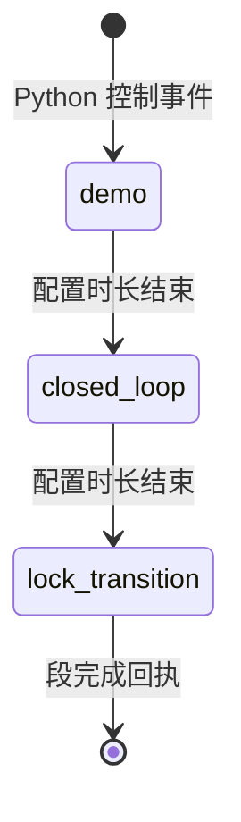

# V-01 完整参与者旅程 v1.0

## 边界说明

完整研究旅程包含 Unity 核心之外的前测和后测，但 Unity 核心本身不呈现问卷、不接收参与者操作，也不读取前后测答案。第一模块由 Python 按已冻结 manifest 选择，Unity 不从前量表推断入口。

## 总览

模块 1 至模块 4 分别消费 manifest 中的位置 0 至 3。每个位置只能是 `storm/heat/snow/fade` 之一，四者恰好各一次。

## 逐段旅程

| 旅程节点 | 参与者所见所闻 | 参与者操作 | Unity 状态 | Python/记录状态 | 进入下一节点条件 |
|---|---|---|---|---|---|
| J-01 现场准备 | 屏幕不展示核心材料 | 无 | 未进入正式会话 | 完成设备、构建、许可、存储和分配门 | 全部门通过 |
| J-02 标准化说明 | 由现场人员提供同版说明 | 只听取说明 | 可停留在非核心占位画面 | 记录说明版本，不启动核心计时 | 现场人员在外部确认 |
| J-03 实验前量表 | 外部表单或纸面材料 | 填写量表 | 不显示量表内容 | 量表进入后续分析数据；Unity 不读取答案 | 前测提交且分配有效 |
| J-04 中性入口 | 全屏、低信息量的准备画面；无技术状态 | 无 | 已握手，处于 `PREPARED` 镜像 | manifest 已不可覆盖落盘，Unity 已确认 prepare | 现场人员从外部发起 start |
| J-05 模块揭示 | 当前模块环境自然出现，不显示技术标识 | 无 | `RUNNING`，加载 manifest 指定模块 | 发送同一 `event_id/control_seq` 的模块与 demo 控制 | Unity ACK 且首帧回执有效 |
| J-06 demo | 主要看到目标节律和该模块的核心机制示范；实际与累计信息按规范保持不误导 | 无 | 镜像 `demo` | 单调计时、事件与回执持续记录 | 配置中的 demo 时长结束 |
| J-07 closed_loop | 目标、实际、累计变化同时形成可区分关系；声音保持条件公平 | 无 | 镜像 `closed_loop` | 交互状态估计与四层真值由 Python 下发；Unity 只渲染 | 配置中的 closed_loop 时长结束 |
| J-08 lock_transition | 当前模块的累计状态被锁定，环境自然收束并准备转场 | 无 | 镜像 `lock_transition` | 锁定累计值，记录段结束与回执 | 配置中的 lock_transition 时长结束 |
| J-09 模块间转场 | 无需操作的短暂连续过渡，不出现选择菜单或评分 | 无 | 仅按下一个控制事件切换 | 若未到第四模块，推进 manifest 下一个位置 | 下一模块事件有效且 Unity ACK |
| J-10 四模块结束 | 场景完成收束，显示中性完成画面 | 无 | 镜像 `COMPLETED` | 第四模块结束后由 Python 产生正常 end 并封存摘要 | seal 和最终回执可核对 |
| J-11 实验后量表 | 离开核心画面后填写量表与体验评估 | 填写量表 | 不再推进核心状态 | 前后量表、SCCI、理解、负担和条件猜测进入分析数据 | 后测提交 |
| J-12 数据检查 | 参与者不接触操作台 | 无 | 构建保持结束态 | 现场人员检查会话完整性和缺失原因，不向参与者解释假设 | 记录检查结果 |

## 单模块内部状态

### demo

- 目标：让参与者先理解本模块的目标节律和核心环境机制。
- 画面：优先展示目标层，不使用成绩或成功判定。
- 证据：段开始、目标状态、帧序、ACK、首帧和段结束回执。

### closed_loop

- 目标：在同一环境中并列呈现目标、实际与累计变化。
- 画面：实际偏离目标时仍保持连续，累计变化更新规则对两条件一致。
- 证据：目标/实际相位、置信度、累计值、降级状态、帧序和回执。

### lock_transition

- 目标：冻结本模块累计状态，明确一个模块已经结束，并平滑进入下一个模块。
- 画面：不能继续伪装为实时更新，也不能显示对参与者的结果评价。
- 证据：锁定事件、最终累计值、段结束回执和下一模块控制事件。

## 异常旅程

| 情况 | 参与者画面 | 系统行为 | 证据要求 |
|---|---|---|---|
| 启动门未通过 | 保持非核心中性等待画面 | 不发送 start，不展示核心材料 | 原因码和失败门，不记录敏感值 |
| 暂停 | 环境进入稳定保持态，不显示进度损失 | Python 保持权威计时冻结，Unity 只镜像 `PAUSED` | 暂停/恢复事件与截止时间顺延 |
| `DEGRADED` | 仍显示真实但低置信度的实际信息，并自然提示可靠性下降 | 不补零，不改变顺序和时长 | 状态、原因码和帧回执 |
| `UNUSABLE` | 停止把实际层表现为可信实时输入，目标与累计锁定语义保持清楚 | 不猜测实际相位，等待上游状态变化 | 不可用区间与恢复点 |
| `DISCONNECTED` | 使用中性保持表达，参与者无需排障 | Python 按正式策略决定继续等待或中止 | 断连、策略决定和中止回执 |
| 正式存储失败 | 画面平稳结束，不继续正常内容 | 尽力发送 abort，停止正常控制和遥测 | 存储错误、abort 尝试和最终状态 |
| Unity 失败或 ACK 耗尽 | 画面可能中止，现场人员接管 | 正式模式中止，不把失败运行记为完成 | 重试、ACK、错误码和 seal 状态 |

## 旅程验收问题

1. 参与者是否能在不触碰键鼠的情况下走完整个核心旅程？
2. 第一模块是否完全来自 manifest，而不是量表答案或 Unity 本地逻辑？
3. 四个模块是否各一次，且每个模块都经过三个固定段？
4. 参与者看到的关键变化能否对应到记录中的上游真值和渲染回执？
5. 数据降级、暂停和中止是否不会伪装成正常完成？
6. 核心结束后是否才进入后测，且后测不反向影响已经完成的体验？
