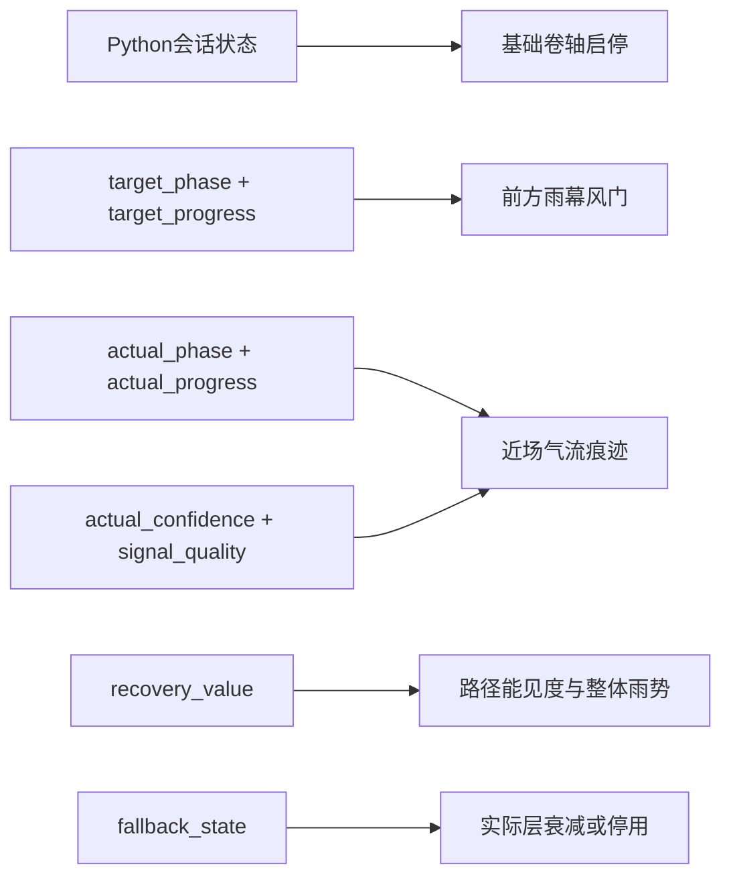

# V-02 节点5：风雨隘口与雨幕风门规格

> 状态：ACCEPTED
> 技术ID：`storm`
> 呼吸功能位置：`3-3-3-3`等时四阶段
> 可见环境概念：风雨隘口
> 唯一核心机制：雨幕风门

## 1. 设计目标

在持续横向卷动的风雨山谷中，使用局部“雨幕风门”表达等时四阶段目标，而不是让整片天气随每次呼吸同步变化。目标、实际、累计状态和基础天气分别接受各自权威输入，使画面自然但仍可审查。

雨幕风门不是一扇实体门。它是山谷前方两侧雨幕、云雾边界和局部气流共同形成的可通行廊道。四阶段构成一个无好坏方向的循环，收拢不表示退步，展开也不表示奖励。

## 2. 四阶段映射

| 阶段 | `TargetCue`：前方雨幕风门 | `ActualFeedback`：近场气流痕迹 | 映射目的 |
|---|---|---|---|
| 吸气 `inhale` | 两侧雨幕边界连续向外、向上让开，廊道拱顶抬升，目标进度决定展开比例 | 近场细气流与雨丝沿弧线向上、向外展开，实际进度决定运动位置 | 对应“展开或上升” |
| 吸后停留 `hold_after_inhale` | 风门保持最大边界与稳定张力，不继续放大、不抖动 | 若实际也进入停留，近场轨迹保持；若实际仍处于其他相位，则继续显示其真实相位 | 对应“稳定保持”，并保留目标与实际差异 |
| 呼气 `exhale` | 廊道中的积聚气流向前并沿谷壁向下排出；风门从高位平缓收拢到中性宽度，不突然关闭 | 近场气流和雨丝沿弧面向前、向下沉降，实际进度决定下行位置 | 对应“收拢或下降”，但不制造环境恶化含义 |
| 呼后停留 `hold_after_exhale` | 风门稳定停在中性宽度，残余气流停止位移，等待下一周期 | 实际层按自身相位保持或继续，不强行与目标对齐 | 对应第二次稳定保持 |

每个阶段边界使用短暂连续过渡，禁止闪白、跳帧、突然缩放和阶段特有文字。V-03提出缓动边界，U-03或对应天气实现包以运行录像冻结。

## 3. 空间职责

| 层 | 屏幕职责 | 是否表达呼吸相位 |
|---|---|:---:|
| 天空与远山 | 建立风雨隘口、纵深和统一画风 | 否 |
| 基础雨幕与云雾 | 非周期性环境运动，维持天气存在 | 否 |
| 前方雨幕风门 | 位于前进方向的中远景，表达目标相位和进度 | 仅场景原生条件 |
| 近场气流痕迹 | 位于近景安全区域，表达实际相位、进度与可用程度 | 仅场景原生条件 |
| 路径能见度与整体雨势 | 只随`recovery_value`缓慢改变 | 否 |
| 前景遮挡 | 提供速度感，不能遮住目标和实际区域 | 否 |

目标位于“前方”，实际位于“当前近场”。参与者通过空间位置和材质区分两者；系统不增加误差箭头、对齐评分或额外奖励动画。

## 4. 驱动关系

禁止增加以下反向或横向耦合：

- 实际层不得推进或修正目标风门；
- 目标风门不得伪造实际层与目标一致；
- Unity不得根据目标与实际的视觉距离自行更新累计状态；
- 基础雨势不得按目标周期呼吸；
- 基础卷轴速度不得根据实际相位、匹配程度或累计状态改变。

## 5. Unity输入与行为

| 接口 | 本场景行为 |
|---|---|
| `SetTargetPhase(phase, progress)` | 只更新前方雨幕风门的阶段和归一化进度 |
| `SetActualPhase(phase, progress, quality)` | 只更新近场气流痕迹；`quality`控制可见确定性，不改写目标 |
| `SetRecovery(value)` | 低频更新路径能见度、远景清晰度和限定范围内的整体雨势 |
| `SetFallback(active, reason)` | 实际层逐渐衰减或停用；目标风门继续；不显示评价性反馈 |
| `LockAtClosedLoopEnd()` | 锁定累计状态，停止接受新的实际变化，进入统一转场 |
| `ResetForSession()` | 恢复固定卷轴起点、中性风门、初始天气和无残留实际层 |

暂停时，卷轴、目标、实际、粒子和累计过渡同时冻结；恢复后从同一视觉状态继续。Unity只做插值和平滑，不自行推进呼吸阶段。

## 6. 两种提示条件

### 场景原生条件

- 前方雨幕风门显示目标；
- 近场气流痕迹显示实际；
- 不显示抽象双环。

### 抽象双环条件

- 外环显示目标，内环显示实际；
- 雨幕风门保留为中性场景构图，但不得按目标或实际周期变化；
- 近场气流只保留与两条件相同的非周期性环境运动，不表达实际；
- 路径能见度、整体雨势、共同声音、卷轴路径和累计变化与场景原生条件一致。

两种条件比较的是完整提示表示方案。雨幕风门相位动画属于场景原生表示的一部分，不将结果解释为单独的“风门位置”或“雨幕形状”作用。

## 7. 累计与降级边界

`RecoveryState`只使用Python传入的`recovery_value`，以显著慢于单个周期的速度改变远景清晰度、道路可见度和整体雨势。其变化范围必须受限，不能让后半段变成另一套场景，也不能帮助参与者推断当前相位。

输入可用程度下降时，仅实际层降低可见确定性或停用。目标风门保持开环运行，基础天气不突然增强，累计按上游冻结规则暂停或谨慎更新。画面不得把信息受限表达为参与者失败。

## 8. 生图与分层约束

生成背景时只制作风雨隘口、山谷、基础雨幕、道路和前景遮挡。风门的相位边界、近场气流和累计天气遮罩必须作为独立透明层、遮罩或Unity效果实现，不能烘焙在一张长背景中。

连续卷轴段使用同一风格锚点、地平线、谷道宽度和重叠参考区。每段必须预留不被闪电、强光或大型前景物占据的目标安全区和实际安全区，以便后续动画不与背景争夺可见性。

## 9. 节点5通过条件

1. 四个目标阶段仅由`target_phase/target_progress`重建，且停留阶段无漂移。
2. 实际层可用独立fixture显示与目标不同的阶段，不被自动吸附或修正。
3. 抽象条件录像中，天气背景无法泄露目标周期。
4. 同一`recovery_value`在两条件产生一致的慢变量天气变化。
5. 暂停、恢复和重置不会跳相位或遗留上一模块状态。
6. 生成素材可以按层独立替换，接缝检查不依赖呼吸动画。

## 10. 决策结果

“风雨隘口 + 雨幕风门”已被接受为`storm`功能位置的正式环境与唯一核心机制。本文件的四阶段映射和驱动隔离构成后续实现边界；V-03与V-04提出并预演参数，U-03或对应天气实现包以运行证据冻结。
