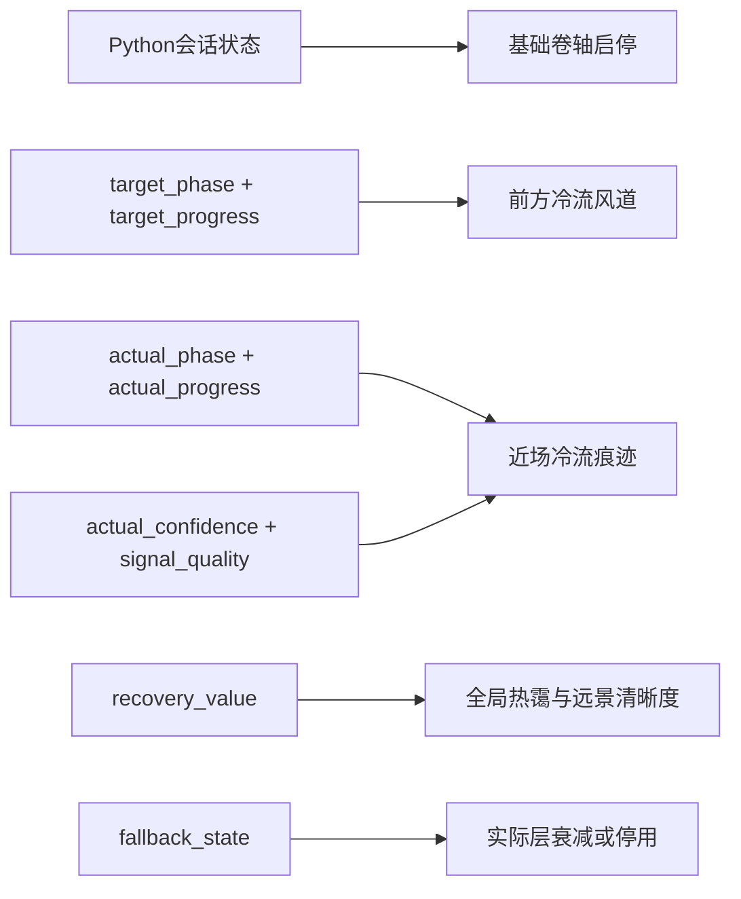

# V-02 节点6：热浪盐原与冷流风道规格

> 状态：ACCEPTED
> 技术ID：`heat`
> 呼吸功能位置：`4-6`延长呼气
> 可见环境概念：热浪盐原
> 唯一核心机制：冷流风道

## 1. 设计目标

在横向卷动的盐原中，以一股先汇集、再贴地长距离推进的冷流表达`4-6`结构。吸气负责形成冷流势能，呼气负责较长时间的释放和推进；延长呼气通过运动持续时间与空间行程呈现，不使用文字倒计时、亮度奖励或卷轴加速。

基础热浪是天气背景，不随单个呼吸周期同步起伏。累计状态只缓慢改变全局热霭，避免把“当前呼气”和“过程累计”混为同一视觉变化。

## 2. 两阶段映射

| 阶段 | `TargetCue`：前方冷流风道 | `ActualFeedback`：近场冷流痕迹 | 映射目的 |
|---|---|---|---|
| 吸气 `inhale`，目标4秒 | 前方中远景的细冷流从地表裂隙和低洼处向上汇集，弧形风带逐渐展开并抬升；末端形成稳定的待释放流头 | 近场较细的气流、盐尘边缘或冷色折射按实际相位与进度向上、向外汇集 | 对应“展开或上升”，建立后续释放的可见准备 |
| 呼气 `exhale`，目标6秒 | 风带收窄并向下贴近地表，流头沿前进方向持续推进；尾部有序回收，使整个6秒均存在可追踪运动 | 近场冷流按实际进度向前、向下运行；实际呼气提前结束或延长时，只改变近场痕迹，不修正目标风道 | 对应“收拢或下降”，用更长行程显现延长呼气 |

目标呼气结束时，流头自然离开目标安全区、尾部回收到中性起点；下一次吸气从新的细流种子开始，避免整条风带瞬间倒放。V-03提出路径、宽度、透明度和缓动边界，对应天气实现包以运行证据冻结。

## 3. 单调动画关系

对阶段进度`p`使用`0..1`归一化关系，V-02只冻结方向：

- 目标吸气：抬升高度、展开宽度和汇集完整度随`p`单调增加；
- 目标呼气：垂直高度随`p`单调下降，前向行程随`p`单调增加，风带厚度平缓收窄；
- 实际层使用相同方向语法，但只读取实际相位与进度；
- `actual_confidence`只影响实际层的边缘稳定度和可见确定性，不改变目标路径；
- 任一阶段切换都不得通过闪烁、突然变色或卷轴速度变化强调。

这些关系保证6秒呼气比4秒吸气具有更长的时间和空间展开，但不把呼气渲染得更亮、更强或更像奖励。

## 4. 空间职责

| 层 | 屏幕职责 | 是否表达呼吸相位 |
|---|---|:---:|
| 天空、远山和盐原 | 建立干热、开阔的统一环境 | 否 |
| 基础热霭 | 非周期性折射和缓慢横移，维持天气存在 | 否 |
| 前方冷流风道 | 位于前进方向的中远景，表达目标相位与进度 | 仅场景原生条件 |
| 近场冷流痕迹 | 位于近景安全区，表达实际相位、进度与可用程度 | 仅场景原生条件 |
| 远景清晰度与热霭强度 | 只随`recovery_value`缓慢改变 | 否 |
| 前景盐晶和岩块 | 提供卷轴速度参照，不遮挡提示区域 | 否 |

目标与实际使用不同深度、线条粗细和局部材质，但保持同一相位运动语法。不得用冷暖颜色单独承担阶段区分，防止颜色差异替代运动信息。

## 5. 驱动关系

禁止增加以下耦合：

- 实际冷流不得推进、减速或纠正目标冷流；
- Unity不得根据两股冷流是否重合自行增加累计状态；
- 目标或实际相位不得改变基础卷轴速度；
- 基础热霭不得按4秒或6秒周期起伏；
- 累计热霭变化不得反向修改目标阶段、持续时间或风道路径。

## 6. Unity输入与行为

| 接口 | 本场景行为 |
|---|---|
| `SetTargetPhase(phase, progress)` | 只更新前方目标风道；本模块只接受吸气与呼气相位 |
| `SetActualPhase(phase, progress, quality)` | 只更新近场实际痕迹；实际可与目标处于不同相位 |
| `SetRecovery(value)` | 低频改变全局热霭强度与远景清晰度，不生成相位运动 |
| `SetFallback(active, reason)` | 实际层边缘先失去稳定度，再按上游状态衰减或停用；目标继续 |
| `LockAtClosedLoopEnd()` | 锁定累计视觉状态，停止新的实际变化并进入统一转场 |
| `ResetForSession()` | 恢复固定卷轴起点、中性风道、初始热霭和无残留实际层 |

暂停时冻结卷轴、目标、实际、热霭时间参数和粒子；恢复后从相同视觉状态继续。Unity只插值收到的权威状态，不按照本地计时器自行完成4秒或6秒阶段。

## 7. 两种提示条件

### 场景原生条件

- 前方冷流风道表达目标；
- 近场冷流痕迹表达实际；
- 不显示抽象双环。

### 抽象双环条件

- 外环表达目标，内环表达实际；
- 目标风道与实际痕迹的相位动画关闭，不保留4秒或6秒周期线索；
- 盐原、基础热霭、前景卷动、共同声音及累计热霭变化与场景原生条件一致；
- 不增加呼气专属风声、冷却音效或文字提示。

两条件仍是完整提示表示方案，不把结果解释为单独的冷色、运动距离或提示位置作用。

## 8. 累计与降级边界

`RecoveryState`只读取上游`recovery_value`，在显著慢于10秒呼吸周期的时间尺度上有限降低全局热霭并提升远景轮廓清晰度。累计变化不得消除热浪盐原的场景身份，也不得在每次呼气结束时产生阶跃奖励。

输入可用程度下降时，近场实际痕迹先降低边缘稳定度，再按冻结状态衰减或停用。目标冷流继续开环运行；基础天气不突然增强，累计状态按上游规则暂停或谨慎更新。

## 9. 生图与分层约束

背景生成只负责天空、远山、盐原地表、非周期性热霭参考和前景对象。目标冷流、实际冷流、累计热霭遮罩及折射效果必须分层或在Unity中生成，不能烘焙进长卷轴背景。

各卷轴段使用同一地平线、盐原裂纹尺度、热霭强度基线和重叠参考区。中远景目标安全区与近景实际安全区不能被大型盐晶、强太阳反光或持续高对比对象占据。

## 10. 节点6通过条件

1. 目标4秒吸气和6秒呼气可由目标fixture独立重建，呼气运动持续时间和前向行程更长。
2. 实际层可显示与目标不同的相位和进度，不自动吸附或改变目标。
3. 抽象条件录像中的热霭、卷轴和声音不泄露4秒或6秒周期。
4. 两条件对同一`recovery_value`产生一致的慢变量热霭变化。
5. 暂停、恢复、重置和模块切换不会跳相位或遗留冷流。
6. 呼气延长不依赖文字、亮度奖励、屏幕闪烁或卷轴加速。

## 11. 决策结果

本文件的两阶段映射、目标与实际空间关系、累计热霭边界以及两条件隔离规则已被接受。“热浪盐原 + 冷流风道”转为节点6正式规格；V-03与V-04提出并预演美术和动画数值，对应天气实现包以运行证据冻结。
