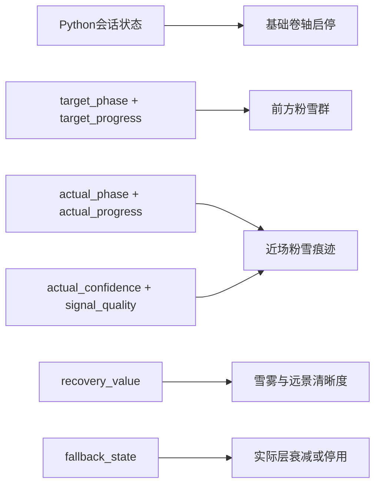

# V-02 节点7：雪雾松林与粉雪升沉规格

> 状态：ACCEPTED
> 技术ID：`snow`
> 呼吸功能位置：`5-5`等时吸呼
> 可见环境概念：雪雾松林
> 唯一核心机制：粉雪升沉

## 1. 设计目标

在横向卷动的雪雾松林中，以粉雪沿同一空间范围升起和落下表达`5-5`等时吸呼。两个阶段共享相同持续时间、运动行程、粒子数量、对比范围和缓动函数，避免把其中一个阶段表现得更重要或更像奖励。

粉雪升沉只发生在局部提示区域。基础降雪、林间雾和卷轴运动不跟随呼吸周期，累计状态只缓慢改变雪雾与远景可见程度。

## 2. 两阶段映射

| 阶段 | `TargetCue`：前方粉雪群 | `ActualFeedback`：近场粉雪痕迹 | 映射目的 |
|---|---|---|---|
| 吸气 `inhale`，目标5秒 | 前方中景枝头与地表边缘的粉雪沿冻结轨迹缓慢升起，群体质心上移、横向范围舒展；末端稳定到最高边界 | 近场较细、较稀疏的粉雪痕迹按实际相位与进度向上、向外移动 | 对应“展开或上升” |
| 呼气 `exhale`，目标5秒 | 同一粉雪群沿镜像轨迹缓慢下降并向内收拢，回到枝头与地表附近；末端稳定落回中性边界 | 近场粉雪痕迹按实际相位与进度向下、向内移动，不受目标位置吸附 | 对应“收拢或下降” |

吸气末端与呼气起点共享同一最高边界，呼气末端与下一吸气起点共享同一中性边界，不进行粒子瞬移、整组重生或动画倒带闪切。

## 3. 等时镜像关系

对阶段进度`p`使用`0..1`归一化关系，目标吸气位置记为`E(p)`，目标呼气位置使用`1-E(p)`。两阶段使用同一缓动函数、同一轨迹长度和同一峰值速度限制，仅运动方向相反。

以下属性在两阶段保持一致：

- 可见粒子总量与粒径分布；
- 平均亮度、透明度和局部对比上限；
- 目标安全区面积与运动路径长度；
- 阶段边界的停稳方式；
- 非相位环境声和基础降雪。

不得通过吸气增亮、呼气变暗，或通过某一阶段增加树木显现、路径开启、奖励音效来区分方向。

## 4. 空间职责

| 层 | 屏幕职责 | 是否表达呼吸相位 |
|---|---|:---:|
| 天空、远林和地表 | 建立雪雾松林与横向纵深 | 否 |
| 基础降雪与林间雾 | 使用固定随机种子或可重放噪声形成非周期性天气 | 否 |
| 前方粉雪群 | 位于前进方向的中景枝头和地表边缘，表达目标相位与进度 | 仅场景原生条件 |
| 近场粉雪痕迹 | 位于近景安全区，表达实际相位、进度与可用程度 | 仅场景原生条件 |
| 雪雾强度与远景轮廓 | 只随`recovery_value`缓慢改变 | 否 |
| 前景树干和枝叶 | 提供视差和速度参照，不遮挡提示区域 | 否 |

目标和实际通过景深、粒径、局部材质和安全区分离，但使用同一升沉方向语法。颜色只作辅助，不能成为唯一相位线索。

## 5. 确定性驱动

粉雪提示不得依赖不可重放的自由粒子物理。V-03应指定固定种子、预计算轨迹、参数化曲线或等价的确定性约束；对应天气实现包证明同一`phase + progress + config_hash`产生相同位置集合和渲染状态。

禁止增加以下耦合：

- 实际粉雪不得推动、吸附或修正目标粉雪；
- Unity不得按两组粉雪的视觉重合程度更新累计状态；
- 基础降雪和林间雾不得形成5秒或10秒周期；
- 卷轴速度不得随目标、实际或累计状态变化；
- 累计雪雾不得反向改变目标轨迹、阶段边界或持续时间。

## 6. Unity输入与行为

| 接口 | 本场景行为 |
|---|---|
| `SetTargetPhase(phase, progress)` | 只更新前方目标粉雪；本模块只接受吸气与呼气相位 |
| `SetActualPhase(phase, progress, quality)` | 只更新近场实际粉雪；允许与目标处于不同相位和进度 |
| `SetRecovery(value)` | 低频改变雪雾强度和远景轮廓，不生成相位运动 |
| `SetFallback(active, reason)` | 实际粉雪先降低轨迹确定性，再按上游状态衰减或停用；目标继续 |
| `LockAtClosedLoopEnd()` | 锁定累计视觉状态，停止新的实际变化并进入统一转场 |
| `ResetForSession()` | 恢复固定卷轴起点、目标中性边界、初始雪雾和无残留实际层 |

暂停时冻结卷轴、目标、实际、基础降雪噪声时间和累计过渡；恢复后从同一视觉状态继续。Unity不使用本地计时器自行完成5秒阶段。

## 7. 两种提示条件

### 场景原生条件

- 前方粉雪群表达目标；
- 近场粉雪痕迹表达实际；
- 不显示抽象双环。

### 抽象双环条件

- 外环表达目标，内环表达实际；
- 前方和近场的相位锁定粉雪层关闭；
- 仅保留与场景原生条件相同、可重放且非周期性的基础降雪和林间雾；
- 雪雾累计变化、卷轴路径、共同声音和转场保持一致；
- 不增加吸气或呼气特有的风声、落雪声和文字提示。

两条件的提示像素数量、运动幅度和显著度差异进入后续公平审计，不以背景粒子补成伪等价画面。

## 8. 累计与降级边界

`RecoveryState`只读取上游`recovery_value`，在显著慢于10秒呼吸周期的时间尺度上有限降低林间雪雾并提升远景树线清晰度。累计变化不得让雪雾松林失去场景身份，也不得在每次呼气结束时显现新道路、脚印或奖励对象。

输入可用程度下降时，近场实际粉雪先失去轨迹确定性，再按冻结状态衰减或停用。目标粉雪保持开环运行；基础天气不突然增强，累计状态按上游规则暂停或谨慎更新。

## 9. 生图与分层约束

背景生成只负责天空、远林、中景松树、地表积雪和前景树干。目标粉雪、实际粉雪、基础降雪、林间雾与累计遮罩必须作为独立层或Unity效果实现，不能烘焙进长卷轴背景。

连续卷轴段使用同一树种、树干尺度、积雪厚度、地平线和重叠参考区。中景枝头需预留目标发射锚点，近景安全区需避免持续高对比树干；所有锚点在分层导出后仍保持公共画布与原点。

## 10. 节点7通过条件

1. 目标5秒吸气和5秒呼气使用镜像轨迹、同一缓动、同一运动行程和同一视觉强度范围。
2. 同一fixture和配置哈希可重建相同目标粉雪状态，不依赖自由物理漂移。
3. 实际层可显示与目标不同的相位和进度，不自动吸附或修改目标。
4. 抽象条件中的基础降雪、林间雾和声音不泄露5秒或10秒周期。
5. 两条件对同一`recovery_value`产生一致的慢变量雪雾变化。
6. 暂停、恢复、重置和模块切换不会跳相位或遗留粒子。

## 11. 决策结果

本文件的镜像升沉映射、确定性粒子驱动、目标与实际空间关系、累计雪雾边界以及两条件隔离规则已被接受。“雪雾松林 + 粉雪升沉”转为节点7正式规格；V-03与V-04提出并预演美术和动画数值，对应天气实现包以运行证据冻结。
