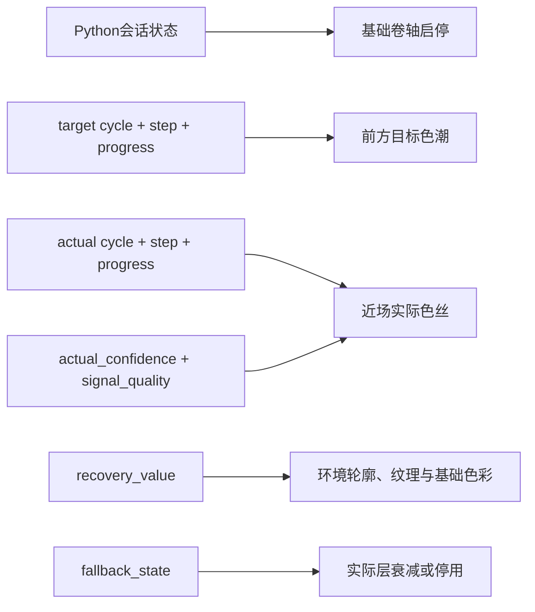

# V-02 节点8：灰霾湿地与色潮回流规格

> 状态：ACCEPTED
> 技术ID：`fade`
> 呼吸功能位置：第一吸气、较短补吸、缓慢完整呼气
> 可见环境概念：灰霾湿地
> 唯一核心机制：色潮回流
> 接口前置：F-01 v2.2相位实例合同

## 1. 设计目标

在横向卷动的低饱和湿地中，以两次可区分的光色汇集和一次较长的沿水道回流表达双吸长呼气结构。当前周期的色潮是局部、暂时的提示，不永久改变背景；环境轮廓、纹理和基础色彩的缓慢恢复只由累计状态驱动。

该分离避免把“此刻应跟随的阶段”和“本模块截至当前的累计变化”都做成同一种持续上色动画。颜色只作辅助，步骤还必须通过运动方向、流体轮廓和第二次短促波峰辨认。

## 2. 三步骤映射

| 步骤 | 粗相位 | `TargetCue`：前方色潮 | `ActualFeedback`：近场色丝 | 映射目的 |
|---|---|---|---|---|
| 第一吸气 `inhale_1` | `inhale` | 前方中远景的分散光色从湿地叶缘、水面和雾中向上汇集，形成第一股宽缓主流；展开高度和完整度随步骤进度增加 | 近场较细色丝按实际步骤与进度向上、向外汇集 | 对应第一次连续展开，建立主流 |
| 较短补吸 `inhale_2` | `inhale` | 主流不回零；第二股更窄的光色从相邻位置短促上升并汇入，在轮廓上形成可辨认的第二个扩展波峰 | 只有交互状态估计识别到`actual_step_id=inhale_2`时才出现第二股近场色丝 | 对应短促二次展开，不用闪烁或突然增亮代替 |
| 长呼气 `exhale_1` | `exhale` | 两股色流合并后收窄、下降并进入前方水道，沿卷轴前进方向持续流过较长空间；尾部有序回收 | 近场色丝按实际呼气进度向下、向前流动，可与目标不同步 | 对应收拢、下降和较长释放 |

第一吸气结束与补吸起点共享同一主流状态，补吸结束与长呼气起点共享同一合并状态。长呼气结束时流头离开目标安全区、尾部回到中性种子，不进行倒放或整层闪切。

## 3. 时长和步骤权威

V-02只冻结步骤顺序和相对关系：

```text
inhale_1 -> inhale_2 -> exhale_1
```

精确目标时长由`breath_protocol_config_version/hash`指向的冻结配置提供，并满足：

- `inhale_2`短于`inhale_1`；
- `exhale_1`是缓慢完整呼气；
- Python按配置产生步骤、周期和步骤内进度；
- Unity不使用本地计时器补齐或重算时长。

在Level材料生成前，精确时长、容许范围和边界事件必须完成另行复核；V-02不自行补造秒数。

## 4. 目标与实际关系

目标色潮位于前进方向的中远景，回答“当前目标步骤是什么、进展到哪里”；实际色丝位于近景安全区，回答“交互状态估计当前识别到哪个步骤、进展到哪里”。二者使用不同景深、线宽和纹理，但共享展开、二次展开、下降回流的运动语法。

每个v2.2遥测帧必须自包含：

```text
target_cycle_index + target_step_id + target_progress
actual_cycle_index + actual_step_id + actual_progress + actual_confidence
```

Unity不得用目标步骤填补`actual_step_id=null`，不得在缺少实际补吸时自动生成第二股近场色丝，也不得因目标与实际视觉重合而增加累计状态。

## 5. 空间职责

| 层 | 屏幕职责 | 是否表达呼吸步骤 |
|---|---|:---:|
| 天空、远岸和湿地地表 | 建立灰霾湿地与横向纵深 | 否 |
| 基础雾、微波纹和植被摆动 | 使用可重放、非周期性环境运动 | 否 |
| 前方色潮主流与补流 | 表达目标步骤与步骤内进度 | 仅场景原生条件 |
| 近场色丝 | 表达实际步骤、进度与可用程度 | 仅场景原生条件 |
| 轮廓连续度、纹理完整度与基础色彩 | 只随`recovery_value`缓慢改变 | 否 |
| 前景芦苇和水岸遮挡 | 提供视差和速度参照，不遮挡提示区域 | 否 |

基础环境保持低饱和但不采用纯灰度。目标和实际同时使用轮廓、运动和局部亮度差异，不能仅靠色相区分，以保留可访问性和灰阶录像审查能力。

## 6. 确定性驱动

色潮不得依赖不可重放的自由流体模拟。V-03应指定固定样条、参数化遮罩、固定种子粒子或等价的确定性约束；对应天气实现包证明同一协议哈希、步骤、周期和进度产生相同状态。



禁止增加以下耦合：

- 实际色丝不得推进、吸附或修正目标色潮；
- 目标色潮经过后不得永久给背景上色；
- Unity不得根据色潮覆盖面积自行更新累计状态；
- 基础雾、波纹、植被或共同声音不得泄露三步骤周期；
- 卷轴速度不得随步骤、实际匹配或累计状态变化；
- 累计基础色彩不得反向改变目标步骤、持续时间或流动路径。

## 7. Unity输入与行为

| 接口 | 本场景行为 |
|---|---|
| `SetTargetPhase(phase, progress)`的v2.2等价接口 | 同时消费`target_step_id`，只更新前方目标色潮 |
| `SetActualPhase(phase, progress, quality)`的v2.2等价接口 | 同时消费`actual_step_id`，只更新近场实际色丝 |
| `SetRecovery(value)` | 低频改变环境轮廓、纹理和基础色彩，不生成步骤动画 |
| `SetFallback(active, reason)` | 实际色丝先降低边缘确定性，再按上游状态衰减或停用；目标继续 |
| `LockAtClosedLoopEnd()` | 锁定累计视觉状态，停止新的实际变化并进入统一转场 |
| `ResetForSession()` | 恢复固定卷轴起点、中性色潮种子、初始灰霾和无残留实际层 |

正式实现应新增显式步骤参数或自包含帧适配器，不得通过Unity内部帧历史猜测`inhale_1`与`inhale_2`。暂停时冻结卷轴、目标、实际、环境噪声时间和累计过渡；恢复后从同一帧状态继续。

## 8. 两种提示条件

### 场景原生条件

- 前方色潮表达目标三步骤；
- 近场色丝表达实际三步骤；
- 不显示抽象双环。

### 抽象双环条件

- 外环第一段扩张表达`inhale_1`；
- 外环在当前半径基础上进行第二次较短扩张，表达`inhale_2`；
- 外环长时间收缩表达`exhale_1`；
- 内环以同一规则表达实际步骤，`actual_step_id=null`时按降级规则衰减或停用；
- 场景目标色潮和实际色丝关闭，仅保留相同的非周期性基础环境与累计变化；
- 不增加步骤特有的声音、文字或闪光。

双环同样必须消费v2.2步骤字段，不能通过粗相位和进度回零推断补吸。

## 9. 累计与降级边界

`RecoveryState`只读取上游`recovery_value`，在显著慢于单个双吸长呼气周期的时间尺度上有限恢复远岸轮廓、植被纹理和背景基础色彩。累计变化不沿当前目标色潮路径推进，也不在每次长呼气结束时产生阶跃奖励。

输入可用程度下降时，近场实际色丝先降低边缘确定性，再按冻结状态衰减或停用。目标色潮保持开环运行；基础灰霾不突然增强，累计状态按上游规则暂停或谨慎更新。

## 10. 生图与分层约束

背景生成只负责天空、远岸、湿地水面、植被、灰霾基线和前景遮挡。目标色潮、实际色丝、基础雾、波纹、累计轮廓/纹理遮罩及色彩恢复遮罩必须独立分层或在Unity中生成，不能烘焙进长卷轴背景。

连续卷轴段使用同一水位线、植被尺度、低饱和色板、地平线和重叠参考区。中远景水道预留目标流动路径，近景预留实际安全区；不得让高反光水面、大型芦苇或强对比边缘持续占据提示区域。

## 11. 节点8通过条件

1. `inhale_1`、`inhale_2`和`exhale_1`可由v2.2自包含帧直接重建，无需帧历史推断。
2. 第二次吸气在不闪烁、不回零主流的前提下形成可辨认的短促第二波峰。
3. 实际层缺少补吸时不会自动生成`inhale_2`，并可与目标显示不同步骤。
4. 当前目标色潮经过后不永久改变背景；累计环境变化只绑定`recovery_value`。
5. 抽象条件的基础环境与共同声音不泄露三步骤周期，双环明确表达第二次扩张。
6. 暂停、恢复、重连、丢帧、重置和模块切换不会错认步骤或遗留色潮。
7. 精确步骤时长、v2.2合同、配置哈希和消费者迁移未完成前，正式运行门保持关闭。

## 12. 决策结果

本文件的三步骤色潮映射、v2.2驱动关系、目标与实际空间分离、累计环境边界和两条件隔离规则已被接受。“灰霾湿地 + 色潮回流”转为节点8正式规格；正式实现仍依赖F-01 v2.2及消费者迁移完成复核。
