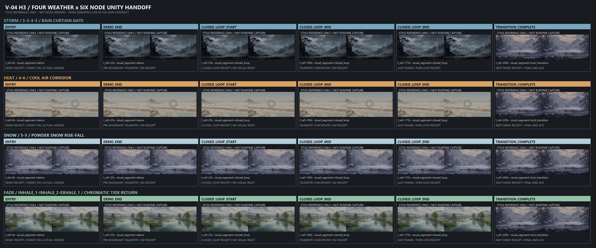

# V-04 H3四天气六节点Unity交接分镜 v1.0

> 状态：`MACHINE_PASS_READY_FOR_INDEPENDENT_REVIEW`
>
> 机器可读权威：`V-04_H3_四天气六节点Unity交接分镜_v1.0.json`

## 1. 阅读方式

推荐时轴为`25/150/25`秒：`demo 0-25`、`closed_loop 25-175`、`lock_transition 175-200`。允许区间为`24-30/140-160/20-30`秒，正式值来自冻结配置。`DEMO_END`和`CLOSED_LOOP_START`是同一段边界的前后两个观察点，Unity不得在两点之间重置目标、实际、卷轴、环境噪声或声音。

参与者在核心体验中不操作。Python/SessionCore负责天气顺序、状态、时钟和四层真值；Unity只负责参与者画面。第一完整目标周期只显示目标，实际数据仍持续形成交互状态估计并记录；第二周期起才显示实际。四种天气都必须由F-05 v2.2显式提供周期身份，Unity不得本地计数或推断周期。累计环境状态在`closed_loop`前保持模块基线。

下图中的天气画面是统一时刻的风格参考静帧，不是六个节点的运行截图，也不证明节点画面已经实现；节点状态以表格和JSON证据模板为准。

## 2. Storm：风雨隘口 / 3-3-3-3 / 雨幕风门

| 节点 | 推荐时刻 | `scene_native` | `abstract_pacer` | 共享状态与验收 |
|---|---:|---|---|---|
| `ENTRY` | 0 s | 前方中性雨幕风门从目标周期起点开始；近场实际气流隐藏 | 外环从目标周期起点开始；内环隐藏 | 同一风雨背景、卷轴和声音从相对时间零开始；实际数据持续记录；累计雨势与路径能见度锁在基线 |
| `DEMO_END` | 25 s 前 | 风门和已淡入的近场实际气流保持当前相位，不跳回中性 | 外环和已淡入内环保持当前相位 | 累计仍为基线；低确定性只改变实际层，不改目标和天气 |
| `CLOSED_LOOP_START` | 25 s 后 | 目标、实际和卷轴连续，开始接受累计雨势/能见度输入 | 双环连续，天气开始接受同一累计输入 | 边界前后逐帧无重置，只有累计输入权限改变 |
| `CLOSED_LOOP_MID` | 100 s | 风门显示目标，近场气流显示可不同步的实际 | 外环显示目标，内环显示同一实际 | 累计变化显著慢于单周期；抽象条件的雨势、卷轴和声音不得泄露3-3-3-3 |
| `CLOSED_LOOP_END` | 175 s | 锁定最后合法实际气流和累计天气，不把实际吸附到目标 | 同时锁定内环和共同累计天气 | 不强制理想终点；收到控制事件后才退出并进入长廊 |
| `TRANSITION_COMPLETE` | 200 s 边界 | 边界前最后一帧为无提示长廊 | 同一无提示长廊 | 非末模块随后应用下一模块`segment=demo`并回执；第四模块只ACK `end`，不产生`end`渲染回执 |

## 3. Heat：热浪盐原 / 4-6 / 冷流风道

| 节点 | 推荐时刻 | `scene_native` | `abstract_pacer` | 共享状态与验收 |
|---|---:|---|---|---|
| `ENTRY` | 0 s | 中性冷流种子进入目标吸气；近场实际冷流隐藏 | 外环开始目标吸气；内环隐藏 | 同一盐原、热霭、卷轴和声音；累计热霭保持基线 |
| `DEMO_END` | 25 s 前 | 目标风道与当前实际痕迹连续，可处于不同相位 | 外环与内环连续，可处于不同相位 | 4秒吸气和6秒呼气不因段边界重算；累计仍为基线 |
| `CLOSED_LOOP_START` | 25 s 后 | 冷流状态不重置，开放累计热霭与远景清晰度输入 | 双环不重置，环境接受同一累计输入 | 只有累计输入权限改变，声音和卷轴连续 |
| `CLOSED_LOOP_MID` | 100 s | 目标长呼通过更长持续时间与前向行程表达；实际可提前或延后 | 外环按4-6目标，内环按同一实际 | 不用卷轴加速、增亮或声音表达延长呼气；基础热霭不按周期起伏 |
| `CLOSED_LOOP_END` | 175 s | 锁定最后合法实际冷流与累计热霭 | 锁定内环与共同累计热霭 | 不因目标与实际重合增加累计，不强制热霭完全消失 |
| `TRANSITION_COMPLETE` | 200 s 边界 | 边界前最后一帧为无提示长廊 | 同一无提示长廊 | 与storm相同的下一`demo`回执或第四模块`end` ACK分支 |

## 4. Snow：雪雾松林 / 5-5 / 粉雪升沉

| 节点 | 推荐时刻 | `scene_native` | `abstract_pacer` | 共享状态与验收 |
|---|---:|---|---|---|
| `ENTRY` | 0 s | 前方粉雪从中性边界开始目标吸气；近场实际粉雪隐藏 | 外环开始目标吸气；内环隐藏 | 同一松林、基础降雪、雾、卷轴和声音；累计雪雾保持基线 |
| `DEMO_END` | 25 s 前 | 目标和已淡入的实际粉雪保持当前镜像轨迹位置 | 外环和内环保持当前相位 | 吸呼粒子数量、行程、显著度和缓动对称；累计仍为基线 |
| `CLOSED_LOOP_START` | 25 s 后 | 不重生粒子、不跳相位，开放累计雪雾输入 | 双环连续，环境接受同一累计输入 | 同一配置和状态必须重建同一粒子集合 |
| `CLOSED_LOOP_MID` | 100 s | 目标粉雪与实际粉雪可异步升沉 | 外环与内环表达同一两组真值 | 基础降雪和雾是可重放非周期运动；不得形成5秒或10秒天气周期 |
| `CLOSED_LOOP_END` | 175 s | 锁定最后合法实际粉雪和累计雪雾 | 锁定内环和共同累计雪雾 | 不生成新道路、脚印或完成奖励，不强制雪雾完全消失 |
| `TRANSITION_COMPLETE` | 200 s 边界 | 边界前最后一帧为无提示长廊 | 同一无提示长廊 | 与storm相同的下一`demo`回执或第四模块`end` ACK分支 |

## 5. Fade：灰霾湿地 / 双吸长呼 / 色潮回流

| 节点 | 推荐时刻 | `scene_native` | `abstract_pacer` | 共享状态与验收 |
|---|---:|---|---|---|
| `ENTRY` | 0 s | 固定镜头、整幅完全褪色；前方第一吸色潮从中性种子开始；近场实际色丝隐藏 | 同一完全褪色固定湿地；外环开始第一吸；内环隐藏 | 整屏`color_u=0`，两条件共享；实际步骤仍记录；累计轮廓/纹理保持基线 |
| `DEMO_END` | 25 s 前 | 主流、补流或长呼回流保持当前步骤；实际色丝按当前自包含步骤显示 | 外环/内环保持当前步骤 | 整屏`color_u≈0.047`，步骤边界不改变复色速度；实际缺少补吸时不得生成第二股色丝 |
| `CLOSED_LOOP_START` | 25 s 后 | 色潮、色丝、固定相机和复色连续，开放累计轮廓/纹理输入 | 双环与共同复色连续，开放同一累计输入 | `color_u≈0.047`；段边界不得重算步骤或切换镜头 |
| `CLOSED_LOOP_MID` | 100 s | 目标色潮与近景实际色丝可处于不同步骤；累计只影响轮廓/纹理 | 双环显示同一目标与实际；环境与复色相同 | `color_u≈0.539`；复色不读取步骤或`recovery_value`，累计不沿目标水道推进 |
| `CLOSED_LOOP_END` | 175 s | 锁定最后合法实际色丝和累计纹理，准备退出湿地 | 锁定内环和共同累计状态 | `color_u≈0.982`；不强制实际、累计或颜色成为完成奖励 |
| `TRANSITION_COMPLETE` | 200 s 边界 | 边界前最后一帧为无提示长廊 | 同一无提示长廊 | 当前湿地已退出；随后采用下一`demo`回执或第四模块`end` ACK分支 |

## 6. 通用降级与转场

`DEGRADED`只让实际载体变得断续、柔化；`UNUSABLE/DISCONNECTED`冻结最后合法实际几何并显示静态断续轮廓，累计环境状态锁定最后值。目标按Python裁定继续开环或中止。任何节点都禁止填零、复制目标、生成模拟实际或把信息受限表现成参与者结果。

山雾长廊不读取目标、实际、累计或降级字段。当前天气退出30%、完整中性长廊40%、下一中性基线进入30%；两条件逐帧相同。运行候选时长20至30秒，具体值由冻结配置提供。

## 7. 证据边界

`ENTRY`、`CLOSED_LOOP_START`和进入`lock_transition`绑定已ACK的F-01 `segment`控制与渲染回执；`DEMO_END`和`CLOSED_LOOP_MID`只保存遥测帧与截图。`TRANSITION_COMPLETE`保存当前转场最后帧后，非末模块回执绑定下一模块`demo`，第四模块只保存`end` ACK。F-01回执使用`module_id`和`segment`，不使用`module_index/weather_id`。

本分镜把V-01旅程、V-02天气机制、V-03四层映射、P-01段状态和V-04样片合并为Unity交接候选。它不证明Unity运行、正式构建、资产许可放行或真实设备链完成。
