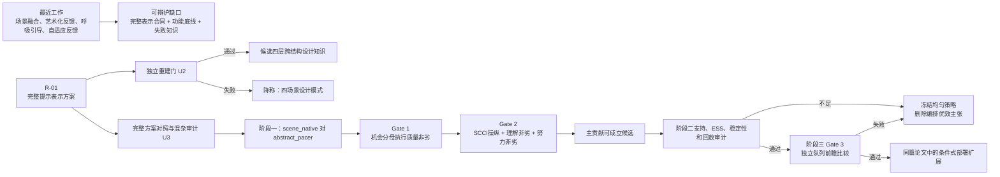

# 最近工作击穿与单篇 IJHCI 论文骨架研究包

| 字段 | 当前值 |
|---|---|
| 任务标识 | W-01 |
| 检索时间窗 | 2015-01-01至2026-08-06 |
| 检索执行日期 | 2026-08-06，Asia/Shanghai |
| 论文策略 | 单篇IJHCI；R-01完整提示表示方案为唯一主贡献；可解释序列编排仅为条件式部署扩展 |
| 项目裁定 | `REJECT_AND_RESUBMIT_DESIGN` |
| 证据状态 | `PLANNED_NOT_OBSERVED` |
| 本研究包结论 | `REVISE_REQUIRED` |

## 受控导入与项目权威

| 项 | 记录 |
|---|---|
| 外部输入 | `C:\Users\fujunye\Downloads\deep-research-report (2).md` |
| SHA-256 | `5856C9C848E13285A42CFDCD212595D53DDAFA0B37B3F69CA028AF143018CD7E` |
| 导入修复 | 移除52处无法脱离原会话复核的GPT内部引用标记；校正检索截止日、时区与两条书目元数据 |
| 验收范围 | `W-01=DONE`仅表示候选研究包交付；新颖性仍为`REVISE_REQUIRED`，证据仍为`PLANNED_NOT_OBSERVED` |

### 项目权威与上下游

- [项目规则](../../../../../AGENTS.md)
- [IJHCI独立审稿攻击与升级裁定](../../00_总控/13_IJHCI独立审稿攻击与升级裁定_v1.1.md)
- [机器可读协议权威](../../00_总控/protocol_authority_v1.1.json)
- [F-02 Gate 2构念与测量包](../../03_步骤02_构念比较条件与测量/01_F-02_Gate2构念与测量深度研究包_v0.9-candidate.md)
- [R-01四层候选语法与完整表示方案](../../20_产品与场景设计/R-01_四层表示方案/R-01_四层候选语法与完整表示方案_v0.9-candidate.md)
- [单篇IJHCI论文结构](../00_IJHCI论文结构.md)
- [核心贡献立足性论证](../01_核心贡献_IJHCI立足性论证_v1.0.md)

### 结构化附件

- [检索日志](w01-search-log.csv)
- [核心证据矩阵](w01-core-evidence-matrix.csv)
- [主张证据矩阵](w01-claims-evidence.csv)
- [DOI审计表](w01-doi-audit.csv)
- [BibTeX引用库](w01-references.bib)
- [W-01验收记录](W-01_验收记录.md)

### 核心来源稳定链接

[Adaptive Biofeedback](https://doi.org/10.1145/2851581.2859027)；[Breeze 2018](https://doi.org/10.1145/3173574.3174219)；[Blum 2019](https://doi.org/10.3389/fpsyg.2019.02172)；[Breeze 2019](https://doi.org/10.1145/3369835)；[PIV](https://doi.org/10.1145/3365107)；[ViBreathe](https://doi.org/10.1080/10447318.2021.1898827)；[Mindful Garden](https://doi.org/10.1145/3500868.3559708)；[BreatheWithMe](https://doi.org/10.1145/3544549.3585589)；[Xu与Cho](https://doi.org/10.48550/arXiv.2310.14343)；[Chittaro等2024](https://doi.org/10.1016/j.ijhcs.2024.103275)；[Heart Garden](https://doi.org/10.1080/10447318.2025.2504201)；[Respireal](https://doi.org/10.1145/3715668.3736338)；[Heartscape](https://doi.org/10.1080/10447318.2026.2669040)；[Breathing a Lullaby](https://doi.org/10.1080/10447318.2026.2672591)；[Same Breath, Different Device](https://doi.org/10.1145/3772363.3798443)。

## 执行摘要

本轮最近工作击穿表明，项目的可辩护新颖性**不能**建立在“将呼吸反馈融入自然场景”“用天气或植物隐喻表现交互状态估计”“艺术化表示优于传统图形”“根据实时状态调整反馈”“使用多个呼吸模块”或“比较沉浸式与普通界面”之上。2015—2026 年的一手工作已经分别覆盖了这些方向：Adaptive Biofeedback 提出了按交互状态和表现改变反馈来源、信息负荷与模态的概念；Blum 等比较了虚拟自然场景与标准图形反馈；PIV、ViBreathe 分别系统研究了个性化触觉节律和响应式／自适应呼吸引导；Chittaro 等构建了多信号、分阶段叙事的虚拟环境并加入安慰剂反馈条件；Heart Garden、Respireal、Heartscape 和 Xu 与 Cho 分别展示了花园、植物、抽象图形及艺术化实时反馈；2026 年的 Same Breath, Different Device 更直接说明，技术载体更沉浸并不自动带来更高的感知效用。

项目仍存在一条**有条件成立**的贡献路线：把场景原生设计界定为一个完整提示表示方案，而不是单一视觉机制；明确区分目标、实际、累计与降级四类信息；用同样完整的抽象方案作对照；通过机会分母执行质量、条件中性理解和心智努力联合检验功能底线；再通过独立重建、客观失败分布和负例提炼有边界的设计知识。现有核心工作通常覆盖其中一至两部分，但在本轮可核验文本中，没有一篇已经同时报告上述完整证据链。这个判断只能用于提出**待检验的相对增量**，不能作为“未发现相同研究”的新颖性证明。

项目协议已经把这条路线写成主张防火墙：阶段一估计的是 `scene_native` 与 `abstract_pacer` 两个完整表示方案的总体差异；SCCI 只作操纵核查；Gate 2 还必须通过条件中性的四层理解与心智努力非劣；四层语法若不能被独立设计者稳定重建，只能降称“四场景设计模式”；序列编排只有在 U6 支持审计和 Gate 3 前瞻性验证通过后，才可进入标题、摘要与贡献列表。

当前判定为 **`REVISE_REQUIRED`**，而不是 `GO`，原因有三。第一，ACM Digital Library、Scopus 和 Web of Science 的数据库原生总命中数及导出记录未能在当前公开访问环境中取得，不能伪造为已完成日志。第二，Breathing a Lullaby 等若干 2026 年工作目前只能核验出版元数据，无法安全编码其样本、条件和结果。第三，R-01 的独立重建、Level A/B/C、正式 Unity 构建、Gate 1、Gate 2、U6 和 Gate 3 都尚未产生观察证据。项目可以继续进入设计与预试，但还不能声称论文贡献已经成立。

| 判定对象 | 当前判断 | 理由 |
|---|---|---|
| IJHCI 范围适配 | 有条件适配 | 交互表示、用户理解、完整方案比较、失败知识和可审计自适应均在 HCI 经验研究范围内。 |
| 场景融合本身的新颖性 | 不成立 | 虚拟自然、花园、植物、天气和艺术化反馈已有直接先例。 |
| 四层标签本身的新颖性 | 尚未成立 | 目前是项目候选构造合同，尚无独立重建或经验生成性证据。 |
| 完整方案加联合功能门 | 有潜力 | 与现有工作相比具有可描述的评价增量，但必须由 Gate 1/2 实证关闭。 |
| 设计知识与失败规则 | 有潜力 | 必须来自预注册失败记录、负例和独立重建，而非开发者反思的重新包装。 |
| 序列编排 | 条件式、非主贡献 | U6 或 Gate 3 未过即从标题、摘要和主要贡献中删除。 |
| 总结论 | `REVISE_REQUIRED` | 可继续，但文献原生检索和项目门控证据均未冻结。 |

## 协议边界与研究依赖

项目权威文件规定，唯一主贡献是：拟提出并检验一种完整提示表示方案，将呼吸目标、真实执行、累计环境状态和数据降级转译为场景自身机制，同时受功能信息底线约束。序列编排不与其并列，只是可能的部署扩展。阶段一不能把组间差异归因于天气、融合位置、运动、亮度或任一单独视觉机制；固定天气与呼吸结构的配对也不能用于估计各自独立效应。

F-02 进一步冻结了论文叙事所需的测量边界：SCCI 仅检查提示是否被感知为场景表达的一部分；四层理解测试目标、实际、累计和降级信息能否被识别与区分；心智努力只评价理解、判断、记忆和跟随信息所投入的认知资源，并明确排除喜欢度、舒适度和身体用力。三个部分不能相互补偿。

项目术语必须保持为“交互状态估计”。消费级设备数据仅作为交互输入和质量记录，不承担个体健康判断；正式论文不得使用超出该证据范围的效果承诺。



**论文贡献防火墙如下。**

| 边界 | 允许表述 | 禁止表述 |
|---|---|---|
| 处理对象 | 两个完整提示表示方案之间的差异 | “只改变了场景融合”“天气机制产生了效果” |
| SCCI | 场景融合操纵被参与者感知 | SCCI 单独证明表示方案有价值 |
| Gate 1 | 在机会分母下执行质量满足预注册非劣条件 | 删除技术不可观测机会后声称同等有效 |
| Gate 2 | 操纵成立且理解、努力均未超过冻结劣化界限 | 用喜欢度或舒适度补偿理解下降 |
| 四层语法 | 独立重建成功后称候选跨结构设计知识 | 仅由原团队实现四例即称通用框架 |
| 四模块 | 四个复合实例的失败分布与案例知识 | 分离估计天气或呼吸结构的独立效应 |
| 序列编排 | U6 与 Gate 3 均过门后的部署增量 | 约 96 条轨迹训练后声称发现普遍最佳顺序 |
| 系统证据 | LIVE_E2E、真实设备和外部延迟验证 | 用 Mock、界面截图或代码存在证明完整系统成立 |

## 检索策略与检索日志

**证据分层。**

| 层级 | 定义 | 可用于编码的范围 |
|---|---|---|
| A：全文直接证据 | 出版方全文、正式开放全文或作者机构保存的正式全文 | 可编码方法、条件、样本、量表、主要结果和局限 |
| B：作者稿直接证据 | 作者上传的完整预印本或机构作者稿 | 可编码稿件所报告内容；需标记版本未经最终出版格式核对 |
| C：摘要直接证据 | 出版方或作者机构的正式摘要与元数据 | 只编码摘要明确报告的研究问题、样本、条件和结果 |
| D：元数据证据 | DOI、题名、作者、年份、页码等出版信息 | 不编码未公开的方法、样本或结果 |
| P：项目推导 | 由项目协议与多篇工作之间的结构比较推导 | 必须写明是待检验的项目判断，不作为观察结果 |

### 可复制检索式

**ACM Digital Library 基础式**

```text
("breathing" OR breath OR respiration OR respiratory
 OR "heart rate variability" OR HRV)
AND
(biofeedback OR "physiological feedback" OR biosignal)
AND
(visualization OR visualisation OR interface OR ambient
 OR metaphor OR artistic OR "virtual environment"
 OR "virtual reality" OR "mixed reality" OR haptic)
```

在 ACM Digital Library 高级检索中应用：

```text
Publication Date: 2015-01-01 TO 2026-08-06
Content Type: Research Article OR Proceedings Article
Target venues:
  CHI Conference on Human Factors in Computing Systems
  CHI Extended Abstracts
  ACM Transactions on Computer-Human Interaction
  Proceedings of the ACM on Interactive, Mobile, Wearable and Ubiquitous Technologies
  Designing Interactive Systems Conference
```

**ACM 场景表示子式**

```text
(breathing OR biofeedback OR biosignal)
AND
("scene-native" OR embedded OR integrated OR ambient
 OR metaphor OR artistic OR naturalistic OR nature
 OR weather OR garden OR plant)
AND
(feedback OR guidance OR visualization)
```

**ACM 自适应与编排子式**

```text
("adaptive biofeedback" OR "adaptive guidance"
 OR "state-aware" OR "context-aware"
 OR sequencing OR orchestration OR "ordering policy")
AND
(breathing OR biofeedback OR mindfulness)
```

**Scopus 基础式**

```text
TITLE-ABS-KEY(
  (breath* OR respirat* OR "heart rate variability" OR HRV)
  AND
  (biofeedback OR "physiological feedback" OR biosignal*)
  AND
  (visual* OR interface* OR ambient OR metaphor*
   OR artistic OR "virtual environment"
   OR "virtual reality" OR "mixed reality" OR haptic*)
)
AND PUBYEAR > 2014
AND PUBYEAR < 2027
```

**Scopus 目标期刊与会议式**

```text
TITLE-ABS-KEY(
  (breath* OR respirat* OR "heart rate variability" OR HRV)
  AND
  (biofeedback OR biosignal*)
  AND
  (visual* OR interface* OR ambient OR metaphor*
   OR artistic OR adaptive OR haptic*)
)
AND PUBYEAR > 2014
AND PUBYEAR < 2027
AND
(
  SRCTITLE("International Journal of Human-Computer Interaction")
  OR SRCTITLE("International Journal of Human-Computer Studies")
  OR SRCTITLE("ACM Transactions on Computer-Human Interaction")
  OR CONFNAME("CHI Conference on Human Factors in Computing Systems")
)
```

**Scopus 四层与不确定性子式**

```text
TITLE-ABS-KEY(
  ("target cue" OR guidance OR feedforward)
  AND
  ("actual feedback" OR performance OR "real-time feedback")
  AND
  (cumulative OR progress OR history OR reward)
  AND
  (uncertainty OR confidence OR degradation
   OR fallback OR "signal quality")
  AND
  (breathing OR biofeedback)
)
AND PUBYEAR > 2014
AND PUBYEAR < 2027
```

该式较严格，执行时应另运行拆分式，避免要求四组词必须同时出现在题名或摘要而漏掉相关论文。

**Web of Science 基础式**

```text
TS=(
  (breath* OR respirat* OR "heart rate variability" OR HRV)
  AND
  (biofeedback OR "physiological feedback" OR biosignal*)
  AND
  (visual* OR interface* OR ambient OR metaphor*
   OR artistic OR "virtual environment"
   OR "virtual reality" OR "mixed reality" OR haptic*)
)
AND PY=(2015-2026)
```

**Web of Science 场景与艺术表示式**

```text
TS=(
  (breath* OR biofeedback OR biosignal*)
  AND
  (embedded OR integrated OR ambient OR metaphor*
   OR artistic OR naturalistic OR nature
   OR weather OR garden OR plant)
  AND
  (guidance OR feedback OR visual*)
)
AND PY=(2015-2026)
```

**Web of Science 自适应与顺序式**

```text
TS=(
  ("adaptive biofeedback" OR "adaptive guidance"
   OR "state-aware" OR "context-aware"
   OR sequencing OR orchestration OR "ordering policy")
  AND
  (breath* OR biofeedback OR mindfulness)
)
AND PY=(2015-2026)
```

**Web of Science 来源限定式**

```text
(
  SO=("International Journal of Human-Computer Interaction")
  OR SO=("International Journal of Human-Computer Studies")
  OR SO=("ACM Transactions on Computer-Human Interaction")
  OR CF=("CHI Conference on Human Factors in Computing Systems")
)
AND
TS=(breath* OR respirat* OR biofeedback OR biosignal*)
AND PY=(2015-2026)
```

### 当前执行日志

下表是本轮在公开访问环境中实际完成的检索与核验记录。**数据库原生结果数未取得的单元格不能由网页搜索结果数代填。** ACM、Scopus 和 Web of Science 的最终可复现日志，必须由具备机构访问权限的研究者执行上述检索式、导出 RIS/CSV，并记录结果页显示的准确数量。

| 日期 | 数据库／入口 | 检索族 | 原生结果数 | 本轮执行结果 | 筛选处理与理由 |
|---|---|---|---:|---|---|
| 2026-08-06 | ACM Digital Library | 呼吸／HRV × 生物反馈 × 可视化 | 未取得 | DOI 定向检索与 ACM 论文页核验 | 纳入 CHI、CHI EA、TOCHI、DIS、IMWUT 的一手记录；不能代替完整集合检索 |
| 2026-08-06 | ACM Digital Library | 场景／隐喻／艺术化表示 | 未取得 | 核验 Breeze、Mindful Garden、Respireal 等 | 排除仅介绍传感算法而没有参与者界面的工作 |
| 2026-08-06 | ACM Digital Library | 自适应／顺序／编排 | 未取得 | 核验 Adaptive Biofeedback、ViBreathe、PIV | 区分“改变呼吸速度或模态”与“对四个模块实施顺序策略” |
| 2026-08-06 | ACM Digital Library | CHI 与 TOCHI 定向 | 未取得 | 纳入 PIV、Breeze、BreatheWithMe、Same Breath | TOCHI 已找到直接相关 PIV，故不能再写“TOCHI 无相关工作” |
| 2026-08-06 | Scopus | 基础式 | 未取得 | 通过作者机构中的 Scopus 记录核对部分论文 | 作者机构记录能证明单篇收录，不提供总命中数 |
| 2026-08-06 | Scopus | IJHCI、IJHCS、CHI、TOCHI 限定 | 未取得 | 形成目标场所核心集 | 仍需机构账号导出并去重 |
| 2026-08-06 | Scopus | 四层与降级词族 | 未取得 | 未形成可审计总集合 | 严格式可能漏检，正式执行须同时运行拆分式 |
| 2026-08-06 | Web of Science | 基础式 | 未取得 | 公开入口无法取得原生结果页 | 保留为待机构执行项 |
| 2026-08-06 | Web of Science | 场景表示式 | 未取得 | 以 DOI 和题名交叉核验 | 不把其他搜索引擎的数量冒充 WoS 数量 |
| 2026-08-06 | Web of Science | 自适应／顺序式 | 未取得 | 确认若干 DOI 有 WoS 元数据线索 | 尚未导出完整记录 |
| 2026-08-06 | IJHCI 出版页 | 题名和 DOI 定向 | 不适用 | 核验 ViBreathe、Heart Garden、Heartscape、Breathing a Lullaby | 前三篇取得摘要或全文；Lullaby 仅能安全编码元数据 |
| 2026-08-06 | IJHCS 出版页 | 呼吸、放松、反馈 | 不适用 | 核验 Chittaro 等 2024 | 取得出版摘要、样本、条件和主要结果 |
| 2026-08-06 | 作者机构／开放全文 | DOI 定向追踪 | 不适用 | 核验 Respireal、Same Breath、Breeze、Mindful Garden 等 | 仅采纳作者机构、出版方或作者稿明确报告的信息 |

### 筛选规则与工作集状态

| 阶段 | 规则 | 当前状态 |
|---|---|---|
| 时间筛选 | 2015-01-01 至 2026-08-06 | 已应用于核心工作集 |
| 来源筛选 | 原始研究、设计研究、正式会议论文、期刊论文或作者完整稿 | 已应用 |
| 界面相关性 | 必须包含呼吸、HRV 或其他实时信号与用户可感知反馈界面 | 已应用 |
| 新颖性威胁 | 能击穿场景融合、四层信息、比较方案、编排、测量或设计知识中的至少一项 | 已应用 |
| 排除 | 纯综述、无交互界面的信号分类、仅概念评论、2015 年前工作 | 综述仅用于追踪，不进入核心证据矩阵 |
| 去重 | DOI 优先；题名、作者、年份辅助 | 当前核心集内已去重 |
| 数据库原生去重 | ACM、Scopus、WoS 导出后执行 | **未完成** |
| 双人题名摘要筛选 | 两人独立纳入／排除 | **未执行** |
| 双人全文核验 | 对核心来源逐字段复核 | **未执行** |

当前形成 **15 篇核心新颖性威胁工作**。这个数字是本轮可核验核心工作集的数量，不是数据库检索的完整分母，也不能生成正式 PRISMA 流程图。

## 最近工作证据矩阵

编码说明：`●` 表示论文明确实现或报告；`◐` 表示部分或隐含覆盖；`○` 表示未报告或不属于该设计；`?` 表示当前证据层级不足。四层信息写作 `T/A/C/D`，分别代表目标、实际、累计和降级。

### 结构编码矩阵

| 工作与场所 | 证据层级 | 场景融合 | 四层信息 T/A/C/D | 呼吸结构 | 比较条件 | 状态编排 | 测量方法 | 设计知识 | 失败规则 |
|---|---|---:|---|---|---|---|---|---:|---:|
| Adaptive Biofeedback，CHI EA | C | ◐ | ?/?/?/? | 未实现冻结 | 概念稿，无实证条件 | ● 改变来源、信息量与模态；非模块排序 | 未来评价计划 | ◐ 概念原则 | ○ |
| Breeze: Sharing Biofeedback，CHI | B | ○ | ○/●/○/○ | 传达实时呼吸模式 | 视觉／声音／触觉 | ○ | 模式解释、定性体验 | ● 模态与模式指南 | ◐ 可解释性问题 |
| Blum 等，Frontiers | A | ● 虚拟自然 | ●/●/○/○ | 固定慢呼吸，约每分钟六次 | 虚拟自然反馈对标准图形反馈 | ○ | 随机平行组、主观、任务及 HRV 指标 | ● 场景反馈设计讨论 | ◐ 报告光环、载体混杂等局限 |
| Breeze 手机系统，IMWUT | A/B | ◐ 游戏化 | ●/●/◐/○ | 吸气—停顿—呼气—停顿 | 系统对主动对照 | ○ | 算法准确率、偏好、使用意向、HF-HRV | ◐ | ◐ 检测准确性限制 |
| PIV，TOCHI | B | ○ | ●/○/○/○ | 个性化双相触觉节律 | 多图样 × 多身体位置 | ◐ 个性化参数；非模块排序 | 自报、皮电、呼吸波形 | ● 位置、图样、个性化规则 | ◐ 无明确运行降级合同 |
| ViBreathe，IJHCI | A | ○ | ●/●/○/○ | 标准、响应式、自适应慢呼吸 | 三种触觉引导模式 | ● 调整引导速度；非模块排序 | n=24 实验、n=4 一周部署、HRV 与体验 | ● 使用情境及正负设计洞见 | ◐ 报告各模式负面体验 |
| Mindful Garden，CSCW Companion | C | ● 花朵 | ○/●/○/○ | 引导活动中的信号反映 | 演示，无正式对照 | ○ | 系统演示 | ◐ 管线与共同体验概念 | ○ |
| BreatheWithMe，CHI EA | A | ◐ 环境式灯光 | ○/●/○/○ | 实时社会呼吸 | 视觉／触觉／组合 | ○ | 15 对参与者、同步、社会临场、访谈 | ● 模态、隐私和社会可接受性 | ● 延迟、显著性、误读风险 |
| Xu 与 Cho，作者预印本 | B | ◐ 艺术化 | ○/●/○/○ | 反馈活动，结构未详报 | 经典图形对艺术化反馈 | ○ | n=10 试点、放松感与理解评价 | ◐ | ◐ 小样本、预印本 |
| Chittaro 等，IJHCS | C/A 摘要及作者机构记录 | ● 虚拟环境与叙事 | ●/●/◐/○ | 分阶段呼吸与放松过程 | 真实反馈对安慰剂反馈 | ◐ 固定叙事阶段；非学习排序 | n=35、放松与临场感 | ◐ | ● 强调安慰剂对照必要性 |
| Heart Garden，IJHCI | A | ● 花园隐喻 | ○/●/◐/○ | 外部引导下的呼吸活动 | 无受控表示对照 | ○ | n=11 从业者工作坊与访谈 | ● 五原则、三项设计启示 | ◐ 报告多元素解释与权威化风险 |
| Respireal，DIS | C | ● 植物及自然场景 | ○/●/◐/○ | 呼吸控制植物生长 | 无正式对照 | ○ | n=7 初步研究 | ◐ | ○ |
| Heartscape，IJHCI | A | ○，抽象艺术表示 | ○/●/◐/○ | 非目标节律引导 | 无受控表示对照 | ○ | n=27 探索性研究与访谈 | ● 四项设计启示 | ◐ 报告解释差异和采用障碍 |
| Breathing a Lullaby，IJHCI | D | ? | ?/?/?/? | 多模态呼吸反馈，但细节不可编码 | ? | ? | ? | ? | ? |
| Same Breath, Different Device，CHI EA | C | VR 场景可能存在，但非核心编码对象 | ●/●/?/? | 慢呼吸反馈训练 | VR 对手机，受试内 n=67 | ○ | 感知效用、使用意向、检测准确性非劣 | ◐ 跨载体经验 | ● VR 未显示优效 |

Adaptive Biofeedback 明确把反馈来源、信息负荷和模态的适配作为研究构想，但该稿说明系统仍在开发、纵向评价计划留待后续，因此它能够击穿“自适应反馈概念首次提出”的主张，却不能击穿本项目关于支持审计、已知行为概率和独立部署比较的拟议增量。

Blum 等已在 60 名参与者的随机平行实验中比较虚拟自然场景反馈与标准图形反馈；两组的反馈表现相近，但虚拟自然条件在部分注意、当下聚焦和自我效能指标上表现更好，同时即时放松和 HRV 指标并未全面优于标准条件。这是对本项目最重要的历史反证之一：场景融合可能改善体验过程，但并不自动提高功能表现或所有主要结果。

PIV 是必须纳入的 TOCHI 直接先例。它对个性化触觉呼吸节律、图样和身体位置进行系统设计与评价，并使用自报和信号指标形成设计建议。因此，本项目不能把“系统研究呼吸提示表示的具体构造变量”本身作为首创；其差异必须落在视觉场景完整方案、四层信息合同、降级语义、条件中性理解和跨场景重建上。

ViBreathe 比较标准、响应式和自适应触觉呼吸引导，用户实验为 24 人，另有 4 人一周部署；全文报告响应式反馈提高参与者对当前表现的关注，自适应速度提高舒适性并降低挑战感，同时未牺牲所测呼吸训练指标。它直接击穿“根据用户状态调整呼吸提示是新颖的”主张。

### 核心文献逐篇记录

| 核心来源 | DOI／年份 | 研究问题与条件 | 样本 | 主要结果 | 局限与本项目具体差异 |
|---|---|---|---:|---|---|
| Adaptive Biofeedback for Mind-Body Practices  | 10.1145/2851581.2859027；2016 | 能否依交互状态、表现和交互改变反馈来源、信息量及模态；概念稿 | 无实证样本 | 提出适配架构，评价留待未来 | 无结果、无完整表示对照、无四层理解或顺序策略支持审计；正式引文年份按2016记录 |
| Breeze: Sharing Biofeedback Through Wearable Technologies  | 10.1145/3173574.3174219；2018 | 呼吸模式通过视觉、声音与触觉如何被解释；另设计佩戴式实时呼吸装置 | 当前摘要未报告，记为 NR | 参与者会主动改变呼吸以匹配收到的模式；给出模态和使用情境指南 | 研究社会信号和模式感知，不是自我引导的完整四层表示方案 |
| Blum 等虚拟自然 HRV 反馈  | 10.3389/fpsyg.2019.02172；2019 | 虚拟自然反馈是否优于标准图形反馈；随机平行组 | 60 | 两条件反馈表现相近；虚拟自然改善若干注意和体验过程指标，但即时放松与 HRV 并非全面更优 | 虚拟载体、场景、音景等形成完整处理包；没有四层可区分性、降级或重建测试 |
| Breeze 手机呼吸系统  | 10.1145/3369835；2019 | 手机麦克风能否实时检测呼吸阶段并支持游戏化反馈训练 | 43 人信号数据；16 人试点 | 阶段检测准确率 75.5%；多数试点参与者在多项体验上偏好 Breeze，并观察到 HF-HRV 提高 | 重点是检测算法与游戏化训练；没有场景原生对抽象完整包的控制比较 |
| PIV  | 10.1145/3365107；2020 | 哪类触觉图样、位置和个性化方式适合隐蔽呼吸节律提示 | 当前一手摘要未安全给出总 n，记为 NR | 个性化重要；论文提出腹部位置及特定呼气强化图样作为后续候选 | 无场景融合、累计层和降级层；但已系统化提示表示构造变量 |
| ViBreathe  | 10.1080/10447318.2021.1898827；2021 | 响应式和自适应 HRV 增强触觉引导相较标准引导有何体验差异 | 24；部署 4 | 响应式提高投入和关注；自适应提高舒适并降低挑战；所测训练表现未受损 | 自适应的是引导速度／反馈，不是四模块顺序；没有降级可见性与联合表示价值门 |
| Mindful Garden  | 10.1145/3500868.3559708；2022 | 如何在共同在场的 AR 活动中把被引导者信号表现为花朵 | 演示论文，正式效果样本 NR | 展示消费级设备实时流向 AR 花朵的可行管线 | 四页演示，缺少受控比较、功能理解和失败评价 |
| BreatheWithMe  | 10.1145/3544549.3585589；2023 | 视觉、触觉和组合形式如何影响共同任务中的社会呼吸体验 | 15 对，共 30 人 | 模态未显著改变呼吸同步；视觉总体更受偏好；出现隐私、社会可接受性和误读问题 | 研究他人呼吸共享而非目标引导，但直接说明表示方式的偏好不等于客观作用 |
| Xu 与 Cho  | 10.48550/arXiv.2310.14343；2023 | 艺术化信号可视化相对经典图形能否提高放松感和理解 | 10 | 作者稿报告艺术化条件在感知放松和易理解方面更好 | 小样本、预印本；未检验四层信息等价、降级和完整方案混杂 |
| Chittaro 等  | 10.1016/j.ijhcs.2024.103275；2024 | 多信号、分阶段叙事虚拟环境中，真实反馈是否优于安慰剂反馈 | 35 | 两条件均产生放松变化；真实反馈在放松和临场感上优于安慰剂 | 已有丰富场景、叙事阶段和多信号；本项目必须证明四层合同、抽象完整包比较和失败知识增量 |
| Heart Garden  | 10.1080/10447318.2025.2504201；2025 | 如何用花园元素映射心率、间期和一致性，并由从业者评价其用途 | 11 | 参与者认为画面有吸引力、能支持注意与平静活动；论文给出五项原则和三项启示 | 无用户层受控比较；多对象映射可能产生解释混淆；没有目标或降级层 |
| Respireal  | 10.1145/3715668.3736338；2025 | 呼吸控制植物生长及虚实自然转换是否支持呼吸觉察和自然联结 | 7 | 初步研究报告呼吸觉察和自然投入提升 | 六页初步研究、无对照；植物生长近似累计奖励，但不是四层可分离合同 |
| Heartscape  | 10.1080/10447318.2026.2669040；2026 | 用户如何理解实时抽象心率可视化及其日常采用可能性 | 27 | 参与者报告更多聚焦、平静和信号觉察；论文形成四项设计启示 | 探索性、无比较条件；动态颜色和运动存在个体解释差异；没有呼吸目标和降级信息 |
| Breathing a Lullaby  | 10.1080/10447318.2026.2672591；2026 | 题名表明关注入睡前多模态呼吸反馈 | ? | ? | 当前仅 D 级元数据；不得根据题名或引用片段推断条件、样本和结果 |
| Same Breath, Different Device  | 10.1145/3772363.3798443；2026 | VR 呼吸反馈训练是否比手机更有效、更愿意使用，同时保持检测准确性感知非劣 | 67，受试内 | 未发现 VR 在感知效用或使用意向上优于手机；检测准确性感知满足非劣结论 | CHI EA 海报，结果以感知指标为主；但强烈反驳“更沉浸／更场景化必然更优” |

### 场所覆盖结论

| 场所 | 已核验的最接近工作 | 对项目的主要压力 |
|---|---|---|
| IJHCI | ViBreathe、Heart Garden、Heartscape、Breathing a Lullaby | 已覆盖自适应呼吸引导、自然隐喻、抽象表示、多模态呼吸反馈 |
| IJHCS | Chittaro 等 2024 | 已覆盖多信号、虚拟环境、叙事阶段和真实／安慰剂反馈比较 |
| CHI／CHI EA | Adaptive Biofeedback、Breeze、BreatheWithMe、Same Breath | 已覆盖自适应概念、多模态呼吸表示、社会呼吸和载体直接比较 |
| TOCHI | PIV | 已覆盖呼吸提示的图样、位置、个性化及信号／自报评价 |
| 其他最接近 | Blum 等、Breeze IMWUT、Mindful Garden、Respireal | 已覆盖自然场景对照、阶段检测、花朵隐喻和呼吸控制植物 |

因此，相关工作章节不能以“现有研究主要使用抽象圆环”作为总括。已有工作横跨抽象图形、虚拟自然、花园、植物、灯光、声音、触觉、可穿戴物和混合现实。更准确的缺口是：这些研究通常优先优化沉浸、放松感、投入、信号觉察或某个反馈机制，而很少把**目标、实际、累计和降级是否同时可区分**作为完整表示合同和主要功能门进行受控检验。该表述仍须在数据库原生检索完成后复核。

## 新颖性击穿与主张证据

### 最可能击穿新颖性的工作

| 最近工作 | 对本项目的最强攻击 | 项目可生存条件 | 失败后的主张降级 |
|---|---|---|---|
| Adaptive Biofeedback | “按状态改变反馈来源、信息量与模态”早已有明确概念。 | 序列扩展必须限定为已知行为概率、低容量顺序策略、支持审计和独立队列部署效果，而非泛称自适应。 | 改称“预注册的受约束部署实现”；不声称自适应概念贡献。 |
| Breeze 2018 | 呼吸信号的视觉、声音、触觉表示与设计指南已有系统研究。 | R-01 必须贡献完整四层场景合同，而不是新增一种呼吸动画。 | 降为四个场景的具体视觉实现。 |
| Blum 2019 | 虚拟自然场景对标准图形反馈的受控比较早已完成。 | 必须使用四层理解和心智努力证明功能底线，并明确完整包估计对象。 | 只能报告一次场景方案比较，不能称新评价范式。 |
| Breeze 2019 | 实时呼吸阶段、目标节律和游戏化反馈已有端到端系统与主动对照。 | 项目增量必须是多层信息可分离、降级可见和跨场景设计知识。 | 降为另一种桌面呼吸反馈应用。 |
| PIV 2020 | 呼吸提示图样、位置与个性化已形成 TOCHI 级系统研究。 | 必须说明本项目研究的是视觉语义组织及完整表示合同，而非节律提示构造的一般首创。 | 删除“首次系统构建呼吸提示语法”。 |
| ViBreathe 2021 | 响应式反馈和自适应呼吸速度已被比较，并有短期部署。 | 序列扩展必须与“调整当前提示速度”严格区分；主贡献不得依赖序列。 | 将序列编排移至未来工作或补充方法。 |
| Mindful Garden 2022 | 花朵隐喻与实时信号流已在共同 AR 活动中展示。 | 不能以“信号映射为自然对象”作为贡献；需证明四层和失败合同。 | 改称具体场景映射资产。 |
| BreatheWithMe 2023 | 多模态呼吸表示已经比较，并显示视觉偏好不对应同步效果。 | 必须分别报告操纵、理解、努力、客观错误和偏好。 | 若只得到喜欢度差异，论文降为体验偏好研究。 |
| Xu 与 Cho 2023 | 艺术化反馈对经典图形反馈的直接比较已有初步正结果。 | 需要更大预注册平行组、功能中性任务、混杂审计和非劣门。 | 删除“艺术化反馈更容易理解”的一般化主张。 |
| Chittaro 等 2024 | 丰富虚拟场景、叙事阶段、多信号及真实／安慰剂比较已同时存在。 | 四层信息合同、场景原生对抽象完整包、独立重建和失败知识必须全部形成。 | 若缺少重建，只称“四场景完整表示包”。 |
| Heart Garden 2025 | 花园隐喻、多个实时映射和显式设计原则已正式发表。 | 本项目设计知识必须由比较数据、失败日志和负例支持，而非团队反思。 | 只能报告开发原则和案例，不称实证设计知识。 |
| Respireal 2025 | 呼吸控制植物生长和自然场景转换已有直接实现。 | “植物／天气随呼吸变化”不能列为贡献；重点转向四层可区分和降级。 | 删除场景隐喻新颖性。 |
| Heartscape 2026 | 实时抽象艺术表示、用户解释和设计启示已进入 IJHCI。 | 抽象条件必须被视为同等完整方案；比较应检验信息功能而非贬低抽象表示。 | 若抽象条件不完整，整个对照研究失效。 |
| Breathing a Lullaby 2026 | 题名和页长表明多模态呼吸反馈可能高度接近，全文未知。 | 投稿前必须取得全文并双人编码其结构、条件、样本和结果。 | 若其已包含四层合同和对照，本项目必须收窄到降级层、重建或失败知识；严重重叠时 `NO_GO`。 |
| Same Breath, Different Device 2026 | VR 并未在感知效用或使用意向上优于手机。 | 必须接受场景原生方案可能不优效，并以非劣功能底线与失败规则为核心。 | 若 Gate 2 失败，只报告负结果和设计边界。 |

### 主张—证据矩阵

| 拟议贡献主张 | 当前支持证据 | 最强反证 | 成立条件 | 失败降级 |
|---|---|---|---|---|
| C1：完整场景原生提示表示方案 | **间接证据：**场景、艺术化和环境反馈具有可行性，且可能影响注意与体验。 **项目推导：**将这些元素约束为完整表示合同。 | Blum、Heart Garden、Respireal 已有丰富环境反馈；“场景原生”并非新概念。 | R-01 冻结完整包；U3 混杂审计；阶段一与同等完整抽象包比较。 | “四个场景原生实现案例”。 |
| C2：目标—实际—累计—降级候选四层语法 | **项目推导：**来自运行权威和 F-02 条件中性理解需求。  | 这些层可能只是常规软件数据分层，没有理论生成性。 | Level A 构念审查；未见结构和非天气场景独立重建；盲评层级完整性与禁止耦合。 | “四场景设计模式”，删除跨结构框架表述。 |
| C3：完整方案在功能底线下具有表示价值 | **间接证据：**Blum、Xu、Same Breath 表明表示方案可产生体验差异，也可能不优。 | 场景方案可能更喜欢但更难理解，或者只增加视觉显著度。 | Gate 1 机会分母非劣；Gate 2 按顺序通过 SCCI、理解和努力，并通过客观阶段错误护栏。 | “融合操纵成立但功能代价存在”，不得称有表示价值。 |
| C4：可迁移设计知识与失败边界 | Heart Garden、ViBreathe、Heartscape 已证明该领域能够形成设计启示。 | 如果规则只是开发者经验或四个固定配对后的事后故事，就不构成新知识。 | 预注册失败码、六类混杂、四实例正负例、访谈负例、独立重建结果和第二人复核。 | “四个复合实例的案例总结”。 |
| C5：可解释序列编排部署扩展 | Adaptive Biofeedback 与 ViBreathe 支持按状态适配反馈的总体可行性。 | 约 96 条独立轨迹不足以稳健学习复杂策略；反馈适配已有先例。 | 参与者分组交叉拟合、已知行为概率、ESS、动作支持、校准、跨折稳定性、20% 均匀下限、U6 和 Gate 3。 | 冻结均匀策略；从标题、摘要和贡献列表删除序列编排。 |
| C6：失败感知和可审计运行链 | **项目推导：**正式系统区分 GOOD、DEGRADED、UNUSABLE、DISCONNECTED，并禁止用零值或 Mock 冒充记录。  | 文档化状态机不等于参与者可理解的降级表示，也不等于系统已实现。 | LIVE_E2E、故障注入、外部延迟测量、降级理解题、不可变日志和干净机复现。 | “规划中的运行与降级架构”。 |

### 可推翻主贡献的结果模式

| 结果模式 | 对主张的影响 | 允许报告 |
|---|---|---|
| SCCI 提高，但四层理解低于非劣界 | Gate 2 失败；场景融合以信息损失为代价 | “操纵被感知，但功能理解受损” |
| SCCI 提高，但心智努力超过劣化界 | Gate 2 失败 | “场景融合增加认知负担” |
| SCCI、理解和努力满足，但机会分母执行质量 Gate 1 失败 | 不能声称场景原生方案是可功能替代的表示包 | 仅报告主观表示结果与执行失败 |
| 总理解分数满足，但降级层或目标层按冻结关键层规则失败 | 不得用总分掩盖层级问题 | “部分层可理解，关键层不可稳定区分” |
| 喜欢度提高而客观阶段错误恶化 | 不能用体验偏好补偿错误 | 报告体验—功能冲突 |
| 独立设计者无法按语法重建未见实例 | C2 失败 | 统一降称“四场景设计模式” |
| 六类视觉混杂差异超出冻结范围且无法修复 | U3 失败，无法解释完整方案比较 | 报告材料开发，不进入确认性阶段 |
| U6 支持、ESS 或稳定性不足 | 序列扩展失败 | 均匀策略与支持边界，不作优效主张 |
| Gate 3 未通过或执行护栏失败 | 序列部署增量失败 | 负结果或均衡随机部署 |
| Breathing a Lullaby 全文显示其已实现高度相同的四层完整包和受控比较 | 新颖性主线被实质击穿 | 收窄至降级语义、独立重建或失败知识；若仍无增量则 `NO_GO` |

### 双人来源抽查清单

| 核验项 | 核验者甲 | 核验者乙 | 判定规则 |
|---|---|---|---|
| ACM、Scopus、WoS 每个检索式的原生总数 | 执行并截图／导出 | 复跑或核对保存检索 | 数量和筛选日期一致 |
| 三库导出后的 DOI 去重 | 自动去重并人工抽查 | 独立核对重复题名 | 重复原因有记录 |
| Adaptive Biofeedback 的正式年份 | ACM 正式引文 | 作者机构及 Crossref | 正文采用统一年份并备注差异 |
| Breeze 2018 总样本 | 获取 ACM 正式全文 | 独立查方法段 | 未核实前保持 NR |
| PIV 总样本与实验条件 | 获取 TOCHI 全文 | 独立提取样本与条件 | 不根据图号或摘要猜测 |
| Heart Garden 完整作者与量表 | 核对出版全文 | 核对引用导出 | BibTeX 与正文一致 |
| Breathing a Lullaby 全文 | 获取出版全文 | 独立编码全部矩阵字段 | 未取得前所有方法字段保持 `?` |
| Same Breath 全文／海报 | 核对机构 PDF | 核对 ACM 记录 | 明确其感知结果与客观结果边界 |
| Respireal 七人研究的方法范围 | 核对六页全文 | 核对机构摘要 | 不把探索性结果写成受控效应 |
| Heartscape 的条件、流程和结果 | 提取全文 | 复核是否存在未注意到的对照 | 无对照则不得写“验证优效” |
| Chittaro 的随机化、量表和阶段结构 | 获取全文 | 复核作者机构记录 | 摘要未报告字段不得自行补足 |
| TOCHI 定向检索完整性 | 检索所有呼吸／biofeedback 词族 | 反向引文追踪 | 不因已找到 PIV 即停止检索 |
| 中文一手来源覆盖 | Scopus/WoS 中文关键词与作者检索 | 中文题名反向核对 | 单独记录语言与数据库覆盖 |
| IJHCI 实时投稿政策 | 投稿前查正式作者说明 | 第二人保存日期与页面版本 | 不把当前页面状态永久冻结 |
| BibTeX DOI 解析 | 批量 DOI 校验 | 抽查作者、年份、页码 | 所有关键引用零解析错误 |

### BibTeX 候选库

以下内容是候选引用库。标有 `note` 的条目必须在双人抽查后再进入投稿版本。

```bibtex
@inproceedings{Yu2016AdaptiveBiofeedback,
  author    = {Yu, Bin},
  title     = {Adaptive Biofeedback for Mind-Body Practices},
  booktitle = {Extended Abstracts of the 2016 CHI Conference on Human Factors in Computing Systems},
  pages     = {260--264},
  year      = {2016},
  doi       = {10.1145/2851581.2859027},
}

@inproceedings{Frey2018Breeze,
  author    = {Frey, J{\'e}r{\'e}my and Grabli, May and Slyper, Ronit and Cauchard, Jessica R.},
  title     = {Breeze: Sharing Biofeedback Through Wearable Technologies},
  booktitle = {Proceedings of the 2018 CHI Conference on Human Factors in Computing Systems},
  articleno = {645},
  numpages  = {12},
  year      = {2018},
  doi       = {10.1145/3173574.3174219}
}

@article{Blum2019VRNature,
  author  = {Blum, Johannes and Rockstroh, Christoph and G{\"o}ritz, Anja S.},
  title   = {Heart Rate Variability Biofeedback Based on Slow-Paced Breathing With Immersive Virtual Reality Nature Scenery},
  journal = {Frontiers in Psychology},
  volume  = {10},
  pages   = {2172},
  year    = {2019},
  doi     = {10.3389/fpsyg.2019.02172}
}

@article{Shih2019Breeze,
  author  = {Shih, Chen-Hsuan Iris and Tomita, Naofumi and Lukic, Yanick X. and Hern{\'a}ndez Reguera, {\'A}lvaro and Fleisch, Elgar and Kowatsch, Tobias},
  title   = {Breeze: Smartphone-Based Acoustic Real-Time Detection of Breathing Phases for a Gamified Biofeedback Breathing Training},
  journal = {Proceedings of the ACM on Interactive, Mobile, Wearable and Ubiquitous Technologies},
  volume  = {3},
  number  = {4},
  articleno = {152},
  pages   = {1--30},
  year    = {2019},
  doi     = {10.1145/3369835}
}

@article{Miri2020PIV,
  author  = {Miri, Pardis and Flory, Robert and Uusberg, Andero and Culbertson, Heather and Harvey, Richard H. and Kelman, Agata and Peper, Davis Erik and Gross, James J. and Isbister, Katherine and Marzullo, Keith},
  title   = {PIV: Placement, Pattern, and Personalization of an Inconspicuous Vibrotactile Breathing Pacer},
  journal = {ACM Transactions on Computer-Human Interaction},
  volume  = {27},
  number  = {1},
  articleno = {5},
  pages   = {1--44},
  year    = {2020},
  doi     = {10.1145/3365107}
}

@article{Yu2021ViBreathe,
  author  = {Yu, Bin and An, Pengcheng and Hendriks, Sjoerd and Zhang, Ning and Feijs, Loe and Li, Min and Hu, Jun},
  title   = {ViBreathe: Heart Rate Variability Enhanced Respiration Training for Workaday Stress Management via an Eyes-Free Tangible Interface},
  journal = {International Journal of Human-Computer Interaction},
  volume  = {37},
  number  = {16},
  pages   = {1551--1570},
  year    = {2021},
  doi     = {10.1080/10447318.2021.1898827}
}

@inproceedings{Liu2022MindfulGarden,
  author    = {Liu, Lika Haizhou and Lu, Xi and Martinez, Richard and Wang, Dennis and Liu, Fannie and Monroy-Hern{\'a}ndez, Andr{\'e}s and Epstein, Daniel A.},
  title     = {Mindful Garden: Supporting Reflection on Biosignals in a Co-Located Augmented Reality Mindfulness Experience},
  booktitle = {Companion Publication of the 2022 ACM Conference on Computer Supported Cooperative Work and Social Computing},
  pages     = {201--204},
  year      = {2022},
  doi       = {10.1145/3500868.3559708}
}

@inproceedings{ElAli2023BreatheWithMe,
  author    = {El Ali, Abdallah and Stepanova, Ekaterina R. and Palande, Shalvi and Mader, Angelika and Cesar, Pablo and Jansen, Kaspar},
  title     = {BreatheWithMe: Exploring Visual and Vibrotactile Displays for Social Breath Awareness During Colocated, Collaborative Tasks},
  booktitle = {Extended Abstracts of the 2023 CHI Conference on Human Factors in Computing Systems},
  articleno = {58},
  pages     = {1--8},
  year      = {2023},
  doi       = {10.1145/3544549.3585589}
}

@misc{Xu2023ArtisticVisualization,
  author       = {Xu, Zihan and Cho, Youngjun},
  title        = {Exploring Artistic Visualization of Physiological Signals for Mindfulness and Relaxation: A Pilot Study},
  year         = {2023},
  eprint       = {2310.14343},
  archivePrefix = {arXiv},
  primaryClass = {cs.HC},
  doi          = {10.48550/arXiv.2310.14343},
  note         = {Author preprint; verify whether a later peer-reviewed version exists}
}

@article{Chittaro2024VRBiofeedback,
  author  = {Chittaro, Luca and Serafini, Marta and Vulcano, Yvonne},
  title   = {Virtual Reality Experiences for Breathing and Relaxation Training: The Effects of Real vs. Placebo Biofeedback},
  journal = {International Journal of Human-Computer Studies},
  volume  = {188},
  pages   = {103275},
  year    = {2024},
  doi     = {10.1016/j.ijhcs.2024.103275}
}

@article{Rook2025HeartGarden,
  author  = {Rook, Chris and Panda, Swaroop and Sice, Petia and Fenwick, Anne and Hodgson, Dan and Sice, Marianne D. and Heckels, Drummond Owen and Elvin, Garry},
  title   = {Heart Garden: Visualizing Heart Rate Data Using the Metaphor of a Garden},
  journal = {International Journal of Human-Computer Interaction},
  year    = {2025},
  doi     = {10.1080/10447318.2025.2504201},
  note    = {Replace 'and others' with the complete publisher author list after dual verification}
}

@inproceedings{Luo2025Respireal,
  author    = {Luo, Hong and Zhao, Pengtao and Wang, Hongyue and van Rheden, Vincent and Patibanda, Rakesh and Wang, Yizhen and Hu, Yuchen and Elvitigala, Don Samitha and Mueller, Florian Floyd},
  title     = {Respireal: Enriching Human-Nature Connection Through a Breath-Controlled Mixed Reality Experience},
  booktitle = {Proceedings of the 2025 ACM Designing Interactive Systems Conference},
  pages     = {351--356},
  year      = {2025},
  doi       = {10.1145/3715668.3736338}
}

@article{Rook2026Heartscape,
  author  = {Rook, Chris and Panda, Swaroop and Hodgson, Dan and Fenwick, Anne},
  title   = {Heartscape: Biofeedback Through Real-Time Abstract Heart Rate Visualization},
  journal = {International Journal of Human-Computer Interaction},
  year    = {2026},
  doi     = {10.1080/10447318.2026.2669040}
}

@article{Shi2026BreathingLullaby,
  author  = {Shi, Yunxiang and Xu, Wenyu and Bai, Yiming and Chen, Yunfei and Shan, Huafeng and Wang, Chun and Zhang, Juan and Hu, Ying},
  title   = {{``Breathing a Lullaby''}: Shaping Pre-Sleep Relaxation Through Multimodal Biofeedback},
  journal = {International Journal of Human-Computer Interaction},
  pages   = {1--28},
  year    = {2026},
  doi     = {10.1080/10447318.2026.2672591},
  note    = {Methods, sample and findings not encoded until the full article is independently verified}
}

@inproceedings{Ackermann2026SameBreath,
  author    = {Ackermann, Lola Jo and Galliker, Helen and Lukic, Yanick X. and Kowatsch, Tobias},
  title     = {Same Breath, Different Device: Comparing VR and Smartphone Biofeedback Breathing Training},
  booktitle = {Extended Abstracts of the 2026 CHI Conference on Human Factors in Computing Systems},
  articleno = {575},
  year      = {2026},
  doi       = {10.1145/3772363.3798443}
}
```

## 单篇 IJHCI 论文骨架

项目现有论文规划已经正确地把表示方案设为唯一主线，把序列编排置于条件式扩展。正式稿必须维持这一层级，所有结果段继续保留占位，直至真实数据锁定。

### 标题候选

**默认标题，当前应采用：**

> **Scene-Native Breathing Guidance as a Complete Cue-Representation Package: A Four-Layer Candidate Grammar, Controlled Evaluation, and Failure-Aware Design Knowledge**

**若独立重建未通过：**

> **Scene-Native Breathing Guidance as a Complete Cue-Representation Package: A Four-Scene Design Pattern, Controlled Evaluation, and Failure-Aware Design Knowledge**

**仅在 U6 与 Gate 3 均通过后可采用：**

> **Scene-Native Breathing Guidance as a Complete Cue-Representation Package: Design Grammar, Controlled Evaluation, and a Supported State-Aware Deployment Extension**

不得在当前 `PLANNED_NOT_OBSERVED` 状态使用第三个标题。不得使用“最佳顺序”“智能优化疗效”或“单一场景机制有效”等超边界措辞。

### 摘要占位

> **背景：** 呼吸与实时反馈界面越来越多地使用自然环境、艺术化图形和多模态提示，以降低抽象图表的割裂感。然而，场景融合可能同时改变显著度、运动、亮度和视觉复杂度，并可能牺牲目标、实际、累计和数据降级信息的可区分性。
>
> **目标：** 本研究拟提出并检验一种完整场景原生提示表示方案，并评估其在保持执行质量、四层理解和心智努力功能底线时是否具有表示价值。
>
> **方法：** 我们构建两个完整提示表示方案：场景原生方案和抽象双环方案。两方案共享目标协议、实际输入、累计函数、降级语义、场景、音频和时长，但在目标与实际信息的表示组织上形成完整方案差异。阶段一采用单次参与、平行组设计，并依次检验机会分母执行质量、场景融合操纵、条件中性四层理解和心智努力。独立设计者重建测试评价候选四层语法的生成性。
>
> **结果：** `[样本流、Gate 1、Gate 2、混杂审计、独立重建、失败分布和定性负例占位。不得预填方向。]`
>
> **结论：** `[仅复述实际通过的门。若独立重建失败，使用“四场景设计模式”；若 Gate 2 失败，不使用“具有表示价值”。]`
>
> **条件式扩展：** `[仅当 U6 和 Gate 3 均通过时增加一句部署扩展结果；否则摘要完全删除本句。]`

### 引言

引言应从“表示的功能—体验张力”切入，而不是从“我们设计了四种天气”切入。

第一段界定问题：抽象节律提示通常具有明确目标结构，但可能与体验场景割裂；自然或艺术化反馈可提高沉浸、喜欢度或注意连续性，却可能产生解释含糊、显著性失衡和信息层耦合。Blum、Heart Garden、Heartscape 和 Same Breath 提供了这一张力的直接依据。

第二段明确已有工作：环境反馈、植物隐喻、多模态呼吸提示、触觉个性化和自适应速度均已有贡献，不能作为本文首创。

第三段提出具体缺口：现有工作较少把目标、实际、累计和降级作为一个可检验的信息合同；较少以同等完整的表示方案对照，同时用条件中性理解和心智努力设置不可补偿的功能门；设计规则也经常来源于单系统反思，而非独立重建和预注册失败证据。

第四段列出贡献，但只能使用“拟”或在结果后根据实际门控改写：

| 贡献位置 | 投稿前允许的候选措辞 |
|---|---|
| 表示设计 | 一种区分目标、实际、累计和降级的完整场景原生提示表示方案 |
| 控制评价 | 对两个完整方案的平行组比较，并以机会分母执行质量和联合表示价值门约束结论 |
| 设计知识 | 从四个复合实例、独立重建和失败记录中提炼的有边界规则 |
| 系统可信度 | 可审计的交互状态估计、降级、时钟和重放基础设施 |
| 条件式扩展 | 仅在 U6 与 Gate 3 通过时加入受支持的顺序部署结果 |

### 相关工作

相关工作建议组织为五个连续论证块。

**呼吸提示与表示模态。** 比较 Breeze、PIV、ViBreathe 和 BreatheWithMe，说明视觉、声音、触觉、位置、图样和响应方式均会影响解释、注意和体验。

**场景内生、自然和艺术化反馈。** 比较 Blum、Xu 与 Cho、Heart Garden、Respireal 和 Heartscape；承认场景、自然对象与艺术图形已经被用于实时反馈。

**完整方案比较与识别边界。** 强调 Blum 的虚拟自然对标准反馈、Chittaro 的真实对安慰剂、Same Breath 的 VR 对手机都比较的是多要素处理包，提示本文也必须避免单机制归因。

**反馈理解、含糊性和信息负担。** 使用 BreatheWithMe 的误读与隐私问题、Heart Garden／Heartscape 的个体解释差异，以及 F-02 的条件中性测量要求，提出不能以喜欢度替代信息理解。

**自适应反馈和部署决策。** Adaptive Biofeedback 与 ViBreathe 说明状态适配本身并不新；本文若报告序列扩展，增量必须来自受限动作空间、已知概率、支持审计、回退和独立队列，而非算法名称。

### 方法与 R-01 主贡献

**完整提示表示方案定义。** 将 `scene_native` 和 `abstract_pacer` 都定义为完整方案。两者共享相同事件真值、时长、目标结构、实际输入、累计函数、降级原因和音频。场景原生方案以场景自身机制表达目标和实际；抽象方案以外环表达目标、内环表达实际，同时保留匹配背景和累计状态。

**候选四层设计合同。**

| 层 | 输入 | 表示职责 | 禁止耦合 |
|---|---|---|---|
| 目标 | 目标阶段与进度 | 告诉参与者当前应跟随的阶段及转换 | 不由当前表现或奖励反向改变 |
| 实际 | 实际阶段、进度与置信度 | 表达当前被系统可靠观察到的执行 | 不伪装成目标，不以零值代替缺失 |
| 累计 | 模块内累计函数与锁定状态 | 概括一段过程而非当前瞬间 | 不与某一瞬时错误同义，不在数据不可用时继续美化 |
| 降级 | 质量状态与原因 | 表达部分当前信息可信度下降 | 不评价参与者能力，不改变固定目标协议 |

**视觉混杂审计。** 对运动能量、平均亮度、视觉复杂度、空间偏心、遮挡和事件显著度分别定义算法、单位、采样窗口、工程候选范围及越界处置。所有范围在正式条件差揭示前冻结。两条件是完整方案差异，因此审计的目标是发现致命失衡，不是证明两个画面物理相同。

**独立重建。** 未参与 R-01 制定的设计者依据合同处理未见呼吸结构或非天气场景；盲评检查四层完整性、禁止耦合、降级可见性和复现一致性。该任务不进入阶段一效果估计。

### 系统与可审计运行

系统章节应保持“拟实现／待验证”语气，直到 LIVE_E2E 完成。Python 是会话、单调时钟、目标相位、交互状态估计、质量、累计状态和落盘的唯一权威；Unity 是参与者唯一渲染制品；TD 为只读操作台。正式 Unity 不得依赖 TD 或 Spout，缺失测量使用空值与原因码，不得用 Mock 或零值替代。

系统证据至少报告：

| 证据 | 正文／补充材料 |
|---|---|
| 构建、配置和随机化清单哈希 | 正文摘要，完整清单在补充材料 |
| 双设备真实会话与故障注入 | 补充材料 |
| 控制事件 ACK 与幂等性 | 补充材料 |
| 外部端到端呈现延迟 | 正文方法摘要与补充细节 |
| GOOD／DEGRADED／UNUSABLE／DISCONNECTED 行为 | 正文表示合同与补充状态表 |
| L0 至 L5 可重建性 | 补充材料 |
| 干净机器复现和环境锁 | 数据与复现声明 |

### 实验设计与 Gate 约束

阶段一采用单次参与、平行组，完整目标为 192 人，每个提示方案 96 人，初始招募上限 240；每人只进入一个阶段、一个条件和一次核心体验。该人数是协议锚点，不是当前已经完成的功效结论。Level C 后必须用盲态方差、缺失、上限效应和联合通过率进行 Monte Carlo 模拟。

**RQ1：** 场景原生完整提示表示方案能否先保持机会分母执行质量非劣，再在场景融合操纵成立时维持四层理解和心智努力？

**RQ2：** 两个完整方案在客观阶段错误、注意连续性、喜欢度、舒适度和目的猜测上有何差异？

**RQ3：** 四个固定复合实例的客观失败、正例和负例支持哪些有边界的设计规则？

**RQ4：** 仅当 U6 通过时，冻结部署策略能否在独立队列中相对均衡随机顺序降低体验后 PANAS 负性维度并保持执行护栏？

Gate 1 使用从目标时间线生成的应有周期机会，分别记录 `COMPLIANT`、`NONCOMPLIANT` 和 `TECH_UNOBSERVABLE`。非劣界当前协议值为 `0.075`，全部随机对象和完整四模块集都必须通过。

Gate 2 按顺序检验 SCCI 操纵、四层理解非劣和心智努力非劣，并设置客观阶段错误护栏。理解和努力界值仍是候选，必须在查看正式条件差前依据 Level A/B 和 Level C 盲态参数冻结。

序列扩展采用阶段一 `scene_native` 锁定数据，以参与者为分组单位进行交叉拟合，不能把多次决策行当作独立参与者；每个合法动作保留至少 20% 均匀混合概率。支持、ESS、稳定性或离线价值不足时，直接冻结均匀策略。

### 结果占位

结果章节必须按门控顺序写，避免先展示最有利的体验结果。

| 结果节 | 必须报告 | 当前状态 |
|---|---|---|
| 样本流 | 分配、完成、跨阶段重复审计、偏离与原因码 | `[占位]` |
| 实现与混杂 | 构建哈希、六类视觉混杂、延迟和故障记录 | `[占位]` |
| Gate 1 | 机会完成率、可观测条件 PF、保守复合 PF、两分析集 | `[占位]` |
| SCCI | 项目分布、序数分析、条件间项目功能差异 | `[占位]` |
| 四层理解 | 总分、四层分数、关键层规则、缺失类别 | `[占位]` |
| 心智努力 | 组间差、区间和非劣结论 | `[占位]` |
| 联合 Gate 2 | 明确通过或失败，不允许补偿 | `[占位]` |
| 次要家族 | 阶段错误、注意连续性、喜欢度、舒适度，FDR | `[占位]` |
| 独立重建 | 设计者流程、盲评分、分歧和负例 | `[占位]` |
| 四场景知识 | 客观失败分布、正负案例和边界 | `[占位]` |
| 序列扩展 | 仅在 U6 后报告支持、ESS、稳定性和 Gate 3 | `[条件占位]` |
| 敏感性 | 缺失、偏离、目的猜测和不利偏移 | `[占位]` |

### 讨论、局限、结论与未来工作

讨论首先解释完整方案的功能—体验权衡，而不是解释天气机制。其次区分三类知识：数据直接支持、设计过程推导和未来假设。再次说明四层是否通过独立重建；如未通过，全文统一降称“四场景设计模式”。

局限至少包括：短时桌面体验；普通大学生或实际招募总体；四个固定天气—呼吸复合实例；无无项目条件；SCCI 为项目自建操纵检查；六类视觉混杂只能审计、不能完全消除；约 96 条 `scene_native` 独立轨迹限制策略容量；过程关联不构成确认性机制；消费级设备只提供交互状态估计输入。

结论只复述实际关闭的 Gate 和 U 门。若 Gate 2 通过但独立重建失败，可写“完整场景原生方案在四个实例中满足预注册功能底线，并形成四场景设计模式”；不得写“证明了通用四层框架”。若 Gate 2 失败，应把负结果、冲突和失败规则作为主要知识输出。

未来工作可包括更多场景、非天气重建、长期部署和其他输入模态。序列编排若未过 U6／Gate 3，只能放在未来工作或补充方法中，不能以未验证算法装饰主贡献。

## 判定、最小证据与交付状态

### 最终判定

**`REVISE_REQUIRED`**

该判定不是对项目方向的否定。最接近工作已经击穿了“场景自然化”“艺术反馈”“实时植物／天气映射”“自适应呼吸引导”和“沉浸载体优效”这些较弱的新颖性表述，但尚未直接消除以下组合式贡献的可能性：

> 在完整方案级比较中，以目标、实际、累计和降级的信息可区分性为构造合同，并用机会分母执行质量、条件中性理解、心智努力、独立重建和预注册失败规则约束场景融合主张。

该组合目前仍只是**项目推导和待检验贡献合同**。它只有在最近工作完整检索、R-01 生成性验证和阶段一有序证据门通过后，才可升级为 `GO`。

### 使主贡献成立的最小证据集合

| 证据包 | 最低可执行要求 | 通过标准 |
|---|---|---|
| 最近工作冻结 | ACM、Scopus、WoS 三库原生检索；完整导出；双人题名摘要和核心全文复核 | 检索日期、式、总数、去重数、排除理由和证据层级完整；Breathing a Lullaby 等高威胁全文已编码 |
| Level A | 8 名覆盖交互设计、可视化、测量、认知、统计、可访问性和实现的审查者 | 构念污染与关键遗漏解决；I-CVI 仅作参考，不自动冻结 |
| Level B | 每条件 12—16 人，共 24—32 人，两轮认知访谈 | 无条件身份线索；四层答案键与可见证据一致；心智努力不混入偏好；问卷 90 分位不超过五分钟 |
| 独立重建 | **工程候选最小值：**6 名未参与语法制定的设计者，其中 3 名处理未见呼吸结构、3 名处理非天气场景；3 名盲评 | 完整性、禁止耦合、降级可见和复现性界值在观察结果前冻结；人数和界值仍需人类确认 |
| Level C | 48 人，每条件 24 人 | 测量分布、时长、地板／天花板、缺失、质量和盲态方差可支持 Monte Carlo |
| 正式阶段一 | 192 个完整结果，每条件 96；初始招募上限 240 | Gate 1 两分析集均通过；Gate 2 的 SCCI、理解和努力按顺序通过；客观错误护栏不恶化 |
| 混杂与可访问性 | 六类视觉混杂实测；非颜色唯一；低运动、静音和分辨率路径 | U3、U4 通过；致命失衡修复后重新冻结 |
| 真实运行证据 | 双真实设备、无 TD 独立 Unity、外部延迟、故障注入、干净机重建 | LIVE_E2E、U7 关闭；不得用 Mock 代替 |
| 产能 | 两周真实招募与吞吐演练 | U8 支持 55—70 分钟工位占用及正式规模 |
| 设计知识 | 四实例失败码、混杂、负例、访谈和独立重建联合分析 | 规则逐条绑定证据；反例和不适用条件可追溯 |
| 条件式序列扩展 | 阶段二通过 U6；若继续，阶段三 192 个完整结果，每组 96，上限 240 | 支持、ESS、稳定性、回放均过门，且 Gate 3 的双侧 95% 区间上界严格低于零并通过护栏 |

如果资源只能支持表示主线，最小生存方案是：完成 Level A、Level B、独立重建、Level C、阶段一 192 个完整结果、Gate 1/2、LIVE_E2E 和设计知识分析；**取消阶段三不会使主论文自动失效**。相反，为容纳序列扩展而压缩阶段一样本、复用参与者或放宽 Gate，将破坏主贡献的可识别性。

### 升级和停止规则

| 结果 | 项目裁定 |
|---|---|
| 三库检索完成，未出现实质覆盖全部核心合同的工作；U1—U5、U7、U8 关闭；Gate 1/2 通过；独立重建通过 | 主贡献可升级为 `GO` 候选 |
| 文献增量仍可辩护，但重建失败 | `GO` 仅针对“四场景设计模式”，删除跨结构语法 |
| Gate 1 或 Gate 2 任一失败 | 不得声称完整场景原生方案具有功能受约束的表示价值；稿件转为负结果／失败知识，需重新裁定 |
| 新近全文已经覆盖四层合同、同等完整对照、联合功能门和重建知识，且项目没有额外增量 | `NO_GO` 或彻底重定贡献 |
| U6 或 Gate 3 失败 | 主表示论文可继续；删除标题、摘要和主要贡献中的序列编排 |
| LIVE_E2E、U7 或 U8 未关闭 | 不启动正式阶段，不声称系统可复现或已完成 |

### 已完成项

| 项目 | 状态 |
|---|---|
| 项目协议、F-02 与论文边界整合 | 已完成 |
| ACM、Scopus、WoS 可复制检索式 | 已完成候选 |
| 2015—2026 核心新颖性威胁工作集 | 已形成 15 篇候选集 |
| IJHCI、IJHCS、CHI、TOCHI 场所覆盖 | 已形成；TOCHI 已纳入 PIV |
| 结构编码矩阵 | 已完成候选编码 |
| 核心文献逐篇记录 | 已完成，未知字段保持 NR 或 `?` |
| 新颖性击穿与主张降级规则 | 已完成 |
| 单篇 IJHCI 骨架 | 已完成 |
| 条件式序列扩展防火墙 | 已完成 |
| BibTeX 候选库 | 已完成 |
| 双人来源抽查清单 | 已完成 |
| 当前项目证据状态 | 保持 `PLANNED_NOT_OBSERVED` |

### 未解决项

| 未解决事项 | 风险级别 |
|---|---|
| ACM、Scopus、WoS 数据库原生结果数与导出文件缺失 | 阻断正式“完整检索日志” |
| 三库去重后的总记录、全文排除数和正式筛选流缺失 | 阻断可复现综述声明 |
| Breathing a Lullaby 全文尚未安全编码 | 高新颖性风险 |
| Breeze 2018 与 PIV 的总样本需从正式全文复核 | 中等元数据风险 |
| 四层语法独立重建尚未执行 | 阻断“跨结构框架” |
| Level A/B/C、Gate 1/2、LIVE_E2E 均无观察证据 | 阻断实证贡献 |
| U6、Gate 3 无观察证据 | 阻断序列扩展进入主文贡献 |
| IJHCI 投稿时作者说明和数据政策尚未按投稿日冻结 | 投稿前治理风险 |

### 需要人类确认项

| 确认事项 | 建议责任人 |
|---|---|
| 使用机构权限执行全部 ACM、Scopus、WoS 检索并保存结果数、日期、查询历史及 RIS/CSV | 文献检索者甲 |
| 独立复跑查询并完成题名摘要筛选 | 文献检索者乙 |
| 获取并双人编码 Breathing a Lullaby、PIV、Breeze 2018 和 Chittaro 全文 | 两名来源审查者 |
| 确认独立重建最低 6 名设计者、3 名盲评是否资源可行 | PI、设计负责人、统计负责人 |
| 在 Level A/B/C 前冻结重建评分规则和 Gate 2 非劣界 | PI 与统计负责人 |
| 判断阶段三资源是否保留；不得牺牲阶段一 | 项目负责人 |
| 投稿前核对 IJHCI 最新范围、稿件类型、数据共享与补充材料要求 | 通讯作者 |
| 对 BibTeX 作者、年份、页码和 DOI 进行双人最终校验 | 写作负责人和来源审查者 |

**最终状态：`PLANNED_NOT_OBSERVED`。**
**最终建议：`REVISE_REQUIRED`。**
论文最小生存路线是先证明完整提示表示方案在 Gate 1 和 Gate 2 下成立，并由独立重建及四实例失败证据形成有边界的设计知识；序列编排可以增强同一篇论文，但不得成为主贡献成立的前提。
