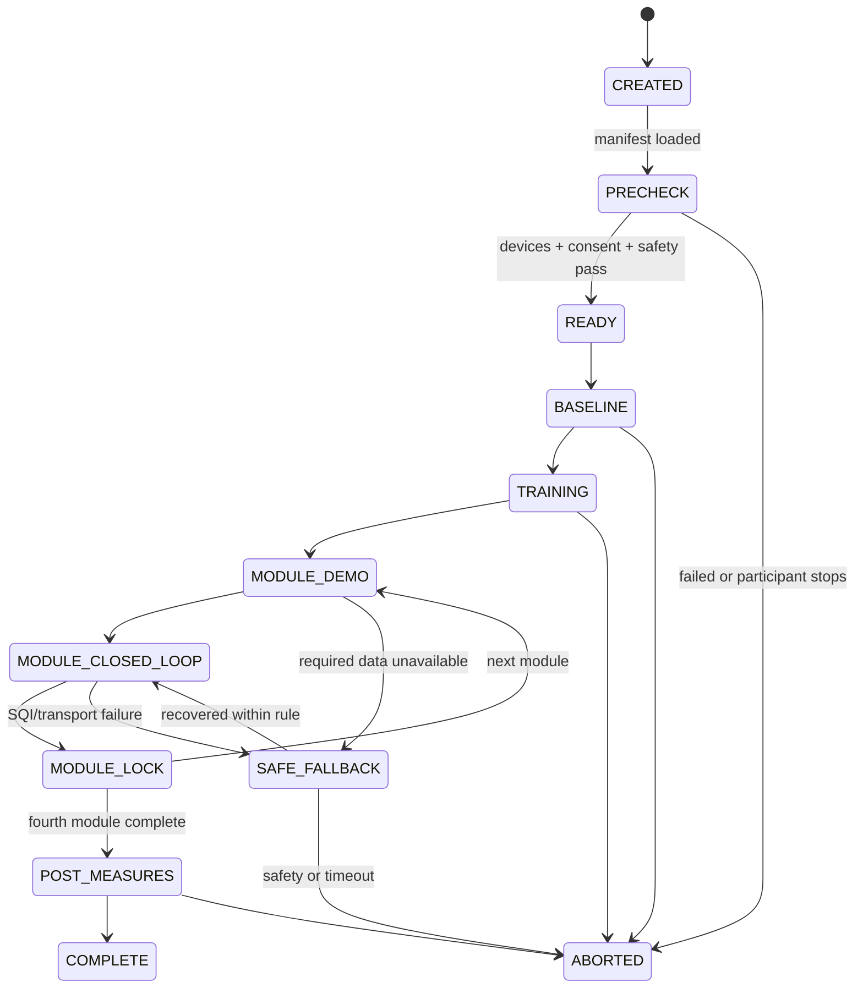

# SRP × IJHCI 科研立项第四步产出
## Implementation Architecture, Data Contract, and Reproducible Execution Package
## 研究实施架构、数据契约与可复现执行包冻结 v1.0

> **文档编号**：SRP-IJHCI-IAR-004  
> **日期**：2026-08-05  
> **承接文件**：科研立项第一步至第三步  
> **目标期刊**：*International Journal of Human–Computer Interaction*（IJHCI）  
> **当前决定**：**PILOT IMPLEMENTATION READY / 可进入预试实现，不可进入正式确认性采集**  
> **本步骤目标**：将研究主张、实验条件和伦理功效方案转化为可执行的软件架构、数据契约、版本体系、随机化工具、质量校验和小任务包。  
>
> 本执行包不表示真实设备、四场景、算法和伦理已经通过验证。任何字段或代码示例都必须在 Level A–C 预试后冻结为正式版本。

---

# 0. 冻结结果

本步骤冻结以下工程原则：

1. **Python 是实验时钟与会话状态的唯一权威源。**
2. **Unity 是参与者侧完整体验制品**，不得依赖 TouchDesigner 渲染必要画面。
3. **TouchDesigner 是只读实验员工作台**，不得修改已分配条件、目标节律或原始数据。
4. 高频生理状态与非关键视觉参数使用实时流；开始、停止、模块切换、降级和中止等关键命令使用可靠控制通道。
5. 原始信号、事件、派生特征、问卷和身份映射分层存储。
6. 每个正式会话必须由不可变 `manifest`、版本哈希、事件日志和校验和共同描述。
7. 正式数据禁止用 Mock 补齐；Mock 会话必须带永久标记，并被正式分析校验器拒绝。
8. 分析数据由原始数据单向派生，禁止人工覆盖原始文件或在派生表中手改主要结果。
9. 所有条件、模块、阈值、构建和随机种子均版本化。
10. 本执行包通过后，可以拆分预试开发任务；伦理批准和三级预试前仍不得进行正式确认性招募。

---

# 1. 总体架构

```text
真实设备
   │
   ▼
Python Device Adapters
   │ 原始采样
   ▼
Clock + Signal Quality + Event Detection
   │
   ├──────────────► Raw Data Writer
   │
   ▼
Protocol Scheduler + Feedback Engine
   │
   ├── Reliable Control ─────► Unity Participant Runtime
   │
   ├── Realtime State ───────► Unity Participant Runtime
   │
   ├── Mirrored Telemetry ───► TouchDesigner Operator Console
   │
   └─────────────────────────► Event Logger
                                  │
                                  ▼
                         Session Evidence Package
                                  │
                    QC → Feature Build → Locked Dataset
                                  │
                                  ▼
                          Preregistered Analysis
```

## 1.1 四个运行平面

| 平面 | 组件 | 权限 |
|---|---|---|
| 参与者体验平面 | Unity | 展示目标、实际反馈、累计恢复和中性降级 |
| 控制与数据平面 | Python | 设备、时钟、协议、质量、反馈、状态机和落盘 |
| 实验员监控平面 | TouchDesigner | 只读监控、告警、人工标记和中止请求 |
| 离线科研平面 | Python/R分析工具 | QC、人工标注、特征、统计和图表 |

TouchDesigner 可以发出“请求中止”或“人工事件标记”，但不能直接向 Unity 写入天气参数。所有修改均须由 Python 状态机验证、记录和转发。

---

# 2. Python 服务边界

参考实现允许单进程起步，但逻辑上必须分为以下模块：

| 模块 | 职责 | 不承担 |
|---|---|---|
| `device_adapter` | 读取呼吸、ECG及设备状态 | 不解释实验条件 |
| `clock_service` | 单调时钟、UTC映射、跨进程偏差估计 | 不修正原始采样内容 |
| `raw_writer` | 原始信号追加写入 | 不计算主要结果 |
| `signal_quality` | 信号质量、断流和伪迹状态 | 不伪造替代数据 |
| `resp_event_detector` | 吸气、呼气、停顿、补吸事件 | 不改变目标模板 |
| `protocol_scheduler` | 目标阶段和模块时间线 | 不读取参与后量表 |
| `feedback_engine` | 实际反馈参数和周期质量 | 不直接写 Unity |
| `recovery_accumulator` | 累计天气恢复 | 不随吸呼往复 |
| `session_orchestrator` | 会话状态机、关键命令和中止 | 不处理身份信息 |
| `event_logger` | 统一事件信封和顺序号 | 不静默丢弃错误 |
| `randomization_loader` | 读取预生成分配 | 不现场重新随机 |
| `qc_builder` | 会话后自动质量报告 | 不判断论文结论 |

---

# 3. Unity 组件边界

Unity 工程至少包含：

```text
ExperimentBootstrap
├─ ManifestLoader
├─ ReliableControlClient
├─ RealtimeStateReceiver
├─ ExperimentStateMachine
├─ TargetCueController
├─ ActualFeedbackController
├─ RecoveryStateController
├─ FallbackController
├─ SceneNativeCueAdapters
│  ├─ StormCueAdapter
│  ├─ HeatCueAdapter
│  ├─ SnowCueAdapter
│  └─ FadeCueAdapter
├─ AbstractPacerController
├─ RenderTelemetry
└─ LocalSafetyOverlay
```

## 3.1 强制分离

Unity 内必须分开保存：

- `target_state`：系统要求的目标阶段；
- `actual_state`：真实设备估计的实际阶段；
- `recovery_state`：累计环境恢复；
- `fallback_state`：数据质量不足时的降级。

禁止用同一个 Animator 参数同时表达上述四种含义。

## 3.2 Unity 独立性

Python或网络暂时不可用时，Unity必须能够：

- 保持场景运行；
- 继续当前目标节律或切换到中性安全画面；
- 显示明确的非闭环降级；
- 保留本地日志；
- 接收恢复或终止命令。

但正式会话中，超过数据质量门的降级区间仍会使模块或会话不进入主要分析。体验连续不等于数据有效。

---

# 4. TouchDesigner 边界

TD 工作台显示：

- 设备连接；
- 原始与滤波呼吸波形；
- ECG/RR状态；
- 目标相位；
- 实际相位；
- 呼吸事件；
- 信号质量；
- 反馈延迟；
- 当前条件和模块；
- 降级状态；
- 日志写入状态；
- 中止按钮；
- 人工事件标记。

TD 不得：

- 生成参与者侧必要呼吸圈；
- 修改随机化；
- 修改目标呼吸协议；
- 改写累计恢复；
- 覆盖原始生理数据；
- 关闭不利日志；
- 在正式会话中临时调整阈值。

---

# 5. 实验状态机



## 5.1 状态转换原则

- 所有状态转换由 Python `session_orchestrator` 发出；
- Unity 回执实际渲染时间；
- TD只观察；
- 每次转换产生不可覆盖事件；
- 非法转换被拒绝并生成 `protocol_violation`；
- 任何中止均不得删除已采集数据。

---

# 6. 时间模型

## 6.1 时钟权威

Python 使用：

- `monotonic_ns`：会话内排序与延迟；
- UTC时间：文件关联、审计和跨设备参考；
- `session_elapsed_ms`：论文和实验阶段时间轴。

不得用墙上时钟直接计算相位或延迟。

## 6.2 同步规则

- Python每秒向Unity发送同步信标；
- 信标包含发送单调时间和会话时间；
- Unity回传接收与渲染时间；
- Python估计偏差与往返延迟；
- 关键事件同时记录源时间、接收时间和渲染时间；
- Level C要求关键事件时间偏差不超过50 ms；
- 实际反馈端到端延迟P95不超过200 ms。

## 6.3 顺序号

每个事件包含：

- `sequence_number`：会话全局递增；
- `source_sequence_number`：来源内部递增；
- `event_id`：UUID；
- 重复事件允许被识别，不静默去重。

---

# 7. 通信通道

## 7.1 可靠控制通道

用于：

- 会话开始/停止；
- 模块开始；
- 阶段切换；
- 条件加载；
- 降级；
- 中止；
- 版本握手。

参考实现：本机 TCP 或 WebSocket，JSON Lines消息，必须有 ACK、超时和重试。

## 7.2 实时状态通道

用于：

- 目标相位进度；
- 实际相位进度；
- 信号质量；
- 视觉连续参数。

参考实现：本机 UDP，20 Hz。每个数据报自包含，不依赖前一个数据报。

## 7.3 镜像遥测

TD只接收Python镜像流；Unity不向TD发送参与者必要数据。

## 7.4 关键规则

- 控制事件不能只通过UDP；
- UDP丢包不补插虚假值；
- Unity只使用最后一个有效状态并应用超时策略；
- 版本握手失败时不得开始会话；
- 网络端口、频率和超时写入manifest。

---

# 8. 会话目录

```text
study_data/
├─ identity_vault/                  # 单独权限，不进入分析仓库
│  └─ contact_mapping.enc
├─ participants/
│  └─ P0001/
│     ├─ S1/
│     │  ├─ manifest.yaml
│     │  ├─ raw/
│     │  │  ├─ respiration.csv.gz
│     │  │  ├─ ecg.csv.gz
│     │  │  └─ device_status.csv.gz
│     │  ├─ events/
│     │  │  └─ events.jsonl
│     │  ├─ questionnaires/
│     │  │  └─ responses.csv
│     │  ├─ derived/
│     │  │  ├─ respiratory_events.csv
│     │  │  ├─ cycles.csv
│     │  │  └─ module_summary.csv
│     │  ├─ annotations/
│     │  ├─ qc_report.json
│     │  ├─ checksums.sha256
│     │  └─ run.log
│     └─ S2/
├─ allocation/
│  ├─ blinded_schedule.csv
│  └─ allocation_key.enc
├─ dataset_releases/
│  └─ v1.0.0/
└─ audit/
```

身份库和研究数据必须物理或权限隔离。

---

# 9. 数据分层

| 层级 | 内容 | 可修改性 |
|---|---|---|
| L0 | 设备原始数据 | 只追加、禁止覆盖 |
| L1 | 统一时间轴和质量标记 | 可重建 |
| L2 | 呼吸事件和周期 | 可重建并记录算法版本 |
| L3 | 模块和会话摘要 | 可重建 |
| L4 | 锁定分析数据集 | 只读版本发布 |
| L5 | 论文图表与模型输出 | 由L4生成 |

人工标注是独立证据层，不能覆盖L0。

---

# 10. 版本体系

至少记录：

```text
study_protocol_version
data_schema_version
randomization_version
unity_build_version
unity_git_commit
python_git_commit
td_project_hash
device_config_version
resp_detector_version
feedback_algorithm_version
questionnaire_version
analysis_plan_version
```

## 10.1 版本规则

- 正式版本采用语义化版本：`MAJOR.MINOR.PATCH`；
- 改变主要构念、条件或算法语义：MAJOR；
- 增加兼容字段或次要功能：MINOR；
- 不改变结果的错误修复：PATCH；
- 正式采集期间任何版本变化都需记录；
- 改变主要结果算法必须暂停采集并评估伦理/预注册修订。

---

# 11. 条件与协议配置

本包的 `config/protocols.v1.yaml` 记录：

- 四个模块；
- 120秒阶段；
- 场景原生适配器；
- 抽象提示适配器；
- 已冻结参数；
- 尚需预试的阻断项。

特别是循环叹息的精确时间包络尚未冻结，配置中必须保持 `formal_blocker: true`，避免示例参数被误认为正式协议。

---

# 12. 随机化

第一篇研究使用：

- 条件顺序：`SN_AP`、`AP_SN`；
- 四序列Williams设计：
  - W1：A-B-D-C
  - W2：B-C-A-D
  - W3：C-D-B-A
  - W4：D-A-C-B
- 模块映射：
  - A：storm
  - B：heat
  - C：snow
  - D：fade

四序列覆盖全部12种有向一阶转换各一次。

104人形成8个单元，每单元13人。随机化必须在正式招募前生成并锁定，不允许实验现场根据人员状态更换条件。

伴随工具：`tools/generate_randomization.py`。

---

# 13. 数据契约

## 13.1 统一事件信封

所有事件使用：

- `schema_version`
- `event_id`
- `session_id`
- `participant_id`
- `sequence_number`
- `source_sequence_number`
- `event_type`
- `source`
- `source_monotonic_ns`
- `session_elapsed_ms`
- `utc_time`
- `payload`

JSON Schema位于：

`contracts/event-envelope.schema.json`

## 13.2 Manifest

每次会话都必须在开始前生成且在开始后锁定：

`contracts/experiment-manifest.schema.json`

Manifest不得包含姓名、手机号、学号等直接身份字段。

---

# 14. 自动质量校验

`tools/validate_session.py`至少检查：

1. Manifest符合Schema；
2. 事件JSONL每行符合Schema；
3. sequence number严格递增；
4. participant/session一致；
5. 正式会话没有 `mock_input=true`；
6. 四个模块存在；
7. demo、closed_loop、lock阶段顺序合理；
8. 关键版本字段完整；
9. 降级和中止事件存在闭合记录；
10. 输出 `qc_report.json`。

校验器通过不代表数据自动进入分析；人工不良事件和伦理偏离仍需独立审核。

---

# 15. 可复现执行包

每次预试或正式发布至少冻结：

```text
release/
├─ README.md
├─ protocol/
├─ schemas/
├─ environment/
│  ├─ python-lock.txt
│  ├─ Unity ProjectVersion.txt
│  ├─ packages-lock.json
│  └─ TouchDesigner version.txt
├─ builds/
│  └─ checksums.sha256
├─ randomization/
├─ analysis/
├─ qc/
└─ CHANGELOG.md
```

## 15.1 构建门

正式构建需要：

- Git工作区干净；
- commit已标记；
- 自动测试通过；
- 构建哈希写入manifest；
- Python依赖锁定；
- Unity包版本锁定；
- TD工程哈希记录；
- 生成校验和；
- 在正式设备上完成一次空跑和一次真实设备烟雾测试。

---

# 16. 分析锁库

流程：

```text
原始数据收集结束
→ 自动QC
→ 盲态人工标注
→ 预注册排除规则
→ 生成L4分析数据集
→ 计算checksums
→ 冻结dataset_release
→ 揭示Condition X/Y
→ 运行确认性模型
```

禁止：

- 看效果后修改周期有效阈值；
- 看效果后删掉不利模块；
- 只报告PPS而隐藏FAS；
- 手工更改SCCI；
- 用运行时综合分替代预注册结果。

---

# 17. 故障与降级

## 17.1 数据质量不足

Python发出：

```text
fallback_active = true
fallback_reason = signal_quality_low
```

Unity：

- 目标提示继续；
- 实际反馈淡出或进入中性状态；
- 累计恢复不再因伪造反馈增加；
- 参与者不需要操作。

## 17.2 Python失联

Unity：

- 冻结实际反馈；
- 进入开环安全提示；
- 记录本地事件；
- 超过阈值后由状态机中止或完成安全退出。

## 17.3 TD失联

不影响Unity或Python；记录监控不可用。

## 17.4 设备断开

禁止自动切换Mock。允许：

- 短时重连；
- 开环安全提示；
- 中止；
- 会话后按质量规则判断。

---

# 18. 安全和隐私实现

- 身份信息不进入运行时manifest；
- 操作台不显示完整手机号或学号；
- 生理数据默认本地加密存储；
- 禁止上传公共云盘；
- 访问按角色授权；
- 中止事件与不良事件单独记录；
- 导出公开数据前执行重识别风险检查；
- 访谈录音与生理数据不使用相同可识别文件名；
- 日志不得记录知情同意表中的直接身份。

---

# 19. 小任务树

详见：`TASK_TREE.md`

任务包遵循：

- 单包1–5人日；
- 有明确输入、输出和验收；
- 不要求一人一次性领取整个子系统；
- 接口优先于内部实现；
- 每包完成后测试、commit、push；
- 主张、伦理、协议和数据契约变化必须回到科研设计门，不由开发者私自决定。

---

# 20. 验收门

## 可进入 Level B/C 原型实现

需满足：

- Manifest和事件Schema可验证；
- 随机化工具可复现；
- Unity能区分四类状态；
- Python状态机可运行；
- TD只读；
- 会话目录可生成；
- 校验器可发现Mock和版本缺失；
- 循环叹息仍被标记为正式阻断项。

## 不可进入正式招募

直到：

- 伦理批准；
- 第三步全部门禁通过；
- Level C完成；
- 正式参数和样本量预注册；
- 数据契约升级为正式版本；
- 构建与数据集发布流程演练通过。

---

# 21. 下一步

第五步应执行：

> **Level A专家审查材料、伦理申请包和Level B/C预试执行材料生成**

应产出：

1. 伦理申请书草案；
2. 知情同意书；
3. 敏感个人信息单独同意页；
4. 招募广告和安全筛查表；
5. 专家审查表；
6. SCCI内容效度表；
7. 认知访谈脚本；
8. 两实验日实验员SOP；
9. 不良事件表；
10. Level C数据质量报告模板。

---

# 版本记录

| 版本 | 日期 | 说明 |
|---|---|---|
| v1.0 | 2026-08-05 | 冻结运行平面、状态机、时间同步、通信、目录、Schema、随机化、QC、版本和任务树 |
