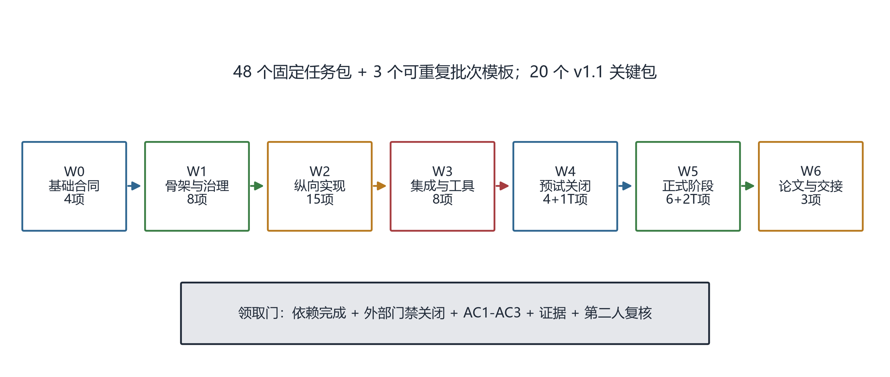

\begin{center}
\textbf{摘\quad 要}
\end{center}

本文给出 SRP 项目的固定任务概要。任务体系以最终项目完整体为终点，通过反向覆盖审计确定论文、制品、研究执行、数据治理和成果交接所需能力，再按正向依赖拆成 48 个固定任务包。另有 3 个可重复会话批次模板，不计入固定任务数。每个固定包工作量为 1 至 5 人日，具有明确领域、依赖、四阶段过程、交付物、AC1 至 AC3 验收要求、证据和第二人复核。IJHCI课题升级要求已下沉到16个既有任务，补充构念闭环、功能等价、过程证据、策略审计、可访问性和开放科学，但不增加任务数或实验条件。依赖图经自动校验无环，且全部任务输出均可到达最终交接任务 W-04。当前仅 F-01 至 F-04 可领取。

\textbf{关键词：} 任务分解；依赖图；验收标准；证据链；四人团队；项目交接

# 任务分解问题

任务拆分既不能把深模块切成大量浅层改动，也不能把数十至数百人的阶段执行压缩成一个名义上的五日任务。为此，固定任务需满足：

1. 单人可在 1 至 5 人日内形成独立交付；
2. 任务名称直接显示所属领域；
3. 输入与输出能够跨任务交接；
4. 验收标准可由测试、日志、哈希、截图、录像、报告或签署记录证明；
5. 所有任务均能正向装配到最终项目完整体；
6. 外部门禁不能被仓库内的文档或 Mock 演示替代。

设任务依赖图为

\begin{equation}
\mathcal{G}=(V,E),\qquad |V_{\mathrm{fixed}}|=48,\quad |V_{\mathrm{template}}|=3,
\label{eq:dag}
\end{equation}

其中，$V$ 为任务登记项，$E$ 为“当前任务依赖前置任务”的有向边。校验要求 $\mathcal{G}$ 为有向无环图，且对任意 $v\in V$，均存在通向最终交接任务 W-04 的路径。

# 波次与装配路径

{width=98%}

**图 1  固定任务与批次模板的正向装配路径。** 图中 T 表示可重复批次模板，不计入 48 个固定任务。

| 波次 | 固定任务数 | 模板数 | 主要结果 |
|---|---:|---:|---|
| W0 | 4 | 0 | 合同、测量材料、Unity 壳、TD 壳 |
| W1 | 8 | 0 | Python 会话与记录、接口、治理、流程配置 |
| W2 | 15 | 0 | 设备、交互状态估计、五种提示、离线与统计实现 |
| W3 | 8 | 0 | 真机 E2E、Level 工具、随机化、策略工具、构建候选 |
| W4 | 4 | 1 | Level A/B/C 关闭与阶段一预注册锁定 |
| W5 | 6 | 2 | 两正式阶段、锁定分析、策略冻结与最终报告 |
| W6 | 3 | 0 | 单篇论文、投稿复现和成果交接 |
| 合计 | 48 | 3 | 项目完整体 |

# W0 基础合同任务

| ID | 领域 | 固定任务概要 | 验收核心 |
|---|---|---|---|
| F-01 | 合同与协议 | 运行合同 v2、Schema、manifest 与 fixture | 合法消息通过；缺字段/错版本/正式 Mock 失败关闭 |
| F-02 | 研究设计 | 构念图、SCCI 与 Level A/B 材料 | 构念分离；新增问卷访谈不超过5分钟；CVI双审 |
| F-03 | Unity | manifest 驱动的会话运行壳 | 四模块加速回放；非法状态失败；无 TD 完成 |
| F-04 | TouchDesigner | 只读操作台页面壳 | fixture 可演示；无 Spout；无随机化/阈值编辑 |

W0 是当前唯一可领取波次。四个任务分别属于不同领域，适合四人并行，且不要求共同修改同一核心实现。

# W1 公共骨架与治理任务

| ID | 领域 | 固定任务概要 | 验收核心 |
|---|---|---|---|
| G-01 | 研究治理 | 单次参与材料、量表许可和角色台账 | 材料与冻结流程一致；许可状态可追踪 |
| G-02 | 数据治理 | 数据分级、去标识化、权限、备份和资产许可 | 身份映射隔离；恢复演练；资产许可完整 |
| P-01 | Python 核心 | manifest 与权威会话编排 | 时钟确定；重复事件幂等；非法转换失败 |
| P-02 | 数据记录 | L0/L1 追加记录与重放 | 不覆盖旧数据；篡改可发现；重放确定 |
| U-01 | Unity | 可靠控制、遥测、ACK 与渲染回执 | 丢包/乱序/重复测试；旧帧不覆盖新帧 |
| U-02 | Unity | 四层 SceneAdapter、锁定、重置与降级 | 四层独立；锁定有效；降级不伪造成功 |
| T-01 | TouchDesigner | 遥测、设备、质量和时钟面板 | 20 Hz fixture 重放；乱序/断流显示；不回写 |
| R-01 | 体验设计 | 四层语法、功能等价与中性说明 | 跨模块规则；三类变量矩阵；文本中性 |

\newpage

# W2 纵向实现任务

| ID | 领域 | 固定任务概要 | 验收核心 |
|---|---|---|---|
| D-01 | 设备接入 | Polar H10 ECG/RR 适配器 | 真机 30 分钟；时间戳完整；断流重连 |
| D-02 | 设备接入 | PLUX respiBAN BLE 呼吸/运动适配器 | 400 Hz 真机记录；通道正确；断流重连 |
| S-01 | 信号处理 | 双设备同步、SQI 与降级状态 | 故障注入；时钟偏差报告；低质量不生成成功状态 |
| S-02 | 交互状态估计 | 呼吸事件、周期、阶段边界与在线 PF | 周期 F1、边界 MAE、在线/离线差达到门 |
| U-03 | Unity 场景 | 风暴四层适配器 | 箱式结构可辨识；四层独立；性能达预算 |
| U-04 | Unity 场景 | 炙烤四层适配器 | 长呼气可辨识；四层独立；性能达预算 |
| U-05 | Unity 场景 | 暴雪四层适配器 | 等时结构可辨识；四层独立；性能达预算 |
| U-06 | Unity 场景 | 褪色四层适配器 | 双吸结构可辨识；无不适闪烁；性能达预算 |
| U-07 | Unity 场景 | 抽象双环与功能信息等价 | 四结构清晰；必须匹配项通过；差异遥测完整 |
| U-08 | Unity 成品 | 视听、性能与可访问性 | 非颜色唯一；对比度/运动/静音/分辨率路径通过 |
| T-02 | TouchDesigner | 人工标记、中止请求与告警 | 请求只到 Python；ACK 可审计；权限负测试 |
| A-01 | 离线分析 | L0 至 L3 确定性重建 | 层级哈希稳定；差异报告；排除原因码 |
| A-02 | 统计实现 | Gate 1 双分析集、插补与敏感性模型 | 100 次插补；双分析同门；结果可复现 |
| A-03 | 统计实现 | 问卷、过程证据、Gate 2/3 与样本模拟 | 分构念计分；错误类型fixture；样本锚点可重建 |
| W-01 | 论文准备 | 理论证据矩阵与双时间尺度骨架 | 最近工作覆盖；主次贡献清楚；正负分支完整 |

# W3 集成与研究工具任务

| ID | 领域 | 固定任务概要 | 验收核心 |
|---|---|---|---|
| I-01 | 系统集成 | 无 TD 双真机完整链与重放 | 四模块真机完成；TD 退出不影响；延迟/时钟达门 |
| Q-01 | 研究工具 | Level A 构念语法专家材料 | CVI自动；构念污染审查；跨模块规则可审 |
| Q-02 | 研究工具 | Level B认知与可访问性预试工具 | 阶段/三层区分；失败闭环；功能等价回归 |
| Q-03 | 研究工具 | Level C 采集、双人标注与阈值冻结工具 | 48 人计划；分歧与信号报告；配置带哈希 |
| X-01 | 随机化 | 阶段一条件乘 24 顺序分层 | 每 48 人块平衡；分配不可预测；耗尽失败关闭 |
| X-02 | 策略实现 | 岭模型、消融、支持、熵、校准与重放 | 不稳定则简化；低质量均匀回退；重放一致 |
| X-03 | 策略运行 | 阶段三冻结策略接入与防在线学习 | 错哈希失败；参数只读；两组日志完整 |
| Z-01 | 构建交付 | 干净检出构建、环境锁、SBOM 与候选制品 | 三制品版本一致；许可证和哈希完整 |

\newpage

# W4 外部门禁与技术预试关闭任务

| ID | 领域 | 固定任务概要 | 验收核心 |
|---|---|---|---|
| E-01 | 研究执行 | Level A 专家审查执行 | 八名专家角色满足；CVI 达门或回退；原始表一致 |
| E-02 | 研究执行 | Level B 认知预试执行与关闭 | 12 至 16 人；关键误解闭环；构建冻结 |
| E-03 | 研究关闭 | Level C 汇总门与阈值冻结 | 48 人批次 QC；数值达门或 `NO_GO`；签署一致 |
| G-03 | 预注册与锁定 | 阶段一贡献、构建与分析锁定 | RQ1--RQ3；U1--U5关闭；负面分支冻结 |

W4 另有可重复模板 B-01。每个 B-01 实例最多 12 人；E-03 必须核对全部实例后才能关闭 Level C。

# W5 正式阶段与锁定分析任务

| ID | 领域 | 固定任务概要 | 验收核心 |
|---|---|---|---|
| E-04 | 研究关闭 | 阶段一批次汇总、锁库与揭盲授权 | 批次 QC；24 顺序平衡；锁库前规则签署 |
| A-05 | 锁定分析 | Gate 1/2、过程证据与策略数据 | 模块/错误完整；门序严格；不挑有利结果 |
| E-05 | 策略冻结 | 阶段二消融稳定性审计与签署 | 支持/熵/校准通过；不稳定则简化；模型只读 |
| G-04 | 预注册与锁定 | 阶段三策略审计与分析锁定 | 策略哈希一致；禁止在线学习；U6关闭 |
| E-06 | 研究关闭 | 阶段三批次汇总、锁库与揭盲授权 | 两组人数与顺序达标；策略未更新；签署完成 |
| A-04 | 最终分析 | 三重门、过程策略审计与复现 | 表图一键；负面边界明确；合成重建可运行 |

W5 另有 B-02 和 B-03 两个可重复模板，分别用于阶段一和阶段三会话。每个实例最多 12 人，按完整 48 人块推进。

# W6 论文与成果交接任务

| ID | 领域 | 固定任务概要 | 验收核心 |
|---|---|---|---|
| W-02 | 论文写作 | 双时间尺度单篇 IJHCI 稿件 | 主次贡献清楚；规则/失败模式完整；双人复核 |
| W-03 | 投稿复现 | 开放科学投稿包与复现包 | 状态声明完整；独立复现；许可与替代说明 |
| W-04 | 成果交接 | 软件、视频、海报、权属材料和归档 | 制品与论文一致；公开顺序正确；移交演练通过 |

# 固定任务的统一过程与验收

每个任务根据领域绑定设计、开发、硬件、分析、集成、执行或交付过程配置，但都遵循四段结构：

1. **准备**：读取冻结依据、依赖制品、接口和不承担项；
2. **实现**：只在所属模块内形成最小完整交付；
3. **验证**：执行正常、异常、边界、重放、性能或权限测试；
4. **交接**：归档证据、更新文档、第二人复核、commit 和 push。

定义任务完成函数

\begin{equation}
D(v)=I(v)\land A_1(v)\land A_2(v)\land A_3(v)\land E(v)\land R(v),
\label{eq:done}
\end{equation}

其中，$I(v)$ 表示依赖和外部门禁已关闭，$A_1$ 至 $A_3$ 表示三条验收通过，$E(v)$ 表示证据可访问，$R(v)$ 表示第二人复核完成。式（\ref{eq:done}）任一项为假时，任务不能标记完成。

# 领取规则与首波任务

当前仅以下四包为 `READY`：

- F-01：运行合同 v2 与 fixture；
- F-02：构念图、SCCI 与 Level A/B 材料；
- F-03：Unity 会话运行壳；
- F-04：TouchDesigner 只读操作台壳。

领取者必须在 CSV 中填写领取人、分支和复核人；每人同时只持有一个实现包。学习资料只用于补齐技能，不能作为验收证据。任务接口需要变化时，应先创建合同变更，不得跨模块直接修改他人接口。

# 结论

48 个固定任务覆盖了从合同、制品、设备和交互状态估计，到研究工具、阶段关闭、锁定分析、论文、投稿和成果交接的完整路径。3 个可重复模板承接无法预先压缩成单个五日包的会话执行。16个关键包进一步承担IJHCI升级要求；该划分既保留深模块职责，又使领取、验收、失败回退和贡献防回退可操作。

# 参考依据

[1] SRP 项目组. SRP 可领取树型任务包 v2.0[Z]. 2026.

[2] SRP 项目组. SRP 任务拆分双向覆盖审计 v2[Z]. 2026.

[3] SRP 项目组. SRP 目标模块地图[Z]. 2026.

[4] SRP 项目组. SRP 实现冻结基线 v1.0[Z]. 2026.

[5] SRP 项目组. SRP IJHCI课题升级决策 v1.0[Z]. 2026.
