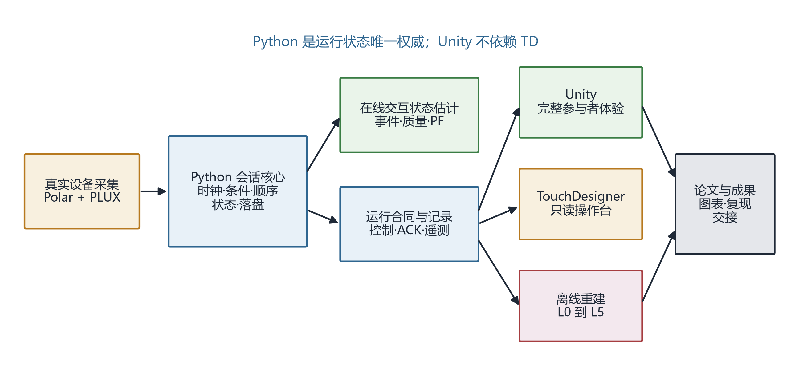
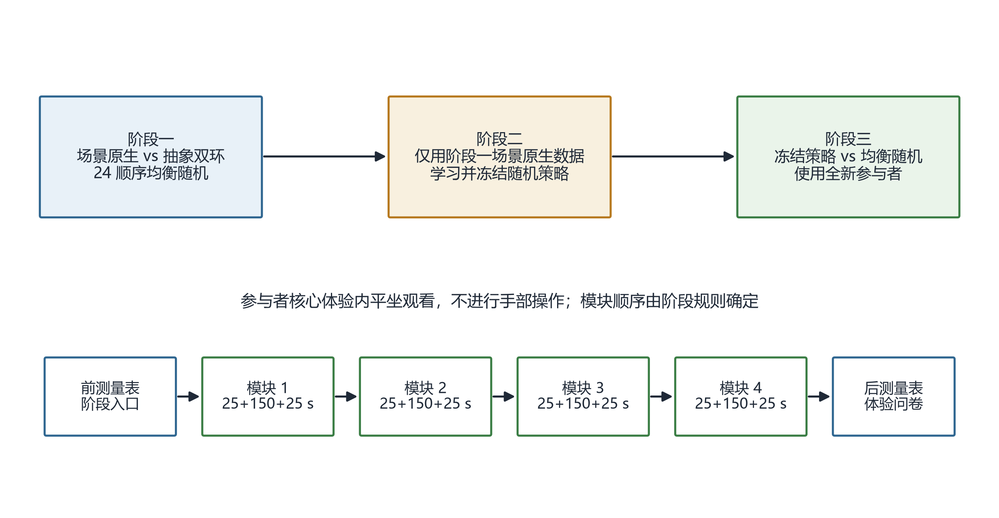

\begin{center}
\textbf{摘\quad 要}
\end{center}

本文简述 SRP 项目的产品、系统、场景、数据和三阶段研究流程。项目将四种天气与四种呼吸结构固定配对，以场景原生运动表达目标呼吸，同时通过真实呼吸与心电过程数据形成实际反馈、累计变化和降级状态。参与者核心体验包含四个自动模块，推荐总时长 13 分 20 秒，全程平坐观看且不进行手部操作。阶段一采用场景原生提示与抽象双环提示的平行组比较，并在每个条件内均衡 24 种完整天气顺序；阶段二仅使用阶段一锁定数据学习并冻结可解释随机策略；阶段三使用全新参与者比较冻结策略与均衡随机基准。体验前后量表均用于离线论文分析，体验后量表不进入实时决策。文中明确系统接口、数据层、随机化、样本量、三重证据门和可声称边界。

\textbf{关键词：} 天气场景；呼吸结构；真实设备；平行组设计；序列策略；三阶段研究

# 项目设计原则

## 参与者侧完整体验

Unity 必须在 TouchDesigner 未安装、未启动或退出时完成完整参与者体验。核心体验不显示实验员技术信息，不要求键盘、鼠标、控制器或场景选择操作。提示、实际反馈、累计变化和降级状态应可感知，但不得堆叠成技术监控界面。

## 固定复合模块

天气与呼吸流程固定配对，研究对象是“天气—呼吸复合模块”，不能据此拆分天气单独作用或呼吸流程单独作用。

| 模块 | 目标呼吸结构 | 场景原生表达 |
|---|---|---|
| 风暴 | 3-3-3-3 四阶段箱式 | 风雨节律与保护罩 |
| 炙烤 | 4 秒吸气、6 秒呼气 | 热浪与冷却气流 |
| 暴雪 | 5 秒吸气、5 秒呼气 | 雪雾、路径与脚印 |
| 褪色 | 双吸后缓慢呼气的循环叹息 | 灰度、色彩汇聚与扩散 |

抽象条件使用双环表达完全相同的呼吸结构、时长和顺序。两个条件只改变提示载体，不改变目标呼吸、真实设备、模块时长、量表和数据处理。

## 四层场景接口

五个 Unity 适配器共享四层接口：

1. **目标层**：展示当前目标相位与进度；
2. **实际层**：展示经质量门处理后的真实呼吸相位与置信度；
3. **累计层**：展示模块内逐步积累的环境变化；
4. **降级层**：数据不足或断流时进入明确的安全状态，不伪造跟随成功。

# 系统架构与运行职责

{width=96%}

**图 1  在线系统与离线分析架构。** Unity 独立承担参与者体验，TouchDesigner 只读，Python 统一设备、时钟、状态、通信和记录。

## 真实设备

- Polar H10 提供 ECG 与 RR 过程数据；
- PLUX respiBAN BLE 提供 400 Hz 呼吸与运动数据；
- 正式 manifest 禁止使用 Mock 适配器；
- 设备断开时记录真实状态并进入降级，不自动切换为模拟数据。

## Python 权威会话

Python 是会话状态、单调时钟、条件、顺序、信号质量、呼吸事件、交互状态估计和落盘的唯一权威。可靠控制与 ACK 使用 TCP；自包含遥测通过 UDP 5005/5006 以 20 Hz 分别发送给 TouchDesigner 和 Unity。

## TouchDesigner 操作台

TouchDesigner 显示设备状态、波形、目标/实际相位、信号质量、序号、延迟、模块、降级和事件。人工标记及中止请求必须先提交 Python 并落盘，TouchDesigner 不直接改变 Unity 状态。

# 单次体验流程

{width=98%}

**图 2  三阶段研究与单次四模块核心体验。** 前后量表位于核心体验之外，核心体验内不进行手部操作。

## 核心体验时长

每个模块采用目标 25 秒示范、150 秒闭环和 25 秒锁定转场：

\begin{equation}
T_m=T_{\mathrm{demo}}+T_{\mathrm{loop}}+T_{\mathrm{lock}}=25+150+25=200\ \mathrm{s}.
\label{eq:module-time}
\end{equation}

因此四模块推荐核心时长为

\begin{equation}
T_{\mathrm{core}}=4T_m=800\ \mathrm{s}=13\ \mathrm{min}\ 20\ \mathrm{s}.
\label{eq:core-time}
\end{equation}

技术预试可在已冻结的小区间内确定最终时长，但同一正式阶段的两个条件必须一致，且不按个体实时状态改变模块长度。

## 单次执行步骤

1. 实验员核对批准状态、构建哈希、设备序列号和唯一参与者编号；
2. 连接两台设备并完成信号质量检查；
3. 参与者完成体验前量表；
4. 记录自然呼吸基线并完成标准化训练；
5. Python 加载冻结 manifest，Unity 自动完成四个模块；
6. 每个模块依次执行示范、闭环、锁定转场；
7. 自动结束并核对日志、设备覆盖、偏离和校验和；
8. 参与者完成体验后量表及 SCCI 等体验问卷。

体验后量表不进入实时实验决策。阶段一中，体验前量表作为分析协变量，但不改变已经随机分配的四模块顺序。阶段三策略组可在第一次选择时使用体验前量表及位置等允许状态；后续选择还可使用已完成模块、最近模块 PF、信号质量和累计降级时长。随机基准组始终使用锁定的均衡顺序清单。

# 三阶段研究设计

## 阶段一：提示载体比较与顺序发现

阶段一采用两个平行组：

- `scene_native`：场景原生提示；
- `abstract_pacer`：抽象双环提示。

每个条件内部对 24 种完整顺序严格均衡。随机化按 48 人完整块生成，使每个条件的 24 种顺序各出现一次。顺序独立于体验中的实时状态，保证顺序发现数据可比较。

阶段一完整结果目标每组 96、共 192。以不超过 20% 的非完整率规划，初始招募上限为 240；追加必须使用完整 48 人块。需要超过 336 人时判定 `NO_GO`。

## 阶段二：离线策略学习与冻结

阶段二不新增参与者，只读取阶段一 `scene_native` 的锁定数据。策略采用带岭惩罚的线性状态—动作价值模型，并通过嵌套交叉验证选择正则强度和 softmax 温度。对剩余合法动作 $\mathcal{A}(s)$，动作概率为

\begin{equation}
\pi(a\mid s)=\frac{0.20}{|\mathcal{A}(s)|}+0.80\frac{\exp[-Q(a,s)/\tau]}{\sum_{b\in\mathcal{A}(s)}\exp[-Q(b,s)/\tau]}.
\label{eq:policy}
\end{equation}

式（\ref{eq:policy}）保证每个合法动作保留正概率。状态缺失或质量不足时，对剩余模块均匀随机。冻结产物包含特征、系数、缩放器、温度、随机种子规则、版本、回退条件和逐决策日志。

## 阶段三：冻结策略独立比较

阶段三使用全新参与者，按 1:1 分配到冻结策略组或 24 顺序均衡随机基准组。阶段三运行时不得使用结果更新策略。完整结果目标每组 96、共 192；初始上限、48 人块和 336 人 `NO_GO` 规则与阶段一一致。

# 数据链与指标职责

## L0 至 L5 数据层

| 层级 | 内容 | 主要用途 |
|---|---|---|
| L0 | 原始设备包、manifest、设备状态 | 保留不可覆盖的原始证据 |
| L1 | 同步时间轴、质量状态、控制/ACK/回执 | 重建在线运行过程 |
| L2 | 呼吸事件、周期、相位边界、标注 | 计算模块过程指标 |
| L3 | 模块级 PF、覆盖、降级、心电过程特征 | 参与者级汇总与策略状态 |
| L4 | 锁定分析集、问卷、排除原因码 | 执行预注册模型 |
| L5 | 三重门结果、图表、敏感性和复现报告 | 论文与成果交付 |

每层必须记录输入哈希、代码提交、配置版本和排除原因。L0 永不被后续处理覆盖。

## 量表与真实设备的职责

- 体验前后 PANAS 负性维度用于分析完整体验的短时变化，以及阶段三策略相对随机顺序的增量作用；
- SCCI 用于回答提示运动与天气表达的语义一致性；
- 呼吸数据用于计算天气—呼吸复合模块的执行质量和过程轨迹；
- Polar H10 数据用于预设过程特征、差异解释和策略候选输入，不替代 Gate 1 或 PANAS；
- 没有无项目条件时，不声称全部前后变化均由项目造成。

# 三重证据门

## Gate 1：执行质量非劣

参与者级执行质量定义为四模块等权平均：

\begin{equation}
PF_i=\frac{1}{4}\sum_{m=1}^{4}PF_{im}.
\label{eq:pf}
\end{equation}

比较差为

\begin{equation}
D_1=\overline{PF}_{\mathrm{scene}}-\overline{PF}_{\mathrm{abstract}},\qquad \Delta_{NI}=0.075.
\label{eq:gate1}
\end{equation}

完整分析集和完整四模块集的双侧 95% 置信区间下界都必须严格大于 $-0.075$，Gate 1 才通过。

## Gate 2：语义一致性优效

SCCI 为体验后一次填写的 5 条、7 点工具。Gate 2 比较

\begin{equation}
D_2=\overline{SCCI}_{\mathrm{scene}}-\overline{SCCI}_{\mathrm{abstract}}.
\label{eq:gate2}
\end{equation}

SCCI 必须先依次通过专家内容效度、目标用户认知预试和 48 人技术预试适用性门，才能承担确认性 Gate 2。

## Gate 3：冻结策略优效

阶段三主要模型以体验后负性维度为结果、体验前得分为协变量。定义调整后差

\begin{equation}
D_3=\widehat{NA}_{\mathrm{post,policy}}-\widehat{NA}_{\mathrm{post,random}}.
\label{eq:gate3}
\end{equation}

双侧 95% 置信区间上界严格小于 0 时，Gate 3 通过。若 Gate 1 或 Gate 2 未通过，阶段三只能承担探索性解释。

# 技术预试与失败规则

Level C 必须输出以下冻结证据：

- 每模块有效同步呼吸覆盖率，实现起点为 80%；
- 最低可分析周期数，实现起点为理论周期数的 70% 向上取整；
- 周期事件 F1 不低于 0.85，阶段边界 MAE 不高于 0.50 秒；
- 在线—离线 PF 绝对差中位数不高于 0.03，95% 分位不高于 0.075；
- 时钟偏差不高于 50 ms，端到端反馈延迟 P95 不高于 200 ms；
- 两台设备分别完成 30 分钟稳定性、丢包、断流和重连检查。

任何硬门未过，应修复并重复对应技术预试。正式数据可见后不得放宽阈值。

# 可解释范围

本设计可以回答：场景原生提示是否在执行质量不劣于抽象提示的同时提高语义一致性，以及冻结序列策略是否相对均衡随机顺序获得增量改善。它不能回答天气单独作用、呼吸方法单独作用、普遍最优固定顺序或长期效果，也不能把消费级设备数据用于个体健康判断。

# 结论

项目设计将产品体验、真实设备、在线交互状态估计、随机化、锁定分析和论文结论绑定到同一证据链。Unity 独立完成核心体验，Python 维持运行和数据权威，TouchDesigner 提供只读监控。三阶段设计避免同一数据既学习又证明策略，24 顺序均衡和新参与者比较为序列研究提供独立验证基础。

# 参考依据

[1] SRP 项目组. SRP 实现冻结基线 v1.0[Z]. 2026.

[2] SRP 项目组. 参与者产品总规格[Z]. 2026.

[3] SRP 项目组. 在线系统总架构[Z]. 2026.

[4] SRP 项目组. 可解释序列编排研究总设计[Z]. 2026.

[5] U.S. Food and Drug Administration. Non-Inferiority Clinical Trials to Establish Effectiveness: Guidance for Industry[EB/OL]. <https://www.fda.gov/media/78504/download>.

[6] International Council for Harmonisation. ICH E9(R1): Addendum on Estimands and Sensitivity Analysis[EB/OL]. <https://www.fda.gov/media/108698/download>.
