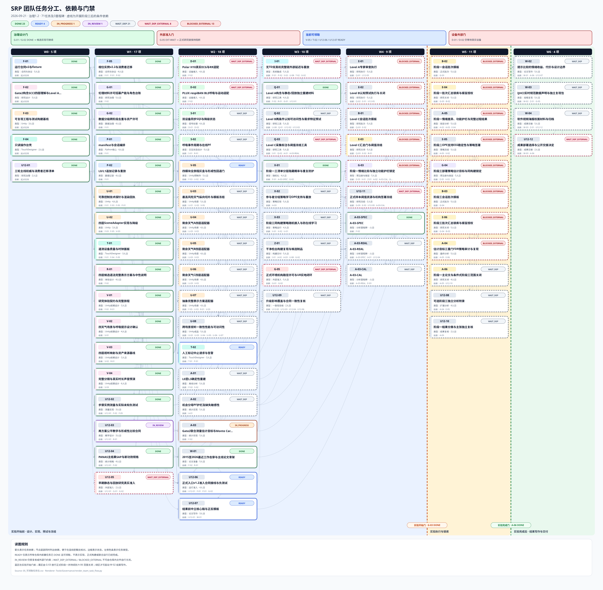

# SRP · 实验体验与论文证据系统

> 四天气场景 · 两种呼吸提示方案 · 真实设备输入 · 可追溯研究证据

SRP面向短时负性情绪调节的交互研究，比较**场景原生提示**与**抽象控件式提示**的收益、代价与适用边界，不预设哪种方案获胜。项目由4人混合团队推进，以阶段一支撑一篇独立IJHCI目标论文，阶段二、三保留为条件式扩展。

## 版本与进度

<!-- TEAM_PROGRESS_START -->
## 团队任务进度

治理v1.2：71项任务（68固定+3模板）；DONE=20项（含18项原签收）；IN_PROGRESS=A-03；IN_REVIEW=U12-03；A-03-SPEC为DONE；READY=U-02/T-02/Q-01/U12-04/U12-06/U12-07；真实准入与研究数值仍未冻结

[](assets/readme/team-task-progress.svg)

点击图可打开原始SVG放大查看。图与摘要由同一任务注册表生成。
<!-- TEAM_PROGRESS_END -->

本页、团队进度图与[任务注册表](00-项目管理/01-项目章程与规划/2026-08-05_SRP_IJHCI_全项目1-12步规划设计包_v1.0/24_团队任务与项目治理/05_可领取任务包.csv)同步；任务签收范围以各自审核记录为准。

[领取独立任务包](00-项目管理/01-项目章程与规划/2026-08-05_SRP_IJHCI_全项目1-12步规划设计包_v1.0/24_团队任务与项目治理/当前解锁独立任务包/README.md)

## 体验与研究设计

- **四个固定镜头场景**：storm风暴、heat炙烤、snow暴雪、fade褪色；每种天气一个核心视觉机制。
- **两种完整提示方案**：`scene_native`与`abstract_pacer`；分别表达目标、实际、累计与输入不可用信息。
- **核心体验推荐800秒**：每模块25秒示范、150秒闭环、25秒锁定与转场，四模块各一次。
- **参与者无需手部操作**：体验中平坐观看并跟随呼吸提示；前后测与理解测量安排在体验之外。
- **阶段一顺序预先均衡分配**：体验中的数据不重新决定场景顺序；每人只参加一个阶段、一个条件和一次核心体验。
- **证据分工**：前后PANAS支持情绪结果分析；真实生理记录支持执行质量及过程分析；理解和负担帮助解释适用边界。

U12-03提出两臂相同的180秒教学候选，正式预算仍未冻结。候选时序为共同准备 → PANAS前测 → 分配揭示 → 分条件教学 → 核心体验 → PANAS后测 → 理解及其他测量。

## 系统分工

```text
真实设备 → Python：采集、交互状态估计、会话编排与追加记录
                    ├─ Unity：独立参与者体验、四层反馈与渲染回执
                    └─ TouchDesigner：监控、可视化及受审计的操作请求

原始记录 + 问卷 + 分配与回执 → 离线处理 → 分析、图表与论文证据
```

Python是流程与时间权威。Unity不依赖TD提供画面；TD不能直接改变研究流程。实际数据缺失保持缺失，不能用目标、零值或模拟输入补齐。开发fixture仅用于开发和故障验证。

## 开发与交付入口

| 内容 | 当前仓库入口 |
|---|---|
| 研究主线与升级边界 | [v1.2治理说明](00-项目管理/01-项目章程与规划/2026-08-05_SRP_IJHCI_全项目1-12步规划设计包_v1.0/24_团队任务与项目治理/u12_upgrade/README.md) |
| 研究候选参数 | [protocol_authority_v1.2.json](00-项目管理/01-项目章程与规划/2026-08-05_SRP_IJHCI_全项目1-12步规划设计包_v1.0/00_总控/protocol_authority_v1.2.json) |
| 运行协议与步骤身份 | [F-05 v2.2接口基线](02-技术研发/05-通信协议/contracts/F-05_v2.2接口对齐基线.md) |
| Python会话编排 | [P-01 SessionCore](02-技术研发/srp_session_core/README.md) |
| 追加存储与确定性重放 | [P-02 SessionStore](02-技术研发/srp_session_store/README.md) |
| 数据治理与权限 | [G-02](02-技术研发/07-数据治理/README.md) |
| 步骤实例理解测量 | [U12-02](02-技术研发/srp_step_measurement/README.md) |
| 公平教学与形成性比较 | [U12-03教学合同](00-项目管理/01-项目章程与规划/2026-08-05_SRP_IJHCI_全项目1-12步规划设计包_v1.0/24_团队任务与项目治理/u12_upgrade/U12-03_fair_training/README.md) |
| 团队工具版本 | [环境冻结基线](00-项目管理/01-项目章程与规划/2026-08-05_SRP_IJHCI_全项目1-12步规划设计包_v1.0/24_团队任务与项目治理/11_团队工具与环境冻结基线_v1.0.md) |
| 完整任务概要 | [任务概要PDF](output/pdf/02_固定任务概要.pdf) |

## 验证与使用边界

最近一次实现候选的根Python回归为**633项通过**，U12-03专项为**22项通过**。这是代码与合同一致性证据，不代表真实设备全链、参与者理解、正式研究或论文录用已经通过。

按环境基线配置依赖后，可运行：

```powershell
Set-Location 'D:\Agent\03-SRP'
git status --short
py -3.14 -m pytest -q
git diff --check
```

当前不是一键可开展正式实验的发布包。旧`main.py`、UDP v1.2及Spout链只作历史原型参考，不作为新研究启动入口。正式体验不依赖LLM或编辑器开发桥。
