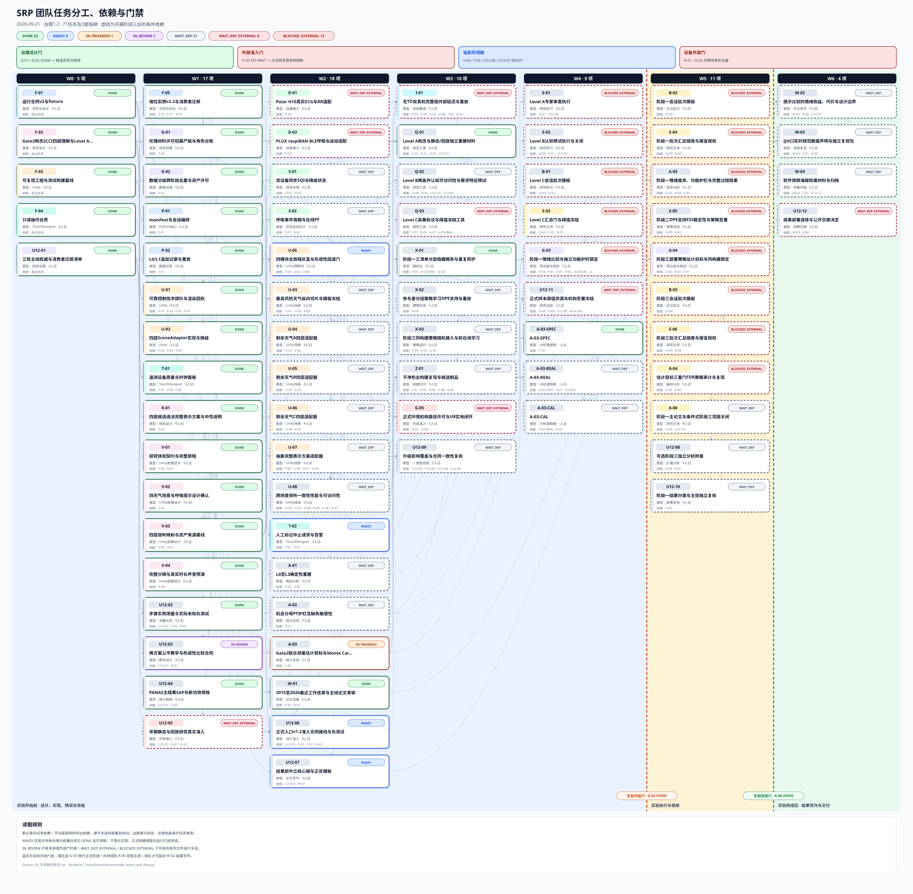

# SRP · 实验体验与论文证据系统

任务包双层整理入口：[人类审阅与Word总结](human/README.md) · [Agent执行层](agent/README.md)。F-01至F-05、G-01至G-05、P-01/P-02、U-01至U-08、T-01/T-02、R-01、V-01至V-05、D-01/D-02、S-01/S-02、A-01至A-06、W-01至W-04、I-01、Q-01至Q-03、X-01至X-03、Z-01、E-01至E-06及B-01至B-03已完成本轮整理，U12-01至U12-05也已整理，共64/71包；下一包U12-06，整体目录迁移仍在逐包推进。早期活动准入见[U12-05交接](agent/tasks/U12-05/outputs/current-admission.md)，PANAS统计规格见[U12-04交接](agent/tasks/U12-04/outputs/current-statistics.md)，公平教学见[U12-03交接](agent/tasks/U12-03/outputs/current-training.md)，步骤测量见[U12-02交接](agent/tasks/U12-02/outputs/current-measurement.md)，主线治理见[U12-01交接](agent/tasks/U12-01/outputs/current-governance.md)，成果移交见[W-04交接](agent/tasks/W-04/outputs/current-handover.md)，投稿复现见[W-03交接](agent/tasks/W-03/outputs/current-submission.md)，单篇主稿见[W-02交接](agent/tasks/W-02/outputs/current-manuscript.md)，实际范围关闭见[A-06交接](agent/tasks/A-06/outputs/current-scope.md)，阶段三独立分析见[A-04交接](agent/tasks/A-04/outputs/current-analysis.md)，阶段三研究关闭见[E-06交接](agent/tasks/E-06/outputs/current-closeout.md)，阶段三批次见[B-03交接](agent/tasks/B-03/outputs/current-batch.md)，可选阶段三独立冻结见[G-04交接](agent/tasks/G-04/outputs/current-extension.md)，可选策略冻结见[E-05交接](agent/tasks/E-05/outputs/current-freeze.md)，阶段一锁定分析见[A-05交接](agent/tasks/A-05/outputs/current-analysis.md)，阶段一锁库见[E-04交接](agent/tasks/E-04/outputs/current-closeout.md)，正式批次见[B-02交接](agent/tasks/B-02/outputs/current-batch.md)，预注册冻结见[G-03交接](agent/tasks/G-03/outputs/current-freeze.md)，Level C关闭见[E-03交接](agent/tasks/E-03/outputs/current-closeout.md)，Level C批次见[B-01交接](agent/tasks/B-01/outputs/current-batch.md)，Level B执行见[E-02交接](agent/tasks/E-02/outputs/current-execution.md)，Level A执行见[E-01交接](agent/tasks/E-01/outputs/current-execution.md)，外部准入见[G-05交接](agent/tasks/G-05/outputs/current-admission.md)，候选重建见[Z-01交接](agent/tasks/Z-01/outputs/current-delivery.md)，策略运行见[X-03交接](agent/tasks/X-03/outputs/current-runtime.md)，策略学习见[X-02交接](agent/tasks/X-02/outputs/current-policy.md)，随机化见[X-01交接](agent/tasks/X-01/outputs/current-randomization.md)，技术预试见[Q-03交接](agent/tasks/Q-03/outputs/current-level-c.md)，认知访谈见[Q-02交接](agent/tasks/Q-02/outputs/current-level-b.md)，构念重建见[Q-01交接](agent/tasks/Q-01/outputs/current-level-a.md)，完整链见[I-01交接](agent/tasks/I-01/outputs/current-integration.md)，论文准备见[W-01说明](agent/tasks/W-01/outputs/current-paper.md)，计分与合成范围见[A-03说明](agent/tasks/A-03/outputs/current-statistics.md)，PF与缺失处理见[A-02说明](agent/tasks/A-02/outputs/current-statistics.md)，离线消费见[A-01说明](agent/tasks/A-01/outputs/current-rebuild.md)。

Unity当前使用入口见[可靠控制说明](agent/tasks/U-01/outputs/current-control-contract.md)与[四层适配说明](agent/tasks/U-02/outputs/current-adapter-contract.md)，最高风险天气见[fade切片交接](agent/tasks/U-03/outputs/current-slice.md)，剩余天气分配见[U-04适配交接](agent/tasks/U-04/outputs/current-adapter.md)。TD当前入口见[只读遥测交接](agent/tasks/T-01/outputs/current-td-contract.md)。当前四层设计使用[表示方案适用说明](agent/tasks/R-01/outputs/current-representation.md)。当前完整旅程见[体验与时序说明](agent/tasks/V-01/outputs/current-experience.md)，天气设计见[当前场景交接](agent/tasks/V-02/outputs/current-scenes.md)，视听和资产见[当前40行映射交接](agent/tasks/V-03/outputs/current-mapping.md)。当前样片见[有效预演与旅程边界](agent/tasks/V-04/outputs/current-preview.md)，全旅程灰盒见[V-05当前交接](agent/tasks/V-05/outputs/current-graybox.md)。设备现状见[真实ECG/RR交接](agent/tasks/D-01/outputs/current-acquisition.md)与[真实呼吸/运动交接](agent/tasks/D-02/outputs/current-acquisition.md)，同步与质量见[S-01当前交接](agent/tasks/S-01/outputs/current-quality.md)，事件及在线PF见[S-02当前交接](agent/tasks/S-02/outputs/current-events.md)。

> 四天气场景 · 两种呼吸提示方案 · 真实设备输入 · 可追溯研究证据

SRP面向短时负性情绪调节的交互研究，比较**场景原生提示**与**抽象控件式提示**的收益、代价与适用边界，不预设哪种方案获胜。项目由4人混合团队推进，以阶段一支撑一篇独立IJHCI目标论文，阶段二、三保留为条件式扩展。

## 版本与进度

<!-- TEAM_PROGRESS_START -->
## 团队任务进度

治理v1.2：71项任务（68固定+3模板）；DONE=24项（含18项原签收）；IN_PROGRESS=A-03/U12-06；IN_REVIEW=U12-03；A-03-SPEC为DONE；READY=V-05/T-02；真实准入与研究数值仍未冻结

[](assets/readme/team-task-progress.svg)

点击图可打开原始SVG放大查看。图与摘要由同一任务注册表生成。
<!-- TEAM_PROGRESS_END -->

本页、团队进度图与[任务注册表](00-项目管理/01-项目章程与规划/2026-08-05_SRP_IJHCI_全项目1-12步规划设计包_v1.0/24_团队任务与项目治理/05_可领取任务包.csv)同步；任务签收范围以各自审核记录为准。

[领取独立任务包](00-项目管理/01-项目章程与规划/2026-08-05_SRP_IJHCI_全项目1-12步规划设计包_v1.0/24_团队任务与项目治理/当前解锁独立任务包/README.md)

## 体验与研究设计

- **四个固定镜头场景**：storm风暴、heat炙烤、snow暴雪、fade褪色；每种天气一个核心视觉机制。
- **两种完整提示方案**：`scene_native`与`abstract_pacer`；分别表达目标、实际、累计与输入不可用信息。
- **核心体验推荐800秒**：每模块25秒示范、150秒闭环、25秒锁定与转场，四模块各一次。
- **参与者无需手部操作**：体验中平坐观看并跟随呼吸提示；前后测与理解测量安排在体验之外。
- **阶段一顺序预先均衡分配**：体验中的数据不重新决定场景顺序；每人只参加一个阶段、一个条件和一次核心体验。
- **证据分工**：前后PANAS支持情绪结果分析；真实生理记录支持执行质量及过程分析；理解和负担帮助解释适用边界。

U12-03提出两臂相同的180秒教学候选，正式预算仍未冻结。候选时序为共同准备 → PANAS前测 → 分配揭示 → 分条件教学 → 核心体验 → PANAS后测 → 理解及其他测量。

## 系统分工

```text
真实设备 → Python：采集、交互状态估计、会话编排与追加记录
                    ├─ Unity：独立参与者体验、四层反馈与渲染回执
                    └─ TouchDesigner：监控、可视化及受审计的操作请求

原始记录 + 问卷 + 分配与回执 → 离线处理 → 分析、图表与论文证据
```

Python是流程与时间权威。Unity不依赖TD提供画面；TD不能直接改变研究流程。实际数据缺失保持缺失，不能用目标、零值或模拟输入补齐。开发fixture仅用于开发和故障验证。

## 仓库结构与本地约定

```text
03-SRP/
├── 00-项目管理/    治理、任务注册表、独立任务包与规划文档
├── 01-需求与设计/  情绪天气方案与体验设计
├── 02-技术研发/    采集、信号处理、通信合同、SessionCore/Store、Unity与TD工程
├── 03-测试与实验/  验证入口与证据归档（evidence/）
├── 04-成果与交付/  论文与成果物
├── srp参考文献/    历史文献库（处于身份与来源复核隔离状态，以W-01为论文证据入口）
└── work/           Codex黑板与验证日志
```

本地开发遵循[AGENTS.md](AGENTS.md)的目录约定（2026-09-19收敛）：SRP在`D:\Agent`下只保留`emotional-healing-system`一个入口（原名`03-SRP`）；并行任务worktree统一放在`_worktrees/`、合并后即删，历史备份与证据差异归档在`_archive/`。两者仅存在于本机，经`.git/info/exclude`本地排除，不入库不出现在克隆中；不得在仓库根运行`git clean -x`类命令。

## 开发与交付入口

| 内容 | 当前仓库入口 |
|---|---|
| 研究主线与升级边界 | [v1.2治理说明](00-项目管理/01-项目章程与规划/2026-08-05_SRP_IJHCI_全项目1-12步规划设计包_v1.0/24_团队任务与项目治理/u12_upgrade/README.md) |
| 研究候选参数 | [protocol_authority_v1.2.json](00-项目管理/01-项目章程与规划/2026-08-05_SRP_IJHCI_全项目1-12步规划设计包_v1.0/00_总控/protocol_authority_v1.2.json) |
| 运行协议与步骤身份 | [F-05 v2.2接口基线](02-技术研发/05-通信协议/contracts/F-05_v2.2接口对齐基线.md) |
| Python会话编排 | [P-01 SessionCore](02-技术研发/srp_session_core/README.md) |
| 追加存储与确定性重放 | [P-02 当前合同说明](agent/tasks/P-02/outputs/current-store-contract.md) |
| 数据治理与权限 | [G-02](02-技术研发/07-数据治理/README.md) |
| 步骤实例理解测量 | [U12-02](02-技术研发/srp_step_measurement/README.md) |
| 公平教学与形成性比较 | [U12-03教学合同](00-项目管理/01-项目章程与规划/2026-08-05_SRP_IJHCI_全项目1-12步规划设计包_v1.0/24_团队任务与项目治理/u12_upgrade/U12-03_fair_training/README.md) |
| 团队工具版本 | [环境冻结基线](00-项目管理/01-项目章程与规划/2026-08-05_SRP_IJHCI_全项目1-12步规划设计包_v1.0/24_团队任务与项目治理/11_团队工具与环境冻结基线_v1.0.md) |
| 完整任务概要 | [任务概要PDF](output/pdf/02_固定任务概要.pdf) |

## 验证与使用边界

最近一次实现候选的根Python回归为**633项通过**，U12-03专项为**22项通过**。这是代码与合同一致性证据，不代表真实设备全链、参与者理解、正式研究或论文录用已经通过。

按环境基线配置依赖后，可运行：

```powershell
Set-Location 'D:\Agent\emotional-healing-system'
git status --short
py -3.14 -m pytest -q
git diff --check
```

当前不是一键可开展正式实验的发布包。旧`main.py`、UDP v1.2及Spout链只作历史原型参考，不作为新研究启动入口。正式体验不依赖LLM或编辑器开发桥。
